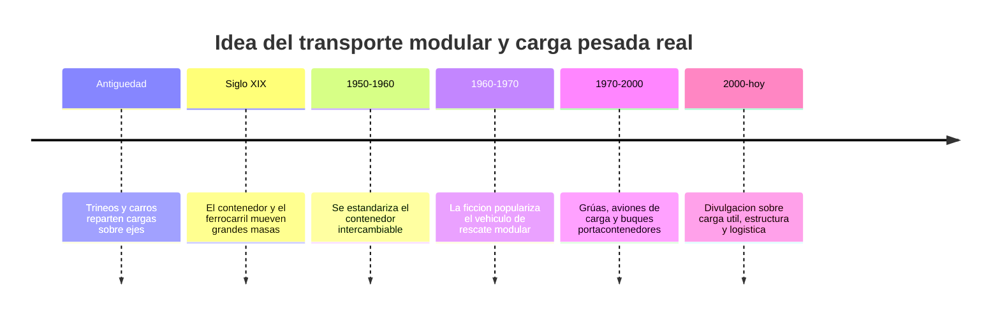

# 📜 Historia del Thunderbird 2

[🏠 Inicio](../../../README.md) · [📦 Curso: Thunderbird 2](../README.md) · 📜 Historia

> ⚖️ Material educativo original; los derechos de las obras pertenecen a sus titulares.

Este modulo situa la idea del transporte pesado modular dentro de la ciencia
ficcion y la compara con la historia real del transporte de carga. No describe
una nave oficial: analiza el concepto generico de "vehiculo de carga modular"
que evoca el estilo "Thunderbirds" y lo contrasta con lo que la ingenieria
sabe hacer de verdad.

## De donde viene la idea

El transporte modular de la ficcion toma prestada la estetica de los grandes
vehiculos de rescate: una maquina enorme que llega, suelta el equipo justo
para la mision y se marcha. Es una imagen atractiva porque entendemos muy bien
la idea de "traer la herramienta correcta". El problema es que mover masa
cuesta energia y estructura, y ahi empieza lo interesante de este curso.

## Lo real frente a lo imaginado

La historia real del transporte de carga siguio un camino muy practico. El gran
avance no fue un vehiculo magico, sino el contenedor estandarizado: una caja
que cualquier vehiculo puede cargar, cambiar y apilar. Esa idea de modulo
intercambiable es exactamente lo que hace util a un transporte polivalente, y
es real, aunque sin las cifras exageradas de la ficcion.

| Periodo | Hito de referencia | Importancia para el curso |
| --- | --- | --- |
| Antiguedad | Carros y trineos reparten el peso | Introduce la idea de reparto de carga. |
| Siglo XIX | Ferrocarril y primeros contenedores | Muestra el transporte de grandes masas. |
| 1950-1960 | Contenedor estandar intercambiable | Base real del modulo polivalente. |
| 1960-1970 | Vehiculo de rescate modular en la ficcion | Fija la imagen popular del transporte. |
| 1970-2000 | Aviones de carga y portacontenedores | Ejemplos reales de carga util enorme. |
| 2000-hoy | Divulgacion de logistica y estructura | Separa el espectaculo de la realidad. |

## Por que la ficcion eligio el vehiculo modular

Contar una historia con un vehiculo que trae "justo lo necesario" es facil de
seguir: hay preparacion, llegada y solucion. Un transporte real necesitaria
horas de carga, calculo de peso y permisos, lo que resulta menos vistoso en
pantalla. La ficcion prioriza la accion sobre la logistica, y eso es una
decision artistica legitima que este curso respeta y analiza.

## Que aprenderemos de todo esto

- Que conceptos de carga real evoca la nave aunque los exagere.
- Que licencias creativas ignoran el peso y la estructura, y por que.
- Como seria un transporte modular si tuviera que obedecer la fisica de verdad.

## Fuentes

- Registrar aqui las fuentes publicas de divulgacion consultadas.
- Enlazar cada fuente tambien en [`manuales/fuentes.md`](../../../manuales/fuentes.md).

---

[🎓 Portada del curso](../README.md) · [➡️ Siguiente: Caracteristicas](../operacion/caracteristicas-thunderbird-2.md)
