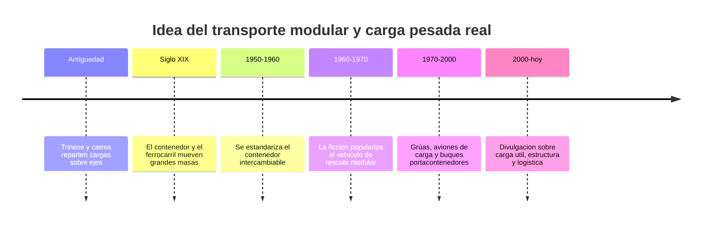

<!-- clase-meta
tipo_documento: clase
clase: 1
codigo: THUNDERBIRD2-01
curso: thunderbird-2
titulo: "Historia del Thunderbird 2"
modalidad: "teórica dialogada"
duracion_minutos: 45
nivel: introductorio
prerrequisito: ninguno
competencia: "contexto_historico"
resultados_aprendizaje:
  - "Explicar origen, evolución tecnológica, variantes representativas e impacto con vocabulario propio de Thunderbird 2."
  - "Aplicar esos conceptos a una decisión segura o a un escenario de simulación de Thunderbird 2."
evidencia: "Línea de tiempo comentada con cuatro hitos o más."
criterio_aprobacion: "Los hitos están ordenados, son pertinentes y dos relaciones de causa y efecto quedan justificadas."
fuentes: manuales/fuentes.md
ultima_revision: 2026-09-10
-->

# 📜 Historia del Thunderbird 2

[🏠 Inicio](../../../README.md) · [📦 Curso: Thunderbird 2](../README.md) · 📜 Historia

> ⚖️ Material educativo original; los derechos de las obras pertenecen a sus titulares.

Esta clase situa la idea del transporte pesado modular dentro de la ciencia
ficción y la compara con la historia real del transporte de carga. No describe
una nave oficial: analiza el concepto genérico de "vehículo de carga modular"
que evoca el estilo "Thunderbirds" y lo contrasta con lo que la ingeniería
sabe hacer de verdad.

```mermaid
timeline
    title Idea del transporte modular y carga pesada real
    Antiguedad : Trineos y carros reparten cargas sobre ejes
    Siglo XIX : El contenedor y el ferrocarril mueven grandes masas
    1950-1960 : Se estandariza el contenedor intercambiable
    1960-1970 : La ficcion populariza el vehiculo de rescate modular
    1970-2000 : Grúas, aviones de carga y buques portacontenedores
    2000-hoy : Divulgacion sobre carga util, estructura y logistica
```

## De donde viene la idea

El transporte modular de la ficción toma prestada la estética de los grandes
vehículos de rescate: una máquina enorme que llega, suelta el equipo justo
para la misión y se marcha. Es una imagen atractiva porque entendemos muy bien
la idea de "traer la herramienta correcta". El problema es que mover masa
cuesta energía y estructura, y ahí empieza lo interesante de este curso.

## Lo real frente a lo imaginado

La historia real del transporte de carga siguió un camino muy práctico. El gran
avance no fue un vehículo mágico, sino el contenedor estandarizado: una caja
que cualquier vehículo puede cargar, cambiar y apilar. Esa idea de módulo
intercambiable es exactamente lo que hace útil a un transporte polivalente, y
es real, aunque sin las cifras exageradas de la ficción.

| Periodo | Hito de referencia | Importancia para el curso |
| --- | --- | --- |
| Antiguedad | Carros y trineos reparten el peso | Introduce la idea de reparto de carga. |
| Siglo XIX | Ferrocarril y primeros contenedores | Muestra el transporte de grandes masas. |
| 1950-1960 | Contenedor estandar intercambiable | Base real del módulo polivalente. |
| 1960-1970 | Vehículo de rescate modular en la ficción | Fija la imagen popular del transporte. |
| 1970-2000 | Aviones de carga y portacontenedores | Ejemplos reales de carga útil enorme. |
| 2000-hoy | Divulgación de logística y estructura | Separa el espectáculo de la realidad. |

## Por qué la ficción eligió el vehículo modular

Contar una historia con un vehículo que trae "justo lo necesario" es fácil de
seguir: hay preparación, llegada y solución. Un transporte real necesitaría
horas de carga, cálculo de peso y permisos, lo que resulta menos vistoso en
pantalla. La ficción prioriza la acción sobre la logística, y eso es una
decisión artística legítima que este curso respeta y analiza.

## Que aprenderemos de todo esto

- Que conceptos de carga real evoca la nave aunque los exagere.
- Que licencias creativas ignoran el peso y la estructura, y por qué.
- Cómo sería un transporte modular si tuviera que obedecer la física de verdad.

## Fuentes

- Registrar aquí las fuentes públicas de divulgación consultadas.
- Enlazar cada fuente también en [`manuales/fuentes.md`](../../../manuales/fuentes.md).

## 🧭 Guía de estudio aplicada

### Pregunta guía

¿Cómo ayuda **De donde viene la idea, Lo real frente a lo imaginado, Por qué la ficción eligió el vehículo modular y Que aprenderemos de todo esto** a **explicar cómo la evolución hizo posibles alternativas como configuración vacía frente a módulo pesado**?

### Explicación razonada

La evolución de Thunderbird 2 se comprende mejor como una sucesión de respuestas a problemas, no como una lista de fechas. Los cambios en energía ficticia, sustentación y propulsión, bahía modular y carga de rescate alteraron qué podía hacer la máquina, quién podía usarla y qué riesgos debían controlarse. El contraste «configuración vacía frente a módulo pesado» permite observar qué decisiones de diseño permanecieron y cuáles cambiaron con la tecnología y el propósito.

Esta clase se conecta con el resto del curso mediante **la carga modular cambia masa, centro de gravedad, potencia y misión**. El hilo de
seguridad consiste en reconocer a tiempo **ignorar cómo la carga modifica control, autonomía y zona de operación** y poder justificar la decisión
**recalcular margen y seleccionar zona antes de comprometer el aterrizaje**; en clases posteriores cambiará el ángulo de análisis, no esa relación causal.
La lectura funcional común sigue **energía ficticia → sustentación y propulsión → bahía modular → carga de rescate**, de modo que cada concepto pueda
ubicarse dentro del funcionamiento completo y no quede como un dato aislado.

**Apoyo documental:** [Thunderbirds Vehicles](https://www.thunderbirds.com/) aporta referencia oficial de vehículos de rescate;
[Aviation Handbooks and Manuals](https://www.faa.gov/regulations_policies/handbooks_manuals) se usa para aerodinámica, sistemas y operación. Estas fuentes
se contrastan con el alcance de la clase y no sustituyen un manual de equipo concreto.

### Caso resuelto: de la observación a la decisión

1. **Situar:** ordena los hitos que explican cómo se llegó a **configuración vacía frente a módulo pesado** y describe la necesidad que impulsó cada cambio.
2. **Relacionar:** explica qué se modificó en **energía ficticia**, **sustentación y propulsión**, **bahía modular** o **carga de rescate**; una fecha sin mecanismo no basta.
3. **Interpretar:** vincula el cambio con una capacidad nueva y también con el riesgo **ignorar cómo la carga modifica control, autonomía y zona de operación**.
4. **Transferir:** usa la evolución para justificar por qué hoy conviene **recalcular margen y seleccionar zona antes de comprometer el aterrizaje**.

### Comprueba tu comprensión

1. ¿Qué necesidad histórica impulsó un cambio en **energía ficticia** o **sustentación y propulsión**?
2. ¿Qué hito modificó la relación entre capacidad y **ignorar cómo la carga modifica control, autonomía y zona de operación**?
3. ¿Por qué **configuración vacía frente a módulo pesado** no puede explicarse como una simple diferencia estética?

Orientación para revisar tus respuestas

- La primera respuesta debe relacionar el eslabón elegido con un efecto posterior, no solo nombrarlo.
- La segunda debe proponer una señal medible u observable y explicar qué tendencia sería preocupante.
- La tercera debe cambiar al menos una variable de capacidad, mando, entorno o margen de seguridad.

## 🎓 Cierre de clase

- **Actividad:** Construye una línea de tiempo de Thunderbird 2 y explica cómo dos cambios históricos transformaron su función o su puesto de mando.
- **Evidencia:** Línea de tiempo comentada con cuatro hitos o más.
- **Criterio de aprobación:** Los hitos están ordenados, son pertinentes y dos relaciones de causa y efecto quedan justificadas.
- **Transferencia:** explica qué cambiaría al pasar a otra variante de esta máquina.

### Fuentes de esta clase

- [THUNDERBIRDS-OFFICIAL](https://www.thunderbirds.com/): Thunderbirds Vehicles, ITV. Uso: referencia oficial de vehículos de rescate.
- [US-FAA-HANDBOOKS](https://www.faa.gov/regulations_policies/handbooks_manuals): Aviation Handbooks and Manuals, FAA. Uso: aerodinámica, sistemas y operación.
- [NASA-FLIGHT](https://www1.grc.nasa.gov/beginners-guide-to-aeronautics/): Beginner's Guide to Aeronautics, NASA. Uso: contraste con física y vuelo reales.

> Las fuentes sostienen el marco conceptual y normativo; esta clase no reemplaza el manual
> del fabricante, la formación certificada ni la habilitación exigida para operar equipos reales.

---

[🎓 Portada del curso](../README.md) · [➡️ Siguiente: Características](../operacion/caracteristicas-thunderbird-2.md)
