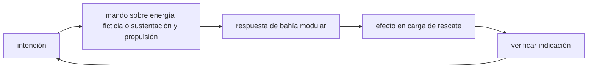

<!-- clase-meta
tipo_documento: clase
clase: 5
codigo: THUNDERBIRD2-05
curso: thunderbird-2
titulo: "Mandos e instrumentos del Thunderbird 2"
modalidad: "taller de simulación"
duracion_minutos: 60
nivel: introductorio
prerrequisito: THUNDERBIRD2-04
competencia: "lectura_y_mando"
resultados_aprendizaje:
  - "Explicar controles, instrumentos, entradas y estados del sistema con vocabulario propio de Thunderbird 2."
  - "Aplicar esos conceptos a una decisión segura o a un escenario de simulación de Thunderbird 2."
evidencia: "Mapa de mandos y resolución de dos estados del tablero."
criterio_aprobacion: "Reconoce los controles críticos y responde a los estados sin introducir acciones inseguras."
fuentes: manuales/fuentes.md
ultima_revision: 2026-09-10
-->

# 🎛️ Mandos e instrumentos del Thunderbird 2

[🏠 Inicio](../../../README.md) · [📦 Curso: Thunderbird 2](../README.md) · 🎛️ Mandos

> ⚖️ Material educativo original; los derechos de las obras pertenecen a sus titulares.

## Vista general

El puesto de mando de un transporte pesado modular realista se parece más a la
cabina de una gran aeronave de carga que a la de un vehículo ligero. Como el
peso cambia en cada misión, el piloto no solo conduce: vigila la carga, el
reparto de peso y el margen de empuje. Esa atención al peso es la gran
diferencia con conducir un vehículo vacío.

## Mapa de controles

| Zona | Control | Tipo | Función | Prioridad | Comentarios |
| --- | --- | --- | --- | --- | --- |
| Mano derecha | Palanca de vuelo | Joystick 3 ejes | Guiar cabeceo, alabeo y rumbo | Alta | Responde más lento con carga pesada. |
| Mano izquierda | Acelerador principal | Palanca lineal | Regular empuje de los motores | Alta | El empuje debe superar el peso total. |
| Panel central | Gestión de carga | Botonera | Anclar y soltar el módulo | Alta | Requiere verificar los cierres. |
| Panel central | Reparto de peso | Selector | Ajustar donde apoya la carga | Media | Mantiene el centro de masa estable. |
| Panel derecho | Control de tren | Botones | Desplegar y recoger apoyos | Media | Dimensionado al peso máximo. |
| Panel izquierdo | Modo de vuelo | Selector | Elegir asistencia de la computadora | Media | Incluye límite de carga segura. |
| Consola | Instrumentos | Pantallas | Mostrar estado y carga | Alta | Ver sección de instrumentos. |

## Instrumentos principales

| Instrumento | Muestra | Unidad | Importancia | Notas |
| --- | --- | --- | --- | --- |
| Peso total | Masa del conjunto cargado | toneladas | Alta | Vehículo más estructura más módulo. |
| Margen de empuje | Empuje frente al peso | porcentaje | Alta | Si baja de cero, no despega. |
| Centro de masa | Posición del equilibrio | ejes | Alta | Debe quedar en la zona segura. |
| Estado de anclajes | Cierres del módulo | luces | Alta | Sin todos firmes no se mueve carga. |
| Nivel de combustible | Combustible restante | porcentaje | Alta | Es masa que también hay que mover. |
| Carga en cada apoyo | Peso por pata o rueda | toneladas | Media | Evita hundir o romper un apoyo. |

## Entradas de simulación

| Acción | Teclado | Controlador | Comentarios |
| --- | --- | --- | --- |
| Aumentar empuje | Flecha arriba | Gatillo derecho | Necesario para elevar más carga. |
| Cabecear | W y S | Stick derecho vertical | Más lento cuanto más peso. |
| Virar rumbo | A y D | Stick derecho horizontal | Requiere anticipación con carga. |
| Alabeo | Q y E | Botones laterales | Inclina el conjunto sobre su eje. |
| Anclar módulo | Tecla G | Botón X | Solo con el vehículo posado y alineado. |
| Soltar módulo | Tecla H | Botón Y | Verificar antes que el módulo apoye. |
| Desplegar tren | Barra espaciadora | Botón central | Antes de tocar el suelo cargado. |

## Estados del sistema

| Estado | Descripción | Indicadores | Acciones disponibles |
| --- | --- | --- | --- |
| Vacío | Sin módulo, mínima masa | Peso total bajo | Volar ágil, ir a recoger carga. |
| Cargando | Anclando o soltando módulo | Anclajes en proceso | Alinear, cerrar, verificar. |
| Cargado | Módulo fijado y en marcha | Peso total alto | Volar con margen de empuje justo. |
| Emergencia | Sobrepeso o anclaje suelto | Alerta de carga | Soltar carga, estabilizar el centro. |

## Observaciones ergonomicas

- La interfaz debe mostrar a la vez el peso total y el margen de empuje, porque
  con carga el límite de despegue está muy cerca.
- El centro de masa es tan importante como el combustible: si se desvia, el
  vehículo se vuelve difícil de controlar.
- El estado de los anclajes debe ser evidente: mover carga mal fijada es
  peligroso.
- Conviene un modo de asistencia que avise antes de superar la carga segura.

## 🧭 Guía de estudio aplicada

### Pregunta guía

¿Cómo ayuda **Vista general, Mapa de controles, Instrumentos principales y Entradas de simulación** a **interpretar mandos e indicaciones durante despegue vertical ficticio con módulo pesado de rescate**?

### Explicación razonada

Un mando no se aprende memorizando su nombre, sino recorriendo el ciclo intención → acción → indicación → verificación. En Thunderbird 2, el operador actúa sobre energía ficticia o sustentación y propulsión, observa la respuesta en bahía modular y confirma el efecto en carga de rescate. Una indicación inesperada exige detener la secuencia mental, identificar el modo activo y evitar una segunda orden que agrave el estado.

Esta clase se conecta con el resto del curso mediante **la carga modular cambia masa, centro de gravedad, potencia y misión**. El hilo de
seguridad consiste en reconocer a tiempo **ignorar cómo la carga modifica control, autonomía y zona de operación** y poder justificar la decisión
**recalcular margen y seleccionar zona antes de comprometer el aterrizaje**; en clases posteriores cambiará el ángulo de análisis, no esa relación causal.
La lectura funcional común sigue **energía ficticia → sustentación y propulsión → bahía modular → carga de rescate**, de modo que cada concepto pueda
ubicarse dentro del funcionamiento completo y no quede como un dato aislado.

**Apoyo documental:** [Thunderbirds Vehicles](https://www.thunderbirds.com/) aporta referencia oficial de vehículos de rescate;
[Aviation Handbooks and Manuals](https://www.faa.gov/regulations_policies/handbooks_manuals) se usa para aerodinámica, sistemas y operación. Estas fuentes
se contrastan con el alcance de la clase y no sustituyen un manual de equipo concreto.

### Caso resuelto: de la observación a la decisión

1. **Intención:** formula qué cambio se necesita durante **despegue vertical ficticio con módulo pesado de rescate**.
2. **Mando:** identifica el control que actúa sobre **energía ficticia** o **sustentación y propulsión** y el modo que debe estar activo.
3. **Lectura:** localiza la indicación que confirma la respuesta de **bahía modular** y el efecto en **carga de rescate**.
4. **Verificación:** si la lectura no coincide, no acumules órdenes; estabiliza e investiga el estado.

### Comprueba tu comprensión

1. ¿Qué mando inicia la respuesta y qué instrumento confirma que el modo correcto está activo?
2. ¿Qué indicación temprana advertiría **ignorar cómo la carga modifica control, autonomía y zona de operación**?
3. ¿Qué secuencia usarías si la respuesta de **carga de rescate** no coincide con la orden?

Orientación para revisar tus respuestas

- La primera respuesta debe relacionar el eslabón elegido con un efecto posterior, no solo nombrarlo.
- La segunda debe proponer una señal medible u observable y explicar qué tendencia sería preocupante.
- La tercera debe cambiar al menos una variable de capacidad, mando, entorno o margen de seguridad.

## 🎓 Cierre de clase

- **Actividad:** Recorre el puesto de mando simulado de Thunderbird 2: localiza los controles de controles, instrumentos, entradas y estados del sistema y asocia cada indicación con una decisión.
- **Evidencia:** Mapa de mandos y resolución de dos estados del tablero.
- **Criterio de aprobación:** Reconoce los controles críticos y responde a los estados sin introducir acciones inseguras.
- **Transferencia:** explica qué cambiaría al pasar a otra variante de esta máquina.

### Fuentes de esta clase

- [THUNDERBIRDS-OFFICIAL](https://www.thunderbirds.com/): Thunderbirds Vehicles, ITV. Uso: referencia oficial de vehículos de rescate.
- [US-FAA-HANDBOOKS](https://www.faa.gov/regulations_policies/handbooks_manuals): Aviation Handbooks and Manuals, FAA. Uso: aerodinámica, sistemas y operación.
- [NASA-FLIGHT](https://www1.grc.nasa.gov/beginners-guide-to-aeronautics/): Beginner's Guide to Aeronautics, NASA. Uso: contraste con física y vuelo reales.

> Las fuentes sostienen el marco conceptual y normativo; esta clase no reemplaza el manual
> del fabricante, la formación certificada ni la habilitación exigida para operar equipos reales.

---

[⬅️ Anterior: Sistemas mecánicos](../operacion/sistemas-mecanicos-thunderbird-2.md) · [➡️ Siguiente: Principios y operación](../operacion/principios-thunderbird-2.md)
