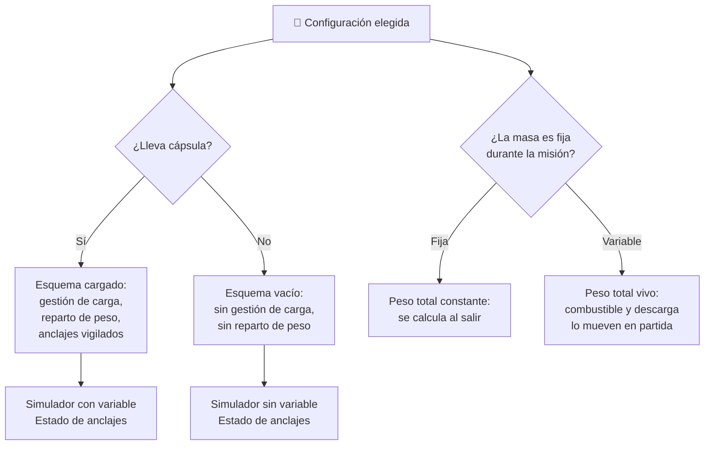

# 🧩 Modelos y variantes del Thunderbird 2

[🏠 Inicio](../../../README.md) · [📦 Curso: Thunderbird 2](../README.md) · 🧩 Modelos

El [Módulo 2](../operacion/caracteristicas-thunderbird-2.md) ya dijo qué es un
transporte pesado modular y qué tipos conceptuales existen: portador ligero,
portador pesado y módulo especializado. Este módulo responde a lo siguiente:
**el vehículo es siempre el mismo, pero lo que lleva no**. Y esa diferencia no
es de matiz: cambia la masa, mueve el centro de masa, cambia la misión y, por
tanto, cambia qué debe modelar el simulador.

> 🎯 **La idea que sostiene el módulo.** "El Thunderbird 2" no es una sola
> máquina desde el punto de vista del mando: es un bastidor más una cápsula
> intercambiable. Sin cápsula anclada, la gestión de carga y el reparto de peso
> no son más fáciles: **no existen**. Un simulador que presente un solo esquema
> de control está representando una configuración concreta aunque diga
> representarlas todas. Todo esto es análisis educativo original sobre una nave
> de ficción: los derechos de las obras pertenecen a sus titulares.

---

## 🧭 Por qué la configuración decide el simulador

El [Módulo 5](../mandos/manual-mandos-thunderbird-2.md) describe un puesto de
mando con una botonera de gestión de carga para anclar y soltar el módulo, y un
selector de reparto de peso para ajustar dónde apoya la carga. El
[Módulo 9](../simulacion/diseno-simulador-thunderbird-2.md) expone las
variables `Masa del módulo`, `Estado de anclajes` y `Centro de masa`. Los tres
describen el vehículo **con cápsula**.

En la configuración sin módulo, esa botonera no tiene nada que anclar y el
selector no tiene nada que repartir. `Masa del módulo` vale cero y
`Estado de anclajes` sencillamente no tiene valores que tomar: no hay cierres
que vigilar. Si el simulador se construye sobre el esquema cargado y luego se le
"añade" el vuelo vacío, el resultado es una nave vacía que gestiona anclajes
inexistentes.

Y al revés: el [Módulo 6](../operacion/principios-thunderbird-2.md) recuerda que
la fracción de carga útil y el margen de empuje solo aprietan cuando hay masa
que mover. La misma nave, con otra cápsula, es otro problema de pilotaje.

---

## 🗂️ Qué cambia en el manejo

| Configuración | Qué cambia al pilotarlo |
| --- | --- |
| Sin módulo (vacío) | La referencia mínima: poca masa, sobra margen de empuje y la palanca de vuelo responde rápido. Es el estado ágil del Módulo 5. |
| Cápsula ligera (portador ligero) | Prioriza rapidez sobre carga útil: la respuesta sigue siendo viva y el margen de empuje es holgado. |
| Cápsula pesada (portador pesado) | Cabecear y virar se vuelve lento y hay que anticipar. El margen de empuje queda justo y el límite de despegue está cerca. |
| Cápsula especializada por misión | El equipo va donde exige la misión, no donde conviene al equilibrio: el centro de masa puede quedar alto o desviado. |
| Cápsula para ruta larga | El combustible es masa que también se mueve: la nave pesa distinto al salir y al llegar, y se aligera durante la partida. |
| Cápsula de descarga en destino | El peso pasa a los apoyos al posarse: sobre terreno blando, cada pata cuenta y el aterrizaje manda más que el vuelo. |

---

## 🎛️ Qué cambia en el mando

| Configuración | Qué mando aparece o desaparece | Consecuencia |
| --- | --- | --- |
| Cápsula ligera, pesada y especializada | Ninguno: el mapa de controles del Módulo 5 aplica tal cual. | Cambian los rangos y los tiempos de respuesta, no los controles. |
| Sin módulo (vacío) | **Desaparecen** la botonera de gestión de carga y el selector de reparto de peso. El instrumento de estado de anclajes **se apaga**. | No hay carga que anclar ni que repartir: el piloto solo vuela. Es un modo de control distinto, no un vuelo fácil. |
| Cápsula para ruta larga | **Aparece** el nivel de combustible como masa que el piloto gestiona en vuelo, no como cifra fija de salida. | No es un mando nuevo, pero altera el resultado del acelerador y del margen de empuje durante toda la ruta. |
| Cápsula de descarga en destino | **Gana peso** el control de tren y el instrumento de carga en cada apoyo pasa de secundario a decisivo. | La maniobra crítica se traslada del vuelo al contacto con el suelo. |
| Cualquier configuración, en modo de vuelo asistido | El selector de modo de vuelo **activa** el límite de carga segura. | La computadora avisa antes de superar la carga: cambia qué puede intentar el piloto. |

---

## 🎮 Qué cambia en el simulador

Contrastado con las variables del
[Módulo 9](../simulacion/diseno-simulador-thunderbird-2.md):

| Configuración | Variables que cambian | Esquema de control |
| --- | --- | --- |
| Cápsula pesada (portador pesado) | Ninguna: es el caso base del curso. `Peso total` alto y `Margen de empuje` ajustado. | El del Módulo 5. |
| Sin módulo (vacío) | `Estado de anclajes` **se elimina**: no hay cierres. `Masa del módulo` vale cero y deja de influir. `Centro de masa` se desacopla de la carga y depende solo del vehículo y del combustible. | Sin entrada de gestión de carga ni de reparto de peso. |
| Cápsula ligera (portador ligero) | `Masa del módulo` **reduce** su rango y `Margen de empuje` se aleja del cero. | El mismo, con respuesta más viva. |
| Cápsula especializada por misión | `Centro de masa` deja de ser un valor centrado y pasa a ser una restricción de la misión. | El mismo, con el reparto de peso en primer plano. |
| Cápsula para ruta larga | `Combustible` deja de ser un dato de salida y pasa a variar durante la partida, arrastrando a `Peso total` y a `Margen de empuje`. | El mismo. |
| Cápsula de descarga en destino | `Terreno de apoyo` deja de ser un valor de base firme y pasa a decidir el aterrizaje. | El mismo, con el tren y los apoyos como maniobra principal. |
| Cualquiera, en `Modo` ficción | `Centro de masa` y `Margen de empuje` se ignoran; `Estado de anclajes` se resuelve al instante. | El mismo, sin consecuencias físicas. |

---

## 🗺️ De la configuración al esquema de control

---

## ⚠️ Qué configuraciones no comparten simulador

Dos casos no se resuelven con un ajuste de parámetros, porque su esquema de
control es otro:

- **El vuelo sin módulo** frente al resto: desaparecen dos entradas del puesto
  de mando y una variable del Módulo 9 se queda sin valores. Es un modo de
  control distinto, no una carga distinta.
- **Las cápsulas de masa variable** (ruta larga y descarga en destino) frente a
  las de masa fija: obligan a que el peso total sea una variable viva durante la
  partida, no una constante que se fija antes de despegar.

El resto de configuraciones sí caben en un mismo simulador ajustando rangos, tal
como plantean los [niveles de realismo](../../../docs/03-niveles-de-realismo.md):
en el nivel 1 basta con notar que la nave pesa más con la cápsula, y las
diferencias emergen a medida que el nivel sube.

---

[⬅️ Anterior: Características](../operacion/caracteristicas-thunderbird-2.md) · [➡️ Siguiente: Sistemas mecánicos](../operacion/sistemas-mecanicos-thunderbird-2.md)
