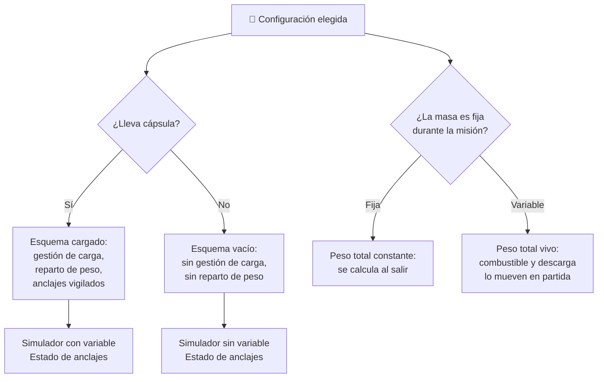

# 🧩 Modelos y variantes del Thunderbird 2

[🏠 Inicio](../../../README.md) · [📦 Curso: Thunderbird 2](../README.md) · 🧩 Modelos

El [Módulo 2](../operacion/caracteristicas-thunderbird-2.md) ya dijo qué es un
transporte pesado modular y qué tipos conceptuales existen: portador ligero,
portador pesado y módulo especializado. Este módulo responde a lo siguiente:
**el vehículo es siempre el mismo, pero lo que lleva no**. Y esa diferencia no
es de matiz: cambia la masa, mueve el centro de masa, cambia la misión y, por
tanto, cambia qué debe modelar el simulador.

> 🎯 **La idea que sostiene el módulo.** "El Thunderbird 2" no es una sola
> máquina desde el punto de vista del mando: es un bastidor más una cápsula
> intercambiable. Sin cápsula anclada, la gestión de carga y el reparto de peso
> no son más fáciles: **no existen**. Un simulador que presente un solo esquema
> de control está representando una configuración concreta aunque diga
> representarlas todas. Todo esto es análisis educativo original sobre una nave
> de ficción: los derechos de las obras pertenecen a sus titulares.

---

## 🧭 Por qué la configuración decide el simulador

El [Módulo 5](../mandos/manual-mandos-thunderbird-2.md) describe un puesto de
mando con una botonera de gestión de carga para anclar y soltar el módulo, y un
selector de reparto de peso para ajustar dónde apoya la carga. El
[Módulo 9](../simulacion/diseno-simulador-thunderbird-2.md) expone las
variables `Masa del módulo`, `Estado de anclajes` y `Centro de masa`. Los tres
describen el vehículo **con cápsula**.

En la configuración sin módulo, esa botonera no tiene nada que anclar y el
selector no tiene nada que repartir. `Masa del módulo` vale cero y
`Estado de anclajes` sencillamente no tiene valores que tomar: no hay cierres
que vigilar. Si el simulador se construye sobre el esquema cargado y luego se le
"añade" el vuelo vacío, el resultado es una nave vacía que gestiona anclajes
inexistentes.

Y al revés: el [Módulo 6](../operacion/principios-thunderbird-2.md) recuerda que
la fracción de carga útil y el margen de empuje solo aprietan cuando hay masa
que mover. La misma nave, con otra cápsula, es otro problema de pilotaje.

---

## 🗂️ Qué cambia en el manejo

| Configuración | Qué cambia al pilotarlo |
| --- | --- |
| Sin módulo (vacío) | La referencia mínima: poca masa, sobra margen de empuje y la palanca de vuelo responde rápido. Es el estado ágil del Módulo 5. |
| Cápsula ligera (portador ligero) | Prioriza rapidez sobre carga útil: la respuesta sigue siendo viva y el margen de empuje es holgado. |
| Cápsula pesada (portador pesado) | Cabecear y virar se vuelve lento y hay que anticipar. El margen de empuje queda justo y el límite de despegue está cerca. |
| Cápsula especializada por misión | El equipo va donde exige la misión, no donde conviene al equilibrio: el centro de masa puede quedar alto o desviado. |
| Cápsula para ruta larga | El combustible es masa que también se mueve: la nave pesa distinto al salir y al llegar, y se aligera durante la partida. |
| Cápsula de descarga en destino | El peso pasa a los apoyos al posarse: sobre terreno blando, cada pata cuenta y el aterrizaje manda más que el vuelo. |

---

## 🎛️ Qué cambia en el mando

| Configuración | Qué mando aparece o desaparece | Consecuencia |
| --- | --- | --- |
| Cápsula ligera, pesada y especializada | Ninguno: el mapa de controles del Módulo 5 aplica tal cual. | Cambian los rangos y los tiempos de respuesta, no los controles. |
| Sin módulo (vacío) | **Desaparecen** la botonera de gestión de carga y el selector de reparto de peso. El instrumento de estado de anclajes **se apaga**. | No hay carga que anclar ni que repartir: el piloto solo vuela. Es un modo de control distinto, no un vuelo fácil. |
| Cápsula para ruta larga | **Aparece** el nivel de combustible como masa que el piloto gestiona en vuelo, no como cifra fija de salida. | No es un mando nuevo, pero altera el resultado del acelerador y del margen de empuje durante toda la ruta. |
| Cápsula de descarga en destino | **Gana peso** el control de tren y el instrumento de carga en cada apoyo pasa de secundario a decisivo. | La maniobra crítica se traslada del vuelo al contacto con el suelo. |
| Cualquier configuración, en modo de vuelo asistido | El selector de modo de vuelo **activa** el límite de carga segura. | La computadora avisa antes de superar la carga: cambia qué puede intentar el piloto. |

---

## 🎮 Qué cambia en el simulador

Contrastado con las variables del
[Módulo 9](../simulacion/diseno-simulador-thunderbird-2.md):

| Configuración | Variables que cambian | Esquema de control |
| --- | --- | --- |
| Cápsula pesada (portador pesado) | Ninguna: es el caso base del curso. `Peso total` alto y `Margen de empuje` ajustado. | El del Módulo 5. |
| Sin módulo (vacío) | `Estado de anclajes` **se elimina**: no hay cierres. `Masa del módulo` vale cero y deja de influir. `Centro de masa` se desacopla de la carga y depende solo del vehículo y del combustible. | Sin entrada de gestión de carga ni de reparto de peso. |
| Cápsula ligera (portador ligero) | `Masa del módulo` **reduce** su rango y `Margen de empuje` se aleja del cero. | El mismo, con respuesta más viva. |
| Cápsula especializada por misión | `Centro de masa` deja de ser un valor centrado y pasa a ser una restricción de la misión. | El mismo, con el reparto de peso en primer plano. |
| Cápsula para ruta larga | `Combustible` deja de ser un dato de salida y pasa a variar durante la partida, arrastrando a `Peso total` y a `Margen de empuje`. | El mismo. |
| Cápsula de descarga en destino | `Terreno de apoyo` deja de ser un valor de base firme y pasa a decidir el aterrizaje. | El mismo, con el tren y los apoyos como maniobra principal. |
| Cualquiera, en `Modo` ficción | `Centro de masa` y `Margen de empuje` se ignoran; `Estado de anclajes` se resuelve al instante. | El mismo, sin consecuencias físicas. |

---

## 🗺️ De la configuración al esquema de control

---

## ⚖️ Hasta qué punto la carga afecta al mando

Las tablas de arriba dicen que con cápsula pesada "cabecear y virar se vuelve
lento". Conviene decir **cuánto** y **por qué**, porque la respuesta no es
proporcional al peso y ahí está lo interesante.

El curso no maneja masas concretas a propósito: no existe una masa canónica de
la cápsula, y una cifra inventada convertiría este módulo en la ficha técnica
falsa que el curso enseña a detectar. Todo lo que sigue son **relaciones**, que
es lo que un simulador necesita de verdad.

### Empuje: la carga se paga entera

En vuelo vertical el empuje sostiene **todo** el peso, porque no hay alas
trabajando. Ahí la carga no se negocia: si la cápsula pesa tanto como el
vehículo vacío, el peso total se duplica y el empuje necesario para sostenerse
se duplica con él. Es la diferencia dura con el crucero, donde la sustentación
carga con el peso y el motor solo vence la resistencia.

Y hay un efecto de segundo orden que el
[Módulo 2](../operacion/caracteristicas-thunderbird-2.md) ya insinúa al decir
que "sostener mucho peso obliga a más estructura": el bastidor que aguanta una
cápsula más pesada pesa a su vez, y ese peso también hay que levantarlo. Cada
kilo de carga útil cuesta más de un kilo de empuje.

### Inercia: importa más dónde va que cuánto pesa

Este es el punto que la intuición se salta. Para cabecear o alabear no basta con
sostener el peso: hay que **rotarlo**, y la resistencia a rotar es el momento de
inercia, que crece con la masa multiplicada por la **distancia al cuadrado** al
eje de giro.

La consecuencia es fuerte: una cápsula colgada bajo el fuselaje, lejos del eje,
penaliza el giro mucho más de lo que su peso sugiere. Si la misma masa se cuelga
al doble de distancia, su aporte a la inercia se **cuadruplica**.

Y como el par de control disponible no crece porque la cápsula pese más, la
aceleración angular que consigue el piloto es ese par dividido por la inercia:
al subir la inercia, el giro se frena en la misma proporción. El
[Módulo 5](../mandos/manual-mandos-thunderbird-2.md) ya anota que la palanca de
vuelo "responde más lento con carga pesada"; esa división es el motivo.

### Centro de masa: la autoridad que se gasta en no caerse

En vuelo vertical el empuje tiene que pasar por el centro de masa. Si no pasa,
aparece un par que vuelca la nave. Una cápsula cuyo equipo va donde exige la
misión —y no donde conviene al equilibrio— desplaza ese centro, y entonces el
piloto gasta autoridad de control **solo en mantenerse nivelado**, antes de
intentar cualquier maniobra.

Eso define una envolvente: existe un desplazamiento a partir del cual el par
necesario para compensar agota el control disponible. Pasado ese punto no es que
pilotar sea difícil, es que la nave no se sostiene. Por eso el selector de
reparto de peso del [Módulo 5](../mandos/manual-mandos-thunderbird-2.md) no es
una comodidad: es lo que devuelve el margen de mando.

### Resumen para el simulador

| Relación física | Qué nota el piloto | Qué debe modelar el simulador |
| --- | --- | --- |
| Empuje necesario ∝ peso total | Con cápsula pesada apenas despega. | `Margen de empuje` cae al subir `Masa del módulo`; si es negativo, no se levanta. |
| Estructura extra por carga extra | Cada kilo útil cuesta más de un kilo. | `Peso total` crece más deprisa que `Masa del módulo`. |
| Inercia ∝ masa × distancia² | La palanca va pastosa; hay que anticipar. | La respuesta angular no depende solo de `Masa del módulo`, también de **dónde** va. |
| Aceleración angular = par / inercia | Mismo mando, giro más lento. | El par de control no crece con la carga: el retardo sale de la división, no de un ajuste. |
| El empuje debe pasar por el centro de masa | Cuesta mantenerse nivelado sin tocar nada. | `Centro de masa` desviado consume autoridad de forma continua. |
| Envolvente de centro de masa | Pasado un límite, no hay compensación posible. | `Centro de masa` fuera de zona segura no es penalización: es pérdida de control. |

Todo esto vive en el modo ciencia. En `Modo` ficción la nave sube recta con
cualquier cápsula, y esa es justamente la licencia creativa que el curso invita
a detectar: la ficción no es que exagere el empuje, es que **ignora la inercia y
el equilibrio**, que es donde estaría el trabajo real de pilotar.

---

## ⚠️ Qué configuraciones no comparten simulador

Dos casos no se resuelven con un ajuste de parámetros, porque su esquema de
control es otro:

- **El vuelo sin módulo** frente al resto: desaparecen dos entradas del puesto
  de mando y una variable del Módulo 9 se queda sin valores. Es un modo de
  control distinto, no una carga distinta.
- **Las cápsulas de masa variable** (ruta larga y descarga en destino) frente a
  las de masa fija: obligan a que el peso total sea una variable viva durante la
  partida, no una constante que se fija antes de despegar.

El resto de configuraciones sí caben en un mismo simulador ajustando rangos, tal
como plantean los [niveles de realismo](../../../docs/03-niveles-de-realismo.md):
en el nivel 1 basta con notar que la nave pesa más con la cápsula, y las
diferencias emergen a medida que el nivel sube.

> ⚖️ **El principio detrás de todo esto.** Cuánto pesa la carga y dónde va no cambia
> solo los números: cambia qué puede hacer el operador. La física común a todas las
> máquinas del catálogo —sostener, girar, equilibrar y la masa que cambia en
> marcha— está en [⚖️ carga y manejo](../../../docs/09-carga-y-manejo.md).

---

[⬅️ Anterior: Características](../operacion/caracteristicas-thunderbird-2.md) · [➡️ Siguiente: Sistemas mecánicos](../operacion/sistemas-mecanicos-thunderbird-2.md)
