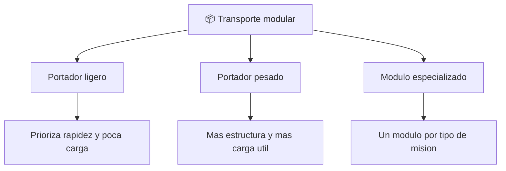

# 📋 Caracteristicas del Thunderbird 2

[🏠 Inicio](../../../README.md) · [📦 Curso: Thunderbird 2](../README.md) · 📋 Caracteristicas

> ⚖️ Material educativo original; los derechos de las obras pertenecen a sus titulares.

Que es un transporte pesado modular generico, que rasgos lo definen en la
ficcion y cuales tendrian sentido fisico real. Este modulo da el contexto antes
de abrir la tecnologia por dentro en el Modulo 3.

---

## 🧭 Definicion

Un transporte pesado modular, en la ficcion estilo "Thunderbirds", es un
vehiculo grande pensado para llevar equipo variado a donde haga falta. Lo
imaginamos capaz de cargar y soltar contenedores completos segun la mision. En
este curso lo usamos como excusa para estudiar como se moveria de verdad un
vehiculo asi cuando lleva mucha masa util.

---

## 🧬 Caracteristicas clave

| Caracteristica | Como la muestra la ficcion | Lectura fisica real |
| --- | --- | --- |
| Modulo intercambiable | Cambia el contenedor en segundos | Razonable: el contenedor estandar existe y es muy util. |
| Carga enorme | Levanta pesos gigantes sin esfuerzo | Todo peso exige empuje y estructura proporcionales. |
| Cambio instantaneo | Suelta y toma modulos al instante | Anclar y soltar carga segura lleva tiempo. |
| Estructura ligera | Fuselaje esbelto pese a la carga | Sostener mucho peso obliga a mas estructura. |
| Despegue vertical | Sube cargado sin pista | Exige un empuje enorme frente al peso total. |
| Autonomia amplia | Llega lejos siempre lleno | Mas carga y combustible reducen el alcance. |

---

## 🗂️ Tipos conceptuales de transporte modular

| Tipo | Idea de diseno | Compromiso fisico |
| --- | --- | --- |
| Portador ligero | Poca masa, modulos pequenos | Rapido pero lleva poca carga util. |
| Portador pesado | Bastidor reforzado, gran modulo | Lleva mucho pero necesita mas empuje. |
| Modulo especializado | Un contenedor por mision | Versatil, pero cada modulo pesa y ocupa. |

---

## 🎯 Para que sirve en el relato

- Dar espectaculo con llegadas y despliegues rapidos de equipo.
- Representar la idea de "traer la solucion" a cualquier lugar.
- Simplificar la logistica compleja a un gesto: soltar el modulo.

En cambio, para este curso sirve como laboratorio: cada rasgo llamativo nos
deja preguntar si seria posible y por que.

---

[⬅️ Anterior: Historia](../historia/historia-thunderbird-2.md) · [➡️ Siguiente: Sistemas mecanicos](sistemas-mecanicos-thunderbird-2.md)
