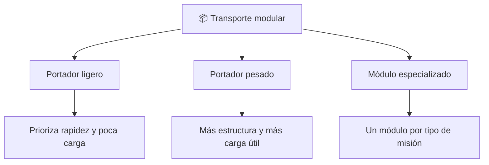

<!-- clase-meta
tipo_documento: clase
clase: 2
codigo: THUNDERBIRD2-02
curso: thunderbird-2
titulo: "Características del Thunderbird 2"
modalidad: "teórica aplicada"
duracion_minutos: 45
nivel: introductorio
prerrequisito: THUNDERBIRD2-01
competencia: "identificacion_funcional"
resultados_aprendizaje:
  - "Explicar definición, rasgos funcionales, tipos y usos con vocabulario propio de Thunderbird 2."
  - "Aplicar esos conceptos a una decisión segura o a un escenario de simulación de Thunderbird 2."
evidencia: "Matriz comparativa y decisión justificada."
criterio_aprobacion: "La elección considera función, límites, mando y efecto en la simulación; no se apoya solo en preferencias."
fuentes: manuales/fuentes.md
ultima_revision: 2026-09-10
-->

# 📋 Características del Thunderbird 2

[🏠 Inicio](../../../README.md) · [📦 Curso: Thunderbird 2](../README.md) · 📋 Características

> ⚖️ Material educativo original; los derechos de las obras pertenecen a sus titulares.

Que es un transporte pesado modular genérico, que rasgos lo definen en la
ficción y cuales tendrían sentido físico real. Esta clase da el contexto antes
de abrir la tecnología por dentro en el Clase 4.

---

## 🧭 Definición

Un transporte pesado modular, en la ficción estilo "Thunderbirds", es un
vehículo grande pensado para llevar equipo variado a donde haga falta. Lo
imaginamos capaz de cargar y soltar contenedores completos según la misión. En
este curso lo usamos como excusa para estudiar cómo se movería de verdad un
vehículo así cuando lleva mucha masa útil.

---

## 🧬 Características clave

| Característica | Como la muestra la ficción | Lectura física real |
| --- | --- | --- |
| Módulo intercambiable | Cambia el contenedor en segundos | Razonable: el contenedor estandar existe y es muy útil. |
| Carga enorme | Levanta pesos gigantes sin esfuerzo | Todo peso exige empuje y estructura proporcionales. |
| Cambio instantáneo | Suelta y toma módulos al instante | Anclar y soltar carga segura lleva tiempo. |
| Estructura ligera | Fuselaje esbelto pese a la carga | Sostener mucho peso obliga a más estructura. |
| Despegue vertical | Sube cargado sin pista | Exige un empuje enorme frente al peso total. |
| Autonomía amplia | Llega lejos siempre lleno | Más carga y combustible reducen el alcance. |

---

## 🗂️ Tipos conceptuales de transporte modular

```mermaid
flowchart TD
    Transporte[📦 Transporte modular] --> Ligero[Portador ligero]
    Transporte --> Pesado[Portador pesado]
    Transporte --> Especial[Módulo especializado]
    Ligero --> Agil[Prioriza rapidez y poca carga]
    Pesado --> Masa[Más estructura y más carga útil]
    Especial --> Mision[Un módulo por tipo de misión]
```

| Tipo | Idea de diseño | Compromiso físico |
| --- | --- | --- |
| Portador ligero | Poca masa, módulos pequeños | Rápido pero lleva poca carga útil. |
| Portador pesado | Bastidor reforzado, gran módulo | Lleva mucho pero necesita más empuje. |
| Módulo especializado | Un contenedor por misión | Versátil, pero cada módulo pesa y ocupa. |

---

## 🎯 Para qué sirve en el relato

- Dar espectáculo con llegadas y despliegues rápidos de equipo.
- Representar la idea de "traer la solución" a cualquier lugar.
- Simplificar la logística compleja a un gesto: soltar el módulo.

En cambio, para este curso sirve como laboratorio: cada rasgo llamativo nos
deja preguntar si sería posible y por qué.

## 🧭 Guía de estudio aplicada

### Pregunta guía

¿Cómo ayuda **Definición, Características clave, Tipos conceptuales de transporte modular y Para qué sirve en el relato** a **elegir una configuración adecuada para despegue vertical ficticio con módulo pesado de rescate**?

### Explicación razonada

Una característica solo es útil cuando permite anticipar comportamiento. En Thunderbird 2, la relación entre energía ficticia, sustentación y propulsión, bahía modular y carga de rescate determina capacidad, respuesta y límites. Por eso «configuración vacía frente a módulo pesado» no se compara por apariencia: se compara por misión, entorno, carga de trabajo y exposición al riesgo «ignorar cómo la carga modifica control, autonomía y zona de operación».

Esta clase se conecta con el resto del curso mediante **la carga modular cambia masa, centro de gravedad, potencia y misión**. El hilo de
seguridad consiste en reconocer a tiempo **ignorar cómo la carga modifica control, autonomía y zona de operación** y poder justificar la decisión
**recalcular margen y seleccionar zona antes de comprometer el aterrizaje**; en clases posteriores cambiará el ángulo de análisis, no esa relación causal.
La lectura funcional común sigue **energía ficticia → sustentación y propulsión → bahía modular → carga de rescate**, de modo que cada concepto pueda
ubicarse dentro del funcionamiento completo y no quede como un dato aislado.

**Apoyo documental:** [Thunderbirds Vehicles](https://www.thunderbirds.com/) aporta referencia oficial de vehículos de rescate;
[Aviation Handbooks and Manuals](https://www.faa.gov/regulations_policies/handbooks_manuals) se usa para aerodinámica, sistemas y operación. Estas fuentes
se contrastan con el alcance de la clase y no sustituyen un manual de equipo concreto.

### Caso resuelto: de la observación a la decisión

1. **Definir la necesidad:** convierte «despegue vertical ficticio con módulo pesado de rescate» en requisitos de capacidad, entorno y respuesta.
2. **Comparar:** contrasta **configuración vacía frente a módulo pesado** usando esos requisitos y la cadena **energía ficticia → sustentación y propulsión → bahía modular → carga de rescate**.
3. **Descartar:** elimina la alternativa que deja menos margen frente a **ignorar cómo la carga modifica control, autonomía y zona de operación**.
4. **Elegir:** declara la variante escogida, la evidencia usada y una limitación que todavía debe respetarse.

### Comprueba tu comprensión

1. ¿Qué característica de **carga de rescate** condiciona primero el caso «despegue vertical ficticio con módulo pesado de rescate»?
2. ¿Qué requisito descartaría una de las alternativas **configuración vacía frente a módulo pesado**?
3. ¿Qué límite debe declararse junto con la variante elegida?

Orientación para revisar tus respuestas

- La primera respuesta debe relacionar el eslabón elegido con un efecto posterior, no solo nombrarlo.
- La segunda debe proponer una señal medible u observable y explicar qué tendencia sería preocupante.
- La tercera debe cambiar al menos una variable de capacidad, mando, entorno o margen de seguridad.

## 🎓 Cierre de clase

- **Actividad:** Compara variantes de Thunderbird 2 mediante los ejes «definición, rasgos funcionales, tipos y usos» y elige una para un caso de uso razonado.
- **Evidencia:** Matriz comparativa y decisión justificada.
- **Criterio de aprobación:** La elección considera función, límites, mando y efecto en la simulación; no se apoya solo en preferencias.
- **Transferencia:** explica qué cambiaría al pasar a otra variante de esta máquina.

### Fuentes de esta clase

- [THUNDERBIRDS-OFFICIAL](https://www.thunderbirds.com/): Thunderbirds Vehicles, ITV. Uso: referencia oficial de vehículos de rescate.
- [US-FAA-HANDBOOKS](https://www.faa.gov/regulations_policies/handbooks_manuals): Aviation Handbooks and Manuals, FAA. Uso: aerodinámica, sistemas y operación.
- [NASA-FLIGHT](https://www1.grc.nasa.gov/beginners-guide-to-aeronautics/): Beginner's Guide to Aeronautics, NASA. Uso: contraste con física y vuelo reales.

> Las fuentes sostienen el marco conceptual y normativo; esta clase no reemplaza el manual
> del fabricante, la formación certificada ni la habilitación exigida para operar equipos reales.

---

[⬅️ Anterior: Historia](../historia/historia-thunderbird-2.md) · [➡️ Siguiente: Modelos y variantes](../modelos/modelos-thunderbird-2.md)
