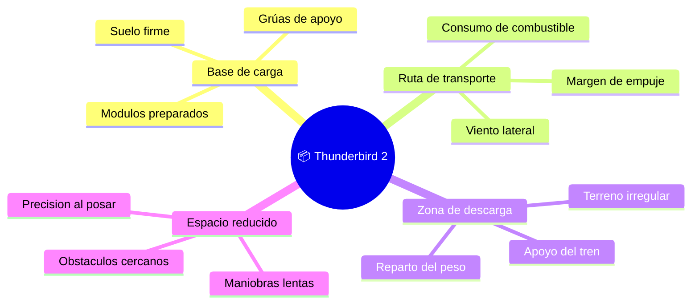

# 🌍 Entornos del Thunderbird 2

[🏠 Inicio](../../../README.md) · [📦 Curso: Thunderbird 2](../README.md) · 🌍 Entornos

> ⚖️ Material educativo original; los derechos de las obras pertenecen a sus titulares.

Dónde opera un transporte pesado modular y cómo cambia su comportamiento según
el entorno. Cada escenario implica reglas físicas distintas, y en simulación se
traduce en condiciones diferentes de terreno, apoyo y espacio de maniobra.

---

## 🗺️ Entornos principales

| Entorno | Características | Riesgos típicos | Ajuste de maniobra |
| --- | --- | --- | --- |
| Base de carga | Suelo firme y equipo de apoyo. | Anclar mal el módulo. | Verificar cierres antes de mover. |
| Ruta de transporte | Vuelo largo con el módulo. | Viento lateral, quedar sin margen. | Vigilar empuje y consumo de combustible. |
| Zona de descarga | Terreno posiblemente irregular. | Hundir un apoyo, volcar. | Repartir peso y elegir suelo firme. |
| Espacio reducido | Obstáculos y poco margen. | Colisiones al maniobrar. | Movimientos lentos y precisos. |

---

## 🌡️ Factores del entorno

- **Terreno**: un suelo blando o inclinado puede hundir un apoyo o desequilibrar
  la carga; hay que elegir donde posarse.
- **Viento**: con un módulo grande el viento lateral empuja más, así que el
  vehículo cargado responde peor a las ráfagas.
- **Espacio**: en una zona estrecha las maniobras deben ser lentas para no
  golpear obstáculos con la carga.
- **Apoyo**: al posarse, el peso pasa al tren de aterrizaje; el suelo debe
  aguantar la carga por cada punto de apoyo.

---

## 🎮 Traducción a simulación

Cada entorno es un escenario con su tipo de terreno, viento y espacio de
maniobra. El paso de una base preparada a una zona de descarga irregular cambia
por completo el reto y es una gran lección de física de carga. Ver cómo se
modela en el
[Módulo 9: Diseño de simulación](../simulacion/diseno-simulador-thunderbird-2.md).

---

[⬅️ Anterior: Principios y operación](principios-thunderbird-2.md) · [➡️ Siguiente: Reglas del universo](../reglamentos/reglas-universo-thunderbird-2.md)
