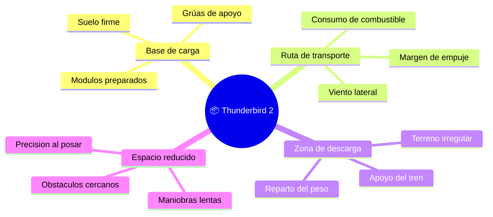

<!-- clase-meta
tipo_documento: clase
clase: 7
codigo: THUNDERBIRD2-07
curso: thunderbird-2
titulo: "Entornos del Thunderbird 2"
modalidad: "análisis de escenarios"
duracion_minutos: 60
nivel: introductorio
prerrequisito: THUNDERBIRD2-06
competencia: "adaptacion_al_entorno"
resultados_aprendizaje:
  - "Explicar entornos, factores ambientales, riesgos y respuesta de simulación con vocabulario propio de Thunderbird 2."
  - "Aplicar esos conceptos a una decisión segura o a un escenario de simulación de Thunderbird 2."
evidencia: "Matriz entorno–cambio–riesgo–respuesta."
criterio_aprobacion: "Cada respuesta se adapta al entorno y distingue riesgos que no son intercambiables entre escenarios."
fuentes: manuales/fuentes.md
ultima_revision: 2026-09-10
-->

# 🌍 Entornos del Thunderbird 2

[🏠 Inicio](../../../README.md) · [📦 Curso: Thunderbird 2](../README.md) · 🌍 Entornos

> ⚖️ Material educativo original; los derechos de las obras pertenecen a sus titulares.

Dónde opera un transporte pesado modular y cómo cambia su comportamiento según
el entorno. Cada escenario implica reglas físicas distintas, y en simulación se
traduce en condiciones diferentes de terreno, apoyo y espacio de maniobra.

---

## 🗺️ Entornos principales

```mermaid
mindmap
  root((📦 Thunderbird 2))
    Base de carga
      Suelo firme
      Grúas de apoyo
      Modulos preparados
    Ruta de transporte
      Viento lateral
      Consumo de combustible
      Margen de empuje
    Zona de descarga
      Terreno irregular
      Apoyo del tren
      Reparto del peso
    Espacio reducido
      Obstaculos cercanos
      Maniobras lentas
      Precision al posar
```

| Entorno | Características | Riesgos típicos | Ajuste de maniobra |
| --- | --- | --- | --- |
| Base de carga | Suelo firme y equipo de apoyo. | Anclar mal el módulo. | Verificar cierres antes de mover. |
| Ruta de transporte | Vuelo largo con el módulo. | Viento lateral, quedar sin margen. | Vigilar empuje y consumo de combustible. |
| Zona de descarga | Terreno posiblemente irregular. | Hundir un apoyo, volcar. | Repartir peso y elegir suelo firme. |
| Espacio reducido | Obstáculos y poco margen. | Colisiones al maniobrar. | Movimientos lentos y precisos. |

---

## 🌡️ Factores del entorno

- **Terreno**: un suelo blando o inclinado puede hundir un apoyo o desequilibrar
  la carga; hay que elegir donde posarse.
- **Viento**: con un módulo grande el viento lateral empuja más, así que el
  vehículo cargado responde peor a las ráfagas.
- **Espacio**: en una zona estrecha las maniobras deben ser lentas para no
  golpear obstáculos con la carga.
- **Apoyo**: al posarse, el peso pasa al tren de aterrizaje; el suelo debe
  aguantar la carga por cada punto de apoyo.

---

## 🎮 Traducción a simulación

Cada entorno es un escenario con su tipo de terreno, viento y espacio de
maniobra. El paso de una base preparada a una zona de descarga irregular cambia
por completo el reto y es una gran lección de física de carga. Ver cómo se
modela en el
[Clase 9: Diseño de simulación](../simulacion/diseno-simulador-thunderbird-2.md).

## 🧭 Guía de estudio aplicada

### Pregunta guía

¿Cómo ayuda **Entornos principales, Factores del entorno, Traducción a simulación y Guía de estudio aplicada** a **adaptar despegue vertical ficticio con módulo pesado de rescate a tres condiciones ambientales distintas**?

### Explicación razonada

El entorno no es decoración: modifica las fuerzas, la percepción y el tiempo disponible. En el caso «despegue vertical ficticio con módulo pesado de rescate», cambia el comportamiento de carga de rescate y aumenta la probabilidad de ignorar cómo la carga modifica control, autonomía y zona de operación. La respuesta correcta empieza por reconocer qué variable cambió y después adaptar límites, ruta o misión.

Esta clase se conecta con el resto del curso mediante **la carga modular cambia masa, centro de gravedad, potencia y misión**. El hilo de
seguridad consiste en reconocer a tiempo **ignorar cómo la carga modifica control, autonomía y zona de operación** y poder justificar la decisión
**recalcular margen y seleccionar zona antes de comprometer el aterrizaje**; en clases posteriores cambiará el ángulo de análisis, no esa relación causal.
La lectura funcional común sigue **energía ficticia → sustentación y propulsión → bahía modular → carga de rescate**, de modo que cada concepto pueda
ubicarse dentro del funcionamiento completo y no quede como un dato aislado.

**Apoyo documental:** [Thunderbirds Vehicles](https://www.thunderbirds.com/) aporta referencia oficial de vehículos de rescate;
[Aviation Handbooks and Manuals](https://www.faa.gov/regulations_policies/handbooks_manuals) se usa para aerodinámica, sistemas y operación. Estas fuentes
se contrastan con el alcance de la clase y no sustituyen un manual de equipo concreto.

### Caso resuelto: de la observación a la decisión

1. **Escenario base:** conserva la misión «despegue vertical ficticio con módulo pesado de rescate» para poder comparar.
2. **Cambiar una condición:** modifica sucesivamente superficie o medio, visibilidad y perturbación externa.
3. **Recalcular margen:** explica cómo cada cambio afecta **carga de rescate** y acerca o aleja **ignorar cómo la carga modifica control, autonomía y zona de operación**.
4. **Adaptar:** cambia límite, ruta, configuración o incluso cancela; no mantengas la misma respuesta por hábito.

### Comprueba tu comprensión

1. ¿Cómo cambiaría **carga de rescate** si empeora la perturbación externa?
2. ¿Qué condición ambiental acerca más el escenario a **ignorar cómo la carga modifica control, autonomía y zona de operación**?
3. ¿Cuándo adaptarías la maniobra y cuándo la cancelarías?

Orientación para revisar tus respuestas

- La primera respuesta debe relacionar el eslabón elegido con un efecto posterior, no solo nombrarlo.
- La segunda debe proponer una señal medible u observable y explicar qué tendencia sería preocupante.
- La tercera debe cambiar al menos una variable de capacidad, mando, entorno o margen de seguridad.

## 🎓 Cierre de clase

- **Actividad:** Contrasta tres entornos de Thunderbird 2 a partir de entornos, factores ambientales, riesgos y respuesta de simulación y determina cómo cambian variables, percepción, riesgos y respuesta.
- **Evidencia:** Matriz entorno–cambio–riesgo–respuesta.
- **Criterio de aprobación:** Cada respuesta se adapta al entorno y distingue riesgos que no son intercambiables entre escenarios.
- **Transferencia:** explica qué cambiaría al pasar a otra variante de esta máquina.

### Fuentes de esta clase

- [THUNDERBIRDS-OFFICIAL](https://www.thunderbirds.com/): Thunderbirds Vehicles, ITV. Uso: referencia oficial de vehículos de rescate.
- [US-FAA-HANDBOOKS](https://www.faa.gov/regulations_policies/handbooks_manuals): Aviation Handbooks and Manuals, FAA. Uso: aerodinámica, sistemas y operación.
- [NASA-FLIGHT](https://www1.grc.nasa.gov/beginners-guide-to-aeronautics/): Beginner's Guide to Aeronautics, NASA. Uso: contraste con física y vuelo reales.

> Las fuentes sostienen el marco conceptual y normativo; esta clase no reemplaza el manual
> del fabricante, la formación certificada ni la habilitación exigida para operar equipos reales.

---

[⬅️ Anterior: Principios y operación](principios-thunderbird-2.md) · [➡️ Siguiente: Reglas del universo](../reglamentos/reglas-universo-thunderbird-2.md)
