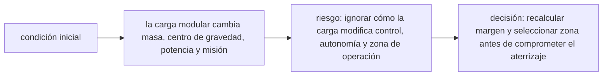

<!-- clase-meta
tipo_documento: clase
clase: 6
codigo: THUNDERBIRD2-06
curso: thunderbird-2
titulo: "Principios y operación del Thunderbird 2"
modalidad: "resolución de problemas"
duracion_minutos: 90
nivel: introductorio
prerrequisito: THUNDERBIRD2-05
competencia: "razonamiento_operacional"
resultados_aprendizaje:
  - "Explicar principios físicos, fases de operación, decisiones y errores frecuentes con vocabulario propio de Thunderbird 2."
  - "Aplicar esos conceptos a una decisión segura o a un escenario de simulación de Thunderbird 2."
evidencia: "Resolución argumentada de un escenario operacional."
criterio_aprobacion: "Aplica los principios correctos, anticipa consecuencias y respeta los límites del curso."
fuentes: manuales/fuentes.md
ultima_revision: 2026-09-10
-->

# 🧪 Principios y operación del Thunderbird 2

[🏠 Inicio](../../../README.md) · [📦 Curso: Thunderbird 2](../README.md) · 🧪 Principios

> ⚖️ Material educativo original; los derechos de las obras pertenecen a sus titulares.

Documento educativo y de divulgación. Aquí está el corazón del curso: la física
de llevar carga y por qué un transporte pesado real no es tan fácil como en las
películas. Explica que si sería posible, que no, y sobre todo por qué.

## La fracción de carga útil

Todo vehículo tiene un peso propio: estructura, motores y combustible. La carga
útil es lo que puede llevar además de eso. La fracción de carga útil compara la
masa aprovechable con el peso total. Cuanto más grande y resistente es el
vehículo, más pesa su propia estructura, y menos fracción queda para carga. Por
eso "hacerlo más grande" no siempre significa "llevar más útil".

## Empuje frente a peso en un vehículo pesado

Para elevar o mover carga hay que vencer el peso. La relación entre el empuje
disponible y el peso total decide si el vehículo puede despegar o acelerar. Con
poca carga sobra empuje; al añadir módulos, el peso crece y el margen se reduce.
Si el peso supera al empuje máximo, el vehículo simplemente no se levanta.

## Centro de masa y estabilidad según el módulo

No basta con que quepa la carga: importa donde va. El centro de masa es el punto
donde se equilibra todo el peso. Un módulo pesado colocado a un lado o muy alto
desplaza ese punto y vuelve el vehículo inestable, propenso a inclinarse o
volcar. Un piloto realista reparte la carga para mantener el centro de masa en
una zona segura antes de moverse.

## El compromiso estructura frente a carga

Aquí está el punto que más cuesta y el más importante. Para sostener más peso se
necesita más estructura, pero esa estructura también pesa y consume parte del
empuje. Reforzar sin límite no hace al vehículo mejor: llega un punto en que
todo el empuje se gasta en mover su propia estructura y no queda margen para
carga útil. El buen diseño busca el equilibrio, no el máximo.

## Que si y que no

| Idea de la ficción | Que si es real | Que no es real |
| --- | --- | --- |
| Carga enorme sin esfuerzo | Se puede llevar mucha carga con diseño | No sin un empuje y estructura proporcionales. |
| Cambio de módulo instantáneo | El módulo intercambiable es real | No es instantáneo: anclar seguro lleva tiempo. |
| Sube vertical siempre lleno | El despegue vertical es posible | No con cualquier carga: gasta muchísimo empuje. |
| Da igual donde va el módulo | La carga se puede colocar | No da igual: el centro de masa manda. |
| Estructura ligera que carga todo | Materiales resistentes existen | No: más carga obliga a más estructura. |
| Autonomía infinita cargado | Se puede tener buen alcance | Más carga y combustible reducen el alcance. |

## Cómo sería una misión de carga realista

- Se calcularía el peso total y el margen de empuje antes de salir.
- Se repartiría la carga para dejar el centro de masa en zona segura.
- El anclaje y la verificación del módulo tomarían su tiempo.
- Ganar tiempo sería cuestión de logística y planificación, no de improvisar.

## Relación con los niveles de realismo

- **Nivel 1 (educativo)**: cargar un módulo y notar que el vehículo pesa más.
- **Nivel 2 (simplificado)**: sumar margen de empuje y centro de masa.
- **Nivel 3 (técnico)**: gestionar fracción de carga útil, estructura y apoyos.

Ver [`docs/03-niveles-de-realismo.md`](../../../docs/03-niveles-de-realismo.md)
para el detalle de cada nivel.

## 🧭 Guía de estudio aplicada

### Pregunta guía

¿Cómo ayuda **La fracción de carga útil, Empuje frente a peso en un vehículo pesado, Centro de masa y estabilidad según el módulo y El compromiso estructura frente a carga** a **resolver despegue vertical ficticio con módulo pesado de rescate sin agotar el margen operacional**?

### Explicación razonada

El principio rector puede resumirse así: la carga modular cambia masa, centro de gravedad, potencia y misión. Esto explica por qué una misma orden produce resultados distintos cuando cambian velocidad, carga, configuración o entorno. Operar bien consiste en leer la tendencia antes de agotar el margen y tomar esta decisión: recalcular margen y seleccionar zona antes de comprometer el aterrizaje.

Esta clase se conecta con el resto del curso mediante **la carga modular cambia masa, centro de gravedad, potencia y misión**. El hilo de
seguridad consiste en reconocer a tiempo **ignorar cómo la carga modifica control, autonomía y zona de operación** y poder justificar la decisión
**recalcular margen y seleccionar zona antes de comprometer el aterrizaje**; en clases posteriores cambiará el ángulo de análisis, no esa relación causal.
La lectura funcional común sigue **energía ficticia → sustentación y propulsión → bahía modular → carga de rescate**, de modo que cada concepto pueda
ubicarse dentro del funcionamiento completo y no quede como un dato aislado.

**Apoyo documental:** [Thunderbirds Vehicles](https://www.thunderbirds.com/) aporta referencia oficial de vehículos de rescate;
[Aviation Handbooks and Manuals](https://www.faa.gov/regulations_policies/handbooks_manuals) se usa para aerodinámica, sistemas y operación. Estas fuentes
se contrastan con el alcance de la clase y no sustituyen un manual de equipo concreto.

### Caso resuelto: de la observación a la decisión

1. **Datos:** reconoce condiciones, configuración y margen disponibles en **despegue vertical ficticio con módulo pesado de rescate**.
2. **Modelo:** aplica **la carga modular cambia masa, centro de gravedad, potencia y misión** para predecir una tendencia antes de actuar.
3. **Riesgo:** explica mediante qué cadena de causas podría ocurrir **ignorar cómo la carga modifica control, autonomía y zona de operación**.
4. **Decisión:** ejecuta mentalmente **recalcular margen y seleccionar zona antes de comprometer el aterrizaje** y define qué observación confirmaría que funcionó.

### Comprueba tu comprensión

1. ¿Qué variable del principio «la carga modular cambia masa, centro de gravedad, potencia y misión» cambia primero en el caso?
2. ¿Cómo se propaga ese cambio hasta **carga de rescate**?
3. ¿Qué evidencia confirmaría que **recalcular margen y seleccionar zona antes de comprometer el aterrizaje** conservó margen operacional?

Orientación para revisar tus respuestas

- La primera respuesta debe relacionar el eslabón elegido con un efecto posterior, no solo nombrarlo.
- La segunda debe proponer una señal medible u observable y explicar qué tendencia sería preocupante.
- La tercera debe cambiar al menos una variable de capacidad, mando, entorno o margen de seguridad.

## 🎓 Cierre de clase

- **Actividad:** Resuelve un escenario de Thunderbird 2 explicando, paso a paso, cómo intervienen principios físicos, fases de operación, decisiones y errores frecuentes.
- **Evidencia:** Resolución argumentada de un escenario operacional.
- **Criterio de aprobación:** Aplica los principios correctos, anticipa consecuencias y respeta los límites del curso.
- **Transferencia:** explica qué cambiaría al pasar a otra variante de esta máquina.

### Fuentes de esta clase

- [THUNDERBIRDS-OFFICIAL](https://www.thunderbirds.com/): Thunderbirds Vehicles, ITV. Uso: referencia oficial de vehículos de rescate.
- [US-FAA-HANDBOOKS](https://www.faa.gov/regulations_policies/handbooks_manuals): Aviation Handbooks and Manuals, FAA. Uso: aerodinámica, sistemas y operación.
- [NASA-FLIGHT](https://www1.grc.nasa.gov/beginners-guide-to-aeronautics/): Beginner's Guide to Aeronautics, NASA. Uso: contraste con física y vuelo reales.

> Las fuentes sostienen el marco conceptual y normativo; esta clase no reemplaza el manual
> del fabricante, la formación certificada ni la habilitación exigida para operar equipos reales.

---

[⬅️ Anterior: Mandos](../mandos/manual-mandos-thunderbird-2.md) · [➡️ Siguiente: Entornos](entornos-thunderbird-2.md)
