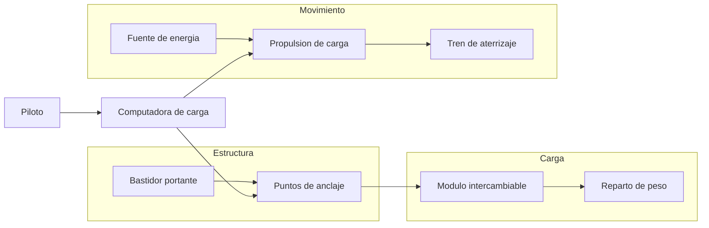

# 🔧 Sistemas mecanicos del Thunderbird 2

[🏠 Inicio](../../../README.md) · [📦 Curso: Thunderbird 2](../README.md) · 🔧 Sistemas mecanicos

> ⚖️ Material educativo original; los derechos de las obras pertenecen a sus titulares.

Este modulo abre el transporte pesado modular por dentro. Compara la tecnologia
imaginaria de la ficcion con la fisica real que la haria funcionar (o que la
desmiente). La regla del curso es clara: describimos conceptos con nuestras
palabras, sin copiar planos ni especificaciones oficiales.

---

## 1. 🏗️ Estructura y bastidor

En la ficcion, el fuselaje parece esbelto y aun asi carga pesos enormes. En la
realidad, sostener mucha masa obliga a un bastidor resistente: vigas, refuerzos
y anclajes que ellos mismos pesan. Cuanto mas grande y cargado es el vehiculo,
mas estructura necesita, y esa estructura resta capacidad de carga util.

| Concepto de ficcion | Fisica real que evoca | Veredicto |
| --- | --- | --- |
| Fuselaje ligero que carga todo | Bastidor resistente al peso | No fisico: mas carga exige mas estructura. |
| Refuerzos invisibles | Vigas y largueros internos | Plausible como idea, pero pesan. |
| Estructura que nunca se deforma | Limite elastico de los materiales | Parcial: todo material tiene un limite. |

---

## 2. 🔗 Sistema de anclaje de modulos

El gran atractivo es el modulo intercambiable: el vehiculo suelta un contenedor
y toma otro. Esto si tiene base real en el contenedor estandar. Lo que no es
real es que el cambio sea instantaneo: anclar y soltar una carga pesada de forma
segura exige cierres firmes, alineacion y verificacion, y eso lleva tiempo.

| Idea de la ficcion | Que dice la fisica real |
| --- | --- |
| Cambio de modulo instantaneo | Anclar carga segura lleva tiempo. |
| Un solo enganche sostiene todo | Se reparten varios anclajes por el peso. |
| El modulo nunca se suelta solo | Sin cierres firmes el peso puede desplazarse. |
| Cualquier modulo encaja igual | Necesita un estandar de medidas y anclaje. |

---

## 3. 🚀 Propulsion para carga pesada

Para mover o elevar mucha masa se necesita un empuje proporcional. En la ficcion
el vehiculo sube cargado sin esfuerzo aparente; en la realidad, el empuje debe
superar el peso total (vehiculo mas estructura mas carga mas combustible). Si la
carga crece, o crece el empuje, o el vehiculo no despega.

| Idea de la ficcion | Que dice la fisica real |
| --- | --- |
| Sube cargado sin esfuerzo | El empuje debe superar el peso total. |
| Mismo motor para cualquier carga | Mas masa exige mas empuje o menos carga. |
| Combustible que no pesa | El combustible es masa que tambien hay que mover. |
| Ascenso vertical siempre facil | Subir recto gasta mucho mas que rodar. |

---

## 4. ⚖️ Reparto de peso y centro de masa

Donde se coloca la carga importa tanto como cuanta carga hay. Un modulo mal
centrado desplaza el centro de masa y desequilibra el vehiculo. En la realidad,
la carga se distribuye para que el centro de masa quede en un punto seguro; en
la ficcion, el vehiculo siempre parece equilibrado sin importar el modulo.

| Sistema | En la ficcion | En la realidad |
| --- | --- | --- |
| Colocacion de la carga | Da igual donde va | Debe centrarse para no desequilibrar. |
| Centro de masa | Siempre estable | Se mueve segun el modulo y su peso. |
| Reaccion al viento o giro | Nula | Un centro alto o desviado vuelca mas facil. |

---

## 5. 🛬 Tren de aterrizaje y apoyo

Al posarse cargado, todo el peso pasa al tren de aterrizaje o a los apoyos. En
la ficcion aguantan cualquier masa sin ceder; en la realidad, el tren debe
dimensionarse para el peso maximo, repartir la carga en el suelo y absorber el
impacto del contacto. Un apoyo insuficiente se hunde o se rompe.

| Elemento | Funcion en la ficcion | Funcion util real |
| --- | --- | --- |
| Patas o ruedas | Aguantan cualquier peso | Dimensionadas al peso maximo del conjunto. |
| Amortiguacion | Contacto siempre suave | Absorbe la energia del aterrizaje cargado. |
| Reparto en el suelo | Ninguno visible | Distribuye el peso para no hundirse. |

---

## 🔁 Como se conecta todo

1. El **bastidor** sostiene el peso y ofrece los puntos de anclaje.
2. El **anclaje** fija el modulo intercambiable de forma segura.
3. La **propulsion** debe generar empuje mayor que el peso total.
4. El **reparto de peso** mantiene el centro de masa en un punto estable.
5. El **tren de aterrizaje** recibe toda la carga al posarse.

Con esto claro, el [Modulo 4: Mandos](../mandos/manual-mandos-thunderbird-2.md)
muestra como el piloto operaria cada sistema.

---

[⬅️ Anterior: Caracteristicas](caracteristicas-thunderbird-2.md) · [➡️ Siguiente: Mandos e instrumentos](../mandos/manual-mandos-thunderbird-2.md)
