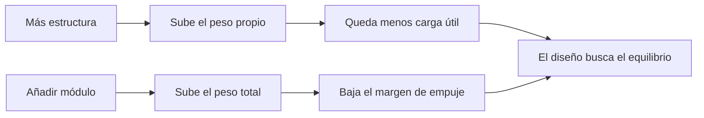

# 🧰 Recursos del Thunderbird 2

[🏠 Inicio](../../../README.md) · [📦 Curso: Thunderbird 2](../README.md) · 🧰 Recursos

> ⚖️ Material educativo original; los derechos de las obras pertenecen a sus titulares.

Glosario específico, enlaces y diagramas de apoyo del curso de transporte
pesado modular. Amplia el [glosario general](../../../docs/05-glosario-general.md).

---

## 📖 Glosario específico

| Término | Definición |
| --- | --- |
| Carga útil | Masa aprovechable que lleva el vehículo además de su peso propio. |
| Fracción de carga útil | Relación entre la masa útil y el peso total del conjunto. |
| Módulo | Contenedor o vaina intercambiable según la misión. |
| Anclaje | Cierre que fija el módulo al bastidor de forma segura. |
| Bastidor | Estructura portante que sostiene el peso y los anclajes. |
| Empuje | Fuerza que impulsa el vehículo; debe superar el peso para elevarlo. |
| Margen de empuje | Diferencia entre el empuje disponible y el peso total. |
| Centro de masa | Punto donde se equilibra todo el peso del conjunto. |
| Reparto de peso | Colocación de la carga para mantener el centro de masa estable. |
| Tren de aterrizaje | Apoyos que reciben el peso del vehículo al posarse. |

---

## 🗺️ Diagrama: peso frente a carga útil

---

## 🔗 Enlaces y fuentes

- Portada del curso: [📦 Curso: Thunderbird 2](../README.md)
- Catálogo de naves de ficción: [🌌 Naves de ficción](../../README.md)
- Glosario general: [📖 docs/05-glosario-general.md](../../../docs/05-glosario-general.md)
- Niveles de realismo: [🎚️ docs/03-niveles-de-realismo.md](../../../docs/03-niveles-de-realismo.md)
- Registro de fuentes: [📚 manuales/fuentes.md](../../../manuales/fuentes.md)

Registrar cada recurso nuevo con su origen y licencia, respetando el aviso de
derechos del catálogo de naves de ficción.

---

[🎓 Portada del curso](../README.md) · [⬅️ Anterior: Diseño de simulación](../simulacion/diseno-simulador-thunderbird-2.md)
