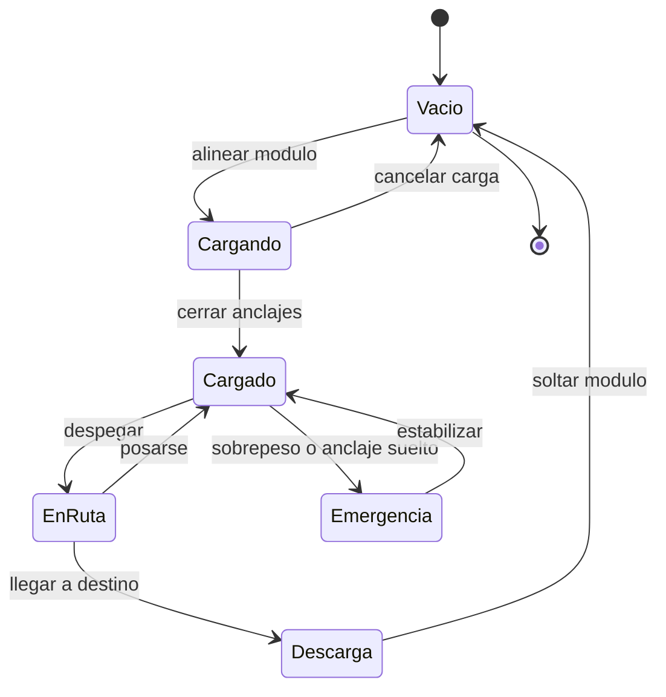

# 🎮 Diseño de simulación del Thunderbird 2

[🏠 Inicio](../../../README.md) · [📦 Curso: Thunderbird 2](../README.md) · 🎮 Simulación

> ⚖️ Material educativo original; los derechos de las obras pertenecen a sus titulares.

Como modelar de forma educativa y divertida un transporte pesado modular. La
idea central es poder alternar entre la versión espectacular de la ficción y la
versión fiel a la física, para que el usuario compare ambas con el mismo
vehículo.

## Objetivo de la simulación

Que el usuario comprenda, jugando, que llevar carga siempre cuesta peso y
empuje, que donde va el módulo cambia el equilibrio, y que la estructura tiene
un límite. El modo ficción sirve para engancharse; el modo ciencia, para
aprender.

## Modo ciencia o ficción

La variable más importante del simulador es el **modo**:

- **Modo ficción**: la carga se cambia al instante, el vehículo sube lleno sin
  esfuerzo y el peso apenas importa. Es divertido y familiar.
- **Modo ciencia**: se aplican el peso total, el margen de empuje, el centro de
  masa y el límite de estructura. Cargar tiene consecuencias reales.

Al cambiar de modo, la interfaz avisa que reglas se activan o desactivan, para
que la comparación sea explícita y educativa.

## Variables principales

| Variable | Tipo | Rango | Afecta a | Comentarios |
| --- | --- | --- | --- | --- |
| Modo | discreta | ciencia / ficción | Todas las reglas | Interruptor central del aprendizaje. |
| Peso total | numérica | vacío + carga | Empuje necesario | Suma vehículo, estructura y módulo. |
| Margen de empuje | numérica | negativo a alto | Despegue | Si es negativo, no se levanta. |
| Centro de masa | numérica | zona segura o no | Estabilidad | En ficción puede ignorarse. |
| Masa del módulo | numérica | 0-maxima | Peso y equilibrio | Cada módulo pesa distinto. |
| Estado de anclajes | discreta | suelto / firme | Seguridad de la carga | Sin firmes no se mueve carga. |
| Combustible | numérica | 0-100% | Peso y alcance | Es masa que también se mueve. |
| Terreno de apoyo | numérica | blando a firme | Aterrizaje | Un suelo blando hunde un apoyo. |

## Ciclo básico

1. Leer entrada del usuario (empuje, rumbo, anclar, soltar).
2. Comprobar el modo activo (ciencia o ficción).
3. Calcular el peso total y el margen de empuje.
4. Aplicar reglas del modo: en ciencia, vigilar centro de masa y estructura.
5. Aplicar el entorno: terreno, viento y espacio de maniobra.
6. Actualizar posición, altura y equilibrio del vehículo.
7. Refrescar instrumentos (peso, margen de empuje, centro de masa, anclajes).

## Modos de juego futuros

- Tutorial de carga: aprender que el vehículo pesa más con el módulo.
- Reto de equilibrio: colocar el módulo para centrar la masa.
- Comparador lado a lado: misma misión en modo ciencia y en modo ficción.
- Gestión de combustible en una ruta larga con carga pesada.
- Escenario de descarga en terreno irregular con apoyos limitados.

## Elementos fuera de alcance

- Presentar la versión de ficción como si fuera física real sin avisarlo.
- Cifras de carga presentadas como datos técnicos oficiales.
- Cualquier contenido que confunda espectáculo con ciencia sin distinguirlos.

## Pendientes

- [ ] Definir valores por defecto de cada variable por tipo de portador.
- [ ] Prototipar el ciclo básico con cálculo de margen de empuje.
- [ ] Ajustar el efecto del centro de masa en la estabilidad.
- [ ] Agregar fuentes de divulgación a [`manuales/fuentes.md`](../../../manuales/fuentes.md).

---

[⬅️ Anterior: Reglas del universo](../reglamentos/reglas-universo-thunderbird-2.md) · [➡️ Siguiente: Recursos](../recursos/recursos-thunderbird-2.md)
