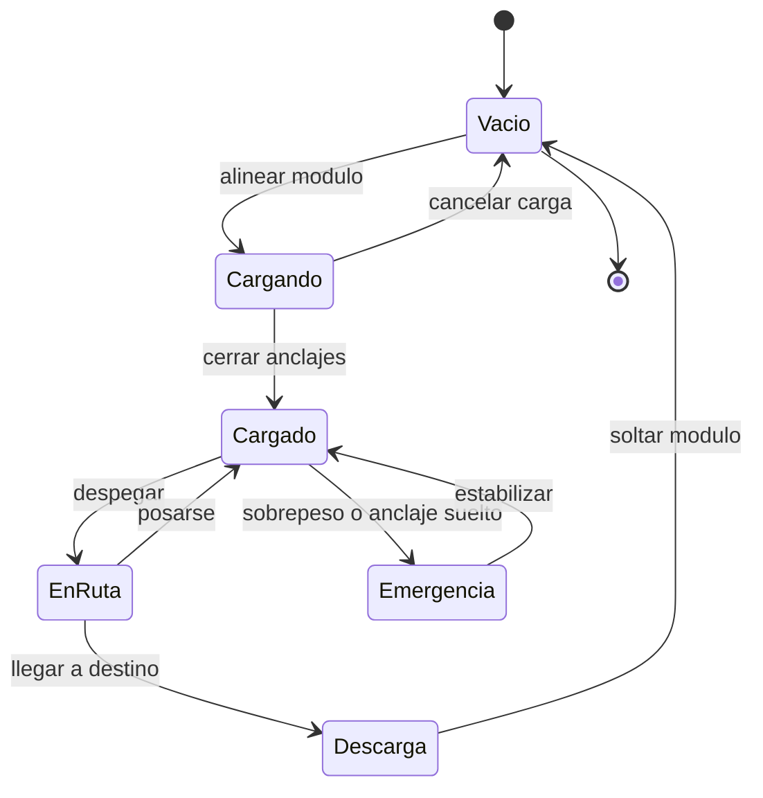

# 🎮 Diseno de simulacion del Thunderbird 2

[🏠 Inicio](../../../README.md) · [📦 Curso: Thunderbird 2](../README.md) · 🎮 Simulacion

> ⚖️ Material educativo original; los derechos de las obras pertenecen a sus titulares.

Como modelar de forma educativa y divertida un transporte pesado modular. La
idea central es poder alternar entre la version espectacular de la ficcion y la
version fiel a la fisica, para que el usuario compare ambas con el mismo
vehiculo.

## Objetivo de la simulacion

Que el usuario comprenda, jugando, que llevar carga siempre cuesta peso y
empuje, que donde va el modulo cambia el equilibrio, y que la estructura tiene
un limite. El modo ficcion sirve para engancharse; el modo ciencia, para
aprender.

## Modo ciencia o ficcion

La variable mas importante del simulador es el **modo**:

- **Modo ficcion**: la carga se cambia al instante, el vehiculo sube lleno sin
  esfuerzo y el peso apenas importa. Es divertido y familiar.
- **Modo ciencia**: se aplican el peso total, el margen de empuje, el centro de
  masa y el limite de estructura. Cargar tiene consecuencias reales.

Al cambiar de modo, la interfaz avisa que reglas se activan o desactivan, para
que la comparacion sea explicita y educativa.

## Variables principales

| Variable | Tipo | Rango | Afecta a | Comentarios |
| --- | --- | --- | --- | --- |
| Modo | discreta | ciencia / ficcion | Todas las reglas | Interruptor central del aprendizaje. |
| Peso total | numerica | vacio + carga | Empuje necesario | Suma vehiculo, estructura y modulo. |
| Margen de empuje | numerica | negativo a alto | Despegue | Si es negativo, no se levanta. |
| Centro de masa | numerica | zona segura o no | Estabilidad | En ficcion puede ignorarse. |
| Masa del modulo | numerica | 0-maxima | Peso y equilibrio | Cada modulo pesa distinto. |
| Estado de anclajes | discreta | suelto / firme | Seguridad de la carga | Sin firmes no se mueve carga. |
| Combustible | numerica | 0-100% | Peso y alcance | Es masa que tambien se mueve. |
| Terreno de apoyo | numerica | blando a firme | Aterrizaje | Un suelo blando hunde un apoyo. |

## Ciclo basico

1. Leer entrada del usuario (empuje, rumbo, anclar, soltar).
2. Comprobar el modo activo (ciencia o ficcion).
3. Calcular el peso total y el margen de empuje.
4. Aplicar reglas del modo: en ciencia, vigilar centro de masa y estructura.
5. Aplicar el entorno: terreno, viento y espacio de maniobra.
6. Actualizar posicion, altura y equilibrio del vehiculo.
7. Refrescar instrumentos (peso, margen de empuje, centro de masa, anclajes).

## Modos de juego futuros

- Tutorial de carga: aprender que el vehiculo pesa mas con el modulo.
- Reto de equilibrio: colocar el modulo para centrar la masa.
- Comparador lado a lado: misma mision en modo ciencia y en modo ficcion.
- Gestion de combustible en una ruta larga con carga pesada.
- Escenario de descarga en terreno irregular con apoyos limitados.

## Elementos fuera de alcance

- Presentar la version de ficcion como si fuera fisica real sin avisarlo.
- Cifras de carga presentadas como datos tecnicos oficiales.
- Cualquier contenido que confunda espectaculo con ciencia sin distinguirlos.

## Pendientes

- [ ] Definir valores por defecto de cada variable por tipo de portador.
- [ ] Prototipar el ciclo basico con calculo de margen de empuje.
- [ ] Ajustar el efecto del centro de masa en la estabilidad.
- [ ] Agregar fuentes de divulgacion a [`manuales/fuentes.md`](../../../manuales/fuentes.md).

---

[⬅️ Anterior: Reglas del universo](../reglamentos/reglas-universo-thunderbird-2.md) · [➡️ Siguiente: Recursos](../recursos/recursos-thunderbird-2.md)
