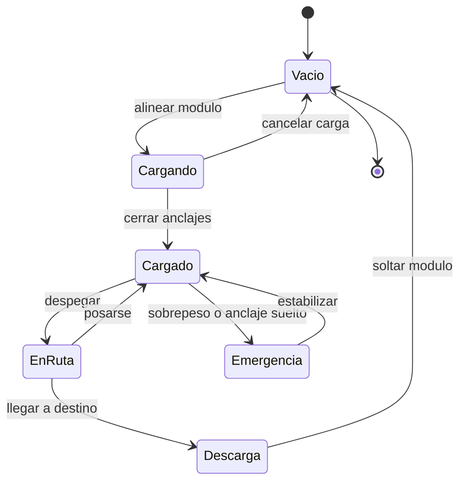
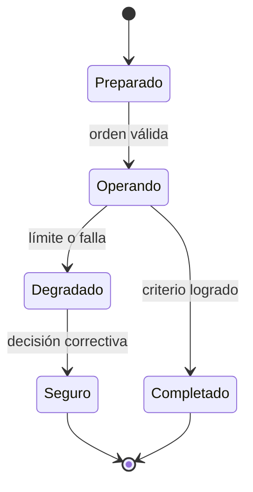

<!-- clase-meta
tipo_documento: clase
clase: 9
codigo: THUNDERBIRD2-09
curso: thunderbird-2
titulo: "Diseño de simulación del Thunderbird 2"
modalidad: "laboratorio de diseño"
duracion_minutos: 90
nivel: introductorio
prerrequisito: THUNDERBIRD2-08
competencia: "modelado_de_simulacion"
resultados_aprendizaje:
  - "Explicar objetivo, variables, estados, ciclo y escenarios de simulación con vocabulario propio de Thunderbird 2."
  - "Aplicar esos conceptos a una decisión segura o a un escenario de simulación de Thunderbird 2."
evidencia: "Ficha de escenario y diagrama de estados."
criterio_aprobacion: "El modelo es específico de la máquina, medible, seguro y trazable a clases anteriores."
fuentes: manuales/fuentes.md
ultima_revision: 2026-09-10
-->

# 🎮 Diseño de simulación del Thunderbird 2

[🏠 Inicio](../../../README.md) · [📦 Curso: Thunderbird 2](../README.md) · 🎮 Simulación

> ⚖️ Material educativo original; los derechos de las obras pertenecen a sus titulares.

Como modelar de forma educativa y divertida un transporte pesado modular. La
idea central es poder alternar entre la versión espectacular de la ficción y la
versión fiel a la física, para que el usuario compare ambas con el mismo
vehículo.

```mermaid
stateDiagram-v2
    [*] --> Vacio
    Vacio --> Cargando: alinear modulo
    Cargando --> Cargado: cerrar anclajes
    Cargando --> Vacio: cancelar carga
    Cargado --> EnRuta: despegar
    EnRuta --> Cargado: posarse
    EnRuta --> Descarga: llegar a destino
    Descarga --> Vacio: soltar modulo
    Cargado --> Emergencia: sobrepeso o anclaje suelto
    Emergencia --> Cargado: estabilizar
    Vacio --> [*]
```

## Objetivo de la simulación

Que el usuario comprenda, jugando, que llevar carga siempre cuesta peso y
empuje, que donde va el módulo cambia el equilibrio, y que la estructura tiene
un límite. El modo ficción sirve para engancharse; el modo ciencia, para
aprender.

## Modo ciencia o ficción

La variable más importante del simulador es el **modo**:

- **Modo ficción**: la carga se cambia al instante, el vehículo sube lleno sin
  esfuerzo y el peso apenas importa. Es divertido y familiar.
- **Modo ciencia**: se aplican el peso total, el margen de empuje, el centro de
  masa y el límite de estructura. Cargar tiene consecuencias reales.

Al cambiar de modo, la interfaz avisa que reglas se activan o desactivan, para
que la comparación sea explícita y educativa.

## Variables principales

| Variable | Tipo | Rango | Afecta a | Comentarios |
| --- | --- | --- | --- | --- |
| Modo | discreta | ciencia / ficción | Todas las reglas | Interruptor central del aprendizaje. |
| Peso total | numérica | vacío + carga | Empuje necesario | Suma vehículo, estructura y módulo. |
| Margen de empuje | numérica | negativo a alto | Despegue | Si es negativo, no se levanta. |
| Centro de masa | numérica | zona segura o no | Estabilidad | En ficción puede ignorarse. |
| Masa del módulo | numérica | 0-maxima | Peso y equilibrio | Cada módulo pesa distinto. |
| Estado de anclajes | discreta | suelto / firme | Seguridad de la carga | Sin firmes no se mueve carga. |
| Combustible | numérica | 0-100% | Peso y alcance | Es masa que también se mueve. |
| Terreno de apoyo | numérica | blando a firme | Aterrizaje | Un suelo blando hunde un apoyo. |

## Ciclo básico

1. Leer entrada del usuario (empuje, rumbo, anclar, soltar).
2. Comprobar el modo activo (ciencia o ficción).
3. Calcular el peso total y el margen de empuje.
4. Aplicar reglas del modo: en ciencia, vigilar centro de masa y estructura.
5. Aplicar el entorno: terreno, viento y espacio de maniobra.
6. Actualizar posición, altura y equilibrio del vehículo.
7. Refrescar instrumentos (peso, margen de empuje, centro de masa, anclajes).

## Modos de juego futuros

- Tutorial de carga: aprender que el vehículo pesa más con el módulo.
- Reto de equilibrio: colocar el módulo para centrar la masa.
- Comparador lado a lado: misma misión en modo ciencia y en modo ficción.
- Gestión de combustible en una ruta larga con carga pesada.
- Escenario de descarga en terreno irregular con apoyos limitados.

## Elementos fuera de alcance

- Presentar la versión de ficción como si fuera física real sin avisarlo.
- Cifras de carga presentadas como datos técnicos oficiales.
- Cualquier contenido que confunda espectáculo con ciencia sin distinguirlos.

## Pendientes

- [ ] Definir valores por defecto de cada variable por tipo de portador.
- [ ] Prototipar el ciclo básico con cálculo de margen de empuje.
- [ ] Ajustar el efecto del centro de masa en la estabilidad.
- [ ] Agregar fuentes de divulgación a [`manuales/fuentes.md`](../../../manuales/fuentes.md).

## 🧭 Guía de estudio aplicada

### Pregunta guía

¿Cómo ayuda **Objetivo de la simulación, Modo ciencia o ficción, Variables principales y Ciclo básico** a **modelar despegue vertical ficticio con módulo pesado de rescate como estados, variables y decisiones observables**?

### Explicación razonada

Una simulación de Thunderbird 2 es educativa si representa decisiones y consecuencias. Como mínimo debe modelar el estado de energía ficticia, la respuesta de sustentación y propulsión, la transición en bahía modular y el resultado en carga de rescate. El escenario «despegue vertical ficticio con módulo pesado de rescate» es valioso porque obliga a observar, formular una hipótesis, actuar y comprobar.

```mermaid
stateDiagram-v2
    [*] --> Preparado
    Preparado --> Operando: orden válida
    Operando --> Degradado: límite o falla
    Degradado --> Seguro: decisión correctiva
    Operando --> Completado: criterio logrado
    Seguro --> [*]
    Completado --> [*]
```

Esta clase se conecta con el resto del curso mediante **la carga modular cambia masa, centro de gravedad, potencia y misión**. El hilo de
seguridad consiste en reconocer a tiempo **ignorar cómo la carga modifica control, autonomía y zona de operación** y poder justificar la decisión
**recalcular margen y seleccionar zona antes de comprometer el aterrizaje**; en clases posteriores cambiará el ángulo de análisis, no esa relación causal.
La lectura funcional común sigue **energía ficticia → sustentación y propulsión → bahía modular → carga de rescate**, de modo que cada concepto pueda
ubicarse dentro del funcionamiento completo y no quede como un dato aislado.

**Apoyo documental:** [Thunderbirds Vehicles](https://www.thunderbirds.com/) aporta referencia oficial de vehículos de rescate;
[Aviation Handbooks and Manuals](https://www.faa.gov/regulations_policies/handbooks_manuals) se usa para aerodinámica, sistemas y operación. Estas fuentes
se contrastan con el alcance de la clase y no sustituyen un manual de equipo concreto.

### Caso resuelto: de la observación a la decisión

1. **Estado inicial:** representa despegue vertical ficticio con módulo pesado de rescate con valores observables para **energía ficticia**, **sustentación y propulsión**, **bahía modular** y **carga de rescate**.
2. **Decisión del estudiante:** ofrece una elección que cambie el estado, no una animación automática.
3. **Consecuencia:** modela la tendencia hacia **ignorar cómo la carga modifica control, autonomía y zona de operación** y una señal previa que permita corregir.
4. **Cierre:** evalúa la explicación de la decisión, además de si el estudiante “ganó” el escenario.

### Comprueba tu comprensión

1. ¿Qué cuatro estados mínimos necesita el escenario «despegue vertical ficticio con módulo pesado de rescate»?
2. ¿Qué variable anticipa **ignorar cómo la carga modifica control, autonomía y zona de operación** antes de llegar al estado de falla?
3. ¿Cómo evaluarías la explicación del estudiante y no solo el resultado final?

Orientación para revisar tus respuestas

- La primera respuesta debe relacionar el eslabón elegido con un efecto posterior, no solo nombrarlo.
- La segunda debe proponer una señal medible u observable y explicar qué tendencia sería preocupante.
- La tercera debe cambiar al menos una variable de capacidad, mando, entorno o margen de seguridad.

## 🎓 Cierre de clase

- **Actividad:** Diseña un escenario educativo de Thunderbird 2 basado en objetivo, variables, estados, ciclo y escenarios de simulación, con entradas, estados, variables y criterio de cierre.
- **Evidencia:** Ficha de escenario y diagrama de estados.
- **Criterio de aprobación:** El modelo es específico de la máquina, medible, seguro y trazable a clases anteriores.
- **Transferencia:** explica qué cambiaría al pasar a otra variante de esta máquina.

### Fuentes de esta clase

- [THUNDERBIRDS-OFFICIAL](https://www.thunderbirds.com/): Thunderbirds Vehicles, ITV. Uso: referencia oficial de vehículos de rescate.
- [US-FAA-HANDBOOKS](https://www.faa.gov/regulations_policies/handbooks_manuals): Aviation Handbooks and Manuals, FAA. Uso: aerodinámica, sistemas y operación.
- [NASA-FLIGHT](https://www1.grc.nasa.gov/beginners-guide-to-aeronautics/): Beginner's Guide to Aeronautics, NASA. Uso: contraste con física y vuelo reales.

> Las fuentes sostienen el marco conceptual y normativo; esta clase no reemplaza el manual
> del fabricante, la formación certificada ni la habilitación exigida para operar equipos reales.

---

[⬅️ Anterior: Reglas del universo](../reglamentos/reglas-universo-thunderbird-2.md) · [➡️ Siguiente: Recursos](../recursos/recursos-thunderbird-2.md)
