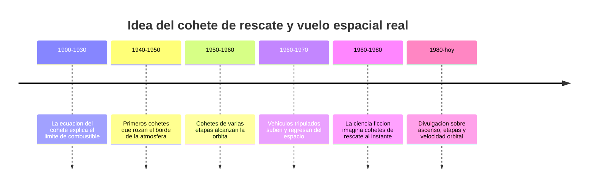

# 📜 Historia del Thunderbird 3

[🏠 Inicio](../../../README.md) · [🚀 Curso: Thunderbird 3](../README.md) · 📜 Historia

> ⚖️ Material educativo original; los derechos de las obras pertenecen a sus titulares.

Este módulo situa la idea del cohete de rescate dentro de la ciencia ficción y la
compara con la historia real del vuelo espacial. No describe una nave oficial:
analiza el concepto genérico de "cohete de rescate" que evoca el estilo
"Thunderbirds" y lo contrasta con lo que la ingeniería sabe hacer de verdad.

## De donde viene la idea

El cohete de rescate de la ficción toma prestada una fantasía muy humana: poder
despegar en segundos, llegar donde haga falta y volver como si nada. Es una
imagen emocionante porque asociamos el cohete con la potencia y la urgencia. El
problema es que subir al espacio y quedarse allí es mucho más exigente de lo que
sugiere el relato, y ahí empieza lo interesante de este curso.

## Lo real frente a lo imaginado

La historia real del vuelo espacial siguió otro camino. Los cohetes que salieron
de la atmósfera no subieron en línea recta ni volvieron al instante: gastaron
enormes cantidades de propelente, se inclinaron poco a poco hacia la horizontal
y soltaron partes vacías para no cargar peso muerto. Alcanzar la órbita fue,
sobre todo, un problema de velocidad y de masa de combustible.

| Periodo | Hito de referencia | Importancia para el curso |
| --- | --- | --- |
| 1900-1930 | Formulación de la ecuación del cohete | Explica por  qué el combustible crece de forma exponencial. |
| 1940-1950 | Cohetes que rozan el borde atmosférico | Muestra que subir alto no es orbitar. |
| 1950-1960 | Cohetes de varias etapas en órbita | Confirma la ventaja de soltar masa vacía. |
| 1960-1970 | Vuelos tripulados de ida y vuelta | Base real de un vehículo de rescate. |
| 1960-1980 | Auge del cohete de rescate en pantalla | Fija la imagen popular del despegue instantáneo. |
| 1980-hoy | Divulgación de mecánica del ascenso | Separa el espectáculo de la realidad. |

## Por  qué la ficción eligió el despegue heroico

Contar una historia de rescate con un cohete listo al instante es fácil de
seguir: hay urgencia, cuenta atrás y una salida espectacular. Un ascenso real
dura varios minutos, exige inclinar la trayectoria y consume la mayor parte de la
masa del vehículo en combustible. La ficción prioriza la emoción sobre la física,
y eso es una decisión artística legítima que este curso respeta y analiza.

## Que aprenderemos de todo esto

- Que conceptos de física real evoca el cohete aunque los exagere.
- Que licencias creativas rompen las leyes de Newton y por  qué.
- Cómo sería un cohete de rescate si tuviera que obedecer la física de verdad.

## Fuentes

- Registrar aquí las fuentes públicas de divulgación consultadas.
- Enlazar cada fuente también en [`manuales/fuentes.md`](../../../manuales/fuentes.md).

---

[🎓 Portada del curso](../README.md) · [➡️ Siguiente: Características](../operacion/caracteristicas-thunderbird-3.md)
