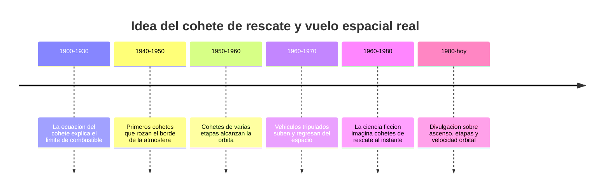

# 📜 Historia del Thunderbird 3

[🏠 Inicio](../../../README.md) · [🚀 Curso: Thunderbird 3](../README.md) · 📜 Historia

> ⚖️ Material educativo original; los derechos de las obras pertenecen a sus titulares.

Este modulo situa la idea del cohete de rescate dentro de la ciencia ficcion y la
compara con la historia real del vuelo espacial. No describe una nave oficial:
analiza el concepto generico de "cohete de rescate" que evoca el estilo
"Thunderbirds" y lo contrasta con lo que la ingenieria sabe hacer de verdad.

## De donde viene la idea

El cohete de rescate de la ficcion toma prestada una fantasia muy humana: poder
despegar en segundos, llegar donde haga falta y volver como si nada. Es una
imagen emocionante porque asociamos el cohete con la potencia y la urgencia. El
problema es que subir al espacio y quedarse alli es mucho mas exigente de lo que
sugiere el relato, y ahi empieza lo interesante de este curso.

## Lo real frente a lo imaginado

La historia real del vuelo espacial siguio otro camino. Los cohetes que salieron
de la atmosfera no subieron en linea recta ni volvieron al instante: gastaron
enormes cantidades de propelente, se inclinaron poco a poco hacia la horizontal
y soltaron partes vacias para no cargar peso muerto. Alcanzar la orbita fue,
sobre todo, un problema de velocidad y de masa de combustible.

| Periodo | Hito de referencia | Importancia para el curso |
| --- | --- | --- |
| 1900-1930 | Formulacion de la ecuacion del cohete | Explica por que el combustible crece de forma exponencial. |
| 1940-1950 | Cohetes que rozan el borde atmosferico | Muestra que subir alto no es orbitar. |
| 1950-1960 | Cohetes de varias etapas en orbita | Confirma la ventaja de soltar masa vacia. |
| 1960-1970 | Vuelos tripulados de ida y vuelta | Base real de un vehiculo de rescate. |
| 1960-1980 | Auge del cohete de rescate en pantalla | Fija la imagen popular del despegue instantaneo. |
| 1980-hoy | Divulgacion de mecanica del ascenso | Separa el espectaculo de la realidad. |

## Por que la ficcion eligio el despegue heroico

Contar una historia de rescate con un cohete listo al instante es facil de
seguir: hay urgencia, cuenta atras y una salida espectacular. Un ascenso real
dura varios minutos, exige inclinar la trayectoria y consume la mayor parte de la
masa del vehiculo en combustible. La ficcion prioriza la emocion sobre la fisica,
y eso es una decision artistica legitima que este curso respeta y analiza.

## Que aprenderemos de todo esto

- Que conceptos de fisica real evoca el cohete aunque los exagere.
- Que licencias creativas rompen las leyes de Newton y por que.
- Como seria un cohete de rescate si tuviera que obedecer la fisica de verdad.

## Fuentes

- Registrar aqui las fuentes publicas de divulgacion consultadas.
- Enlazar cada fuente tambien en [`manuales/fuentes.md`](../../../manuales/fuentes.md).

---

[🎓 Portada del curso](../README.md) · [➡️ Siguiente: Caracteristicas](../operacion/caracteristicas-thunderbird-3.md)
