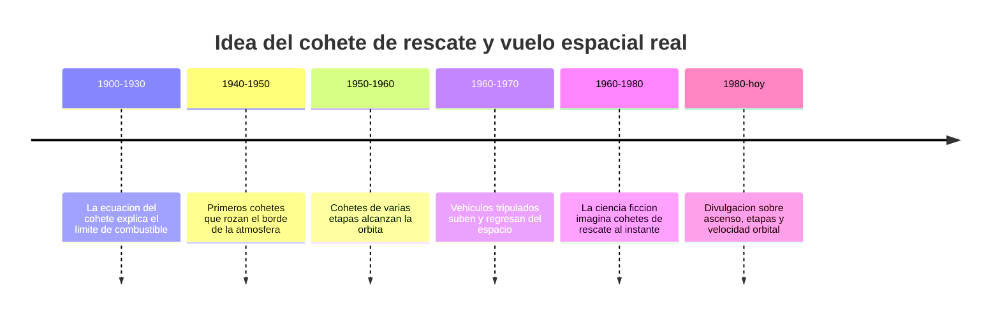

<!-- clase-meta
tipo_documento: clase
clase: 1
codigo: THUNDERBIRD3-01
curso: thunderbird-3
titulo: "Historia del Thunderbird 3"
modalidad: "teórica dialogada"
duracion_minutos: 45
nivel: introductorio
prerrequisito: ninguno
competencia: "contexto_historico"
resultados_aprendizaje:
  - "Explicar origen, evolución tecnológica, variantes representativas e impacto con vocabulario propio de Thunderbird 3."
  - "Aplicar esos conceptos a una decisión segura o a un escenario de simulación de Thunderbird 3."
evidencia: "Línea de tiempo comentada con cuatro hitos o más."
criterio_aprobacion: "Los hitos están ordenados, son pertinentes y dos relaciones de causa y efecto quedan justificadas."
fuentes: manuales/fuentes.md
ultima_revision: 2026-09-10
-->

# 📜 Historia del Thunderbird 3

[🏠 Inicio](../../../README.md) · [🚀 Curso: Thunderbird 3](../README.md) · 📜 Historia

> ⚖️ Material educativo original; los derechos de las obras pertenecen a sus titulares.

Esta clase situa la idea del cohete de rescate dentro de la ciencia ficción y la
compara con la historia real del vuelo espacial. No describe una nave oficial:
analiza el concepto genérico de "cohete de rescate" que evoca el estilo
"Thunderbirds" y lo contrasta con lo que la ingeniería sabe hacer de verdad.

```mermaid
timeline
    title Idea del cohete de rescate y vuelo espacial real
    1900-1930 : La ecuacion del cohete explica el limite de combustible
    1940-1950 : Primeros cohetes que rozan el borde de la atmosfera
    1950-1960 : Cohetes de varias etapas alcanzan la orbita
    1960-1970 : Vehiculos tripulados suben y regresan del espacio
    1960-1980 : La ciencia ficcion imagina cohetes de rescate al instante
    1980-hoy : Divulgacion sobre ascenso, etapas y velocidad orbital
```

## De donde viene la idea

El cohete de rescate de la ficción toma prestada una fantasía muy humana: poder
despegar en segundos, llegar donde haga falta y volver como si nada. Es una
imagen emocionante porque asociamos el cohete con la potencia y la urgencia. El
problema es que subir al espacio y quedarse allí es mucho más exigente de lo que
sugiere el relato, y ahí empieza lo interesante de este curso.

## Lo real frente a lo imaginado

La historia real del vuelo espacial siguió otro camino. Los cohetes que salieron
de la atmósfera no subieron en línea recta ni volvieron al instante: gastaron
enormes cantidades de propelente, se inclinaron poco a poco hacia la horizontal
y soltaron partes vacías para no cargar peso muerto. Alcanzar la órbita fue,
sobre todo, un problema de velocidad y de masa de combustible.

| Periodo | Hito de referencia | Importancia para el curso |
| --- | --- | --- |
| 1900-1930 | Formulación de la ecuación del cohete | Explica por qué el combustible crece de forma exponencial. |
| 1940-1950 | Cohetes que rozan el borde atmosférico | Muestra que subir alto no es orbitar. |
| 1950-1960 | Cohetes de varias etapas en órbita | Confirma la ventaja de soltar masa vacía. |
| 1960-1970 | Vuelos tripulados de ida y vuelta | Base real de un vehículo de rescate. |
| 1960-1980 | Auge del cohete de rescate en pantalla | Fija la imagen popular del despegue instantáneo. |
| 1980-hoy | Divulgación de mecánica del ascenso | Separa el espectáculo de la realidad. |

## Por qué la ficción eligió el despegue heroico

Contar una historia de rescate con un cohete listo al instante es fácil de
seguir: hay urgencia, cuenta atrás y una salida espectacular. Un ascenso real
dura varios minutos, exige inclinar la trayectoria y consume la mayor parte de la
masa del vehículo en combustible. La ficción prioriza la emoción sobre la física,
y eso es una decisión artística legítima que este curso respeta y analiza.

## Que aprenderemos de todo esto

- Que conceptos de física real evoca el cohete aunque los exagere.
- Que licencias creativas rompen las leyes de Newton y por qué.
- Cómo sería un cohete de rescate si tuviera que obedecer la física de verdad.

## Fuentes

- Registrar aquí las fuentes públicas de divulgación consultadas.
- Enlazar cada fuente también en [`manuales/fuentes.md`](../../../manuales/fuentes.md).

## 🧭 Guía de estudio aplicada

### Pregunta guía

¿Cómo ayuda **De donde viene la idea, Lo real frente a lo imaginado, Por qué la ficción eligió el despegue heroico y Que aprenderemos de todo esto** a **explicar cómo la evolución hizo posibles alternativas como ascenso atmosférico frente a encuentro orbital**?

### Explicación razonada

La evolución de Thunderbird 3 se comprende mejor como una sucesión de respuestas a problemas, no como una lista de fechas. Los cambios en propelentes ficticios, motores, guiado y trayectoria espacial alteraron qué podía hacer la máquina, quién podía usarla y qué riesgos debían controlarse. El contraste «ascenso atmosférico frente a encuentro orbital» permite observar qué decisiones de diseño permanecieron y cuáles cambiaron con la tecnología y el propósito.

Esta clase se conecta con el resto del curso mediante **una misión de rescate espacial une lanzamiento, encuentro y reserva para retorno**. El hilo de
seguridad consiste en reconocer a tiempo **consumir la reserva durante la aproximación y perder capacidad de regreso** y poder justificar la decisión
**presupuestar combustible y criterios de aborto para cada fase**; en clases posteriores cambiará el ángulo de análisis, no esa relación causal.
La lectura funcional común sigue **propelentes ficticios → motores → guiado → trayectoria espacial**, de modo que cada concepto pueda
ubicarse dentro del funcionamiento completo y no quede como un dato aislado.

**Apoyo documental:** [Thunderbirds Vehicles](https://www.thunderbirds.com/) aporta referencia oficial de vehículos de rescate;
[Rockets Educator Guide](https://www.nasa.gov/wp-content/uploads/2012/07/rockets-educator-guide-20.pdf) se usa para propulsión, estabilidad y trayectoria. Estas fuentes
se contrastan con el alcance de la clase y no sustituyen un manual de equipo concreto.

### Caso resuelto: de la observación a la decisión

1. **Situar:** ordena los hitos que explican cómo se llegó a **ascenso atmosférico frente a encuentro orbital** y describe la necesidad que impulsó cada cambio.
2. **Relacionar:** explica qué se modificó en **propelentes ficticios**, **motores**, **guiado** o **trayectoria espacial**; una fecha sin mecanismo no basta.
3. **Interpretar:** vincula el cambio con una capacidad nueva y también con el riesgo **consumir la reserva durante la aproximación y perder capacidad de regreso**.
4. **Transferir:** usa la evolución para justificar por qué hoy conviene **presupuestar combustible y criterios de aborto para cada fase**.

### Comprueba tu comprensión

1. ¿Qué necesidad histórica impulsó un cambio en **propelentes ficticios** o **motores**?
2. ¿Qué hito modificó la relación entre capacidad y **consumir la reserva durante la aproximación y perder capacidad de regreso**?
3. ¿Por qué **ascenso atmosférico frente a encuentro orbital** no puede explicarse como una simple diferencia estética?

Orientación para revisar tus respuestas

- La primera respuesta debe relacionar el eslabón elegido con un efecto posterior, no solo nombrarlo.
- La segunda debe proponer una señal medible u observable y explicar qué tendencia sería preocupante.
- La tercera debe cambiar al menos una variable de capacidad, mando, entorno o margen de seguridad.

## 🎓 Cierre de clase

- **Actividad:** Construye una línea de tiempo de Thunderbird 3 y explica cómo dos cambios históricos transformaron su función o su puesto de mando.
- **Evidencia:** Línea de tiempo comentada con cuatro hitos o más.
- **Criterio de aprobación:** Los hitos están ordenados, son pertinentes y dos relaciones de causa y efecto quedan justificadas.
- **Transferencia:** explica qué cambiaría al pasar a otra variante de esta máquina.

### Fuentes de esta clase

- [THUNDERBIRDS-OFFICIAL](https://www.thunderbirds.com/): Thunderbirds Vehicles, ITV. Uso: referencia oficial de vehículos de rescate.
- [NASA-ROCKETS](https://www.nasa.gov/wp-content/uploads/2012/07/rockets-educator-guide-20.pdf): Rockets Educator Guide, NASA. Uso: propulsión, estabilidad y trayectoria.
- [NASA-FLIGHT](https://www1.grc.nasa.gov/beginners-guide-to-aeronautics/): Beginner's Guide to Aeronautics, NASA. Uso: contraste con física y vuelo reales.

> Las fuentes sostienen el marco conceptual y normativo; esta clase no reemplaza el manual
> del fabricante, la formación certificada ni la habilitación exigida para operar equipos reales.

---

[🎓 Portada del curso](../README.md) · [➡️ Siguiente: Características](../operacion/caracteristicas-thunderbird-3.md)
