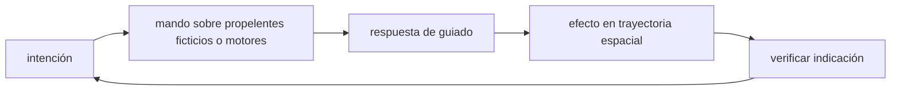

<!-- clase-meta
tipo_documento: clase
clase: 5
codigo: THUNDERBIRD3-05
curso: thunderbird-3
titulo: "Mandos e instrumentos del Thunderbird 3"
modalidad: "taller de simulación"
duracion_minutos: 60
nivel: introductorio
prerrequisito: THUNDERBIRD3-04
competencia: "lectura_y_mando"
resultados_aprendizaje:
  - "Explicar controles, instrumentos, entradas y estados del sistema con vocabulario propio de Thunderbird 3."
  - "Aplicar esos conceptos a una decisión segura o a un escenario de simulación de Thunderbird 3."
evidencia: "Mapa de mandos y resolución de dos estados del tablero."
criterio_aprobacion: "Reconoce los controles críticos y responde a los estados sin introducir acciones inseguras."
fuentes: manuales/fuentes.md
ultima_revision: 2026-09-10
-->

# 🎛️ Mandos e instrumentos del Thunderbird 3

[🏠 Inicio](../../../README.md) · [🚀 Curso: Thunderbird 3](../README.md) · 🎛️ Mandos

> ⚖️ Material educativo original; los derechos de las obras pertenecen a sus titulares.

## Vista general

El puesto de mando de un cohete de rescate realista se parece más a una sala de
control que a una cabina de avión. Durante el ascenso, gran parte del vuelo la
lleva la computadora de guiado: la tripulación supervisa el empuje, la
inclinación de la trayectoria y el momento de soltar cada etapa. La clave no es
"pilotar" al detalle, sino gestionar bien el propelente y la velocidad.

## Mapa de controles

| Zona | Control | Tipo | Función | Prioridad | Comentarios |
| --- | --- | --- | --- | --- | --- |
| Mano derecha | Palanca de empuje | Palanca lineal | Regular la potencia del motor principal | Alta | Define la aceleración del ascenso. |
| Mano izquierda | Control de inclinación | Mando 2 ejes | Orientar la tobera para inclinar la subida | Alta | Cambia el reparto entre altura y velocidad. |
| Panel central | Secuencia de etapas | Botonera | Preparar y confirmar la separación | Alta | Soltar una etapa vacía es irreversible. |
| Panel derecho | Gestión de propelente | Botonera | Vigilar y repartir el propelente | Alta | El propelente es el recurso crítico. |
| Panel izquierdo | Modo de guiado | Selector | Elegir asistencia de la computadora | Media | Incluye ascenso automático. |
| Consola | Instrumentos | Pantallas | Mostrar estado y sensores | Alta | Ver sección de instrumentos. |

## Instrumentos principales

| Instrumento | Muestra | Unidad | Importancia | Notas |
| --- | --- | --- | --- | --- |
| Velocidad horizontal | Velocidad lateral ganada | m/s | Alta | Es la que define si se llega a órbita. |
| Altura | Distancia sobre el suelo | km | Media | Subir alto no basta por si solo. |
| Nivel de propelente | Propelente restante | porcentaje | Alta | Sin propelente se acaba el ascenso. |
| Delta-v restante | Cambio de velocidad disponible | m/s | Alta | Mide cuanto queda por acelerar. |
| Aceleración | Empuje frente a masa actual | g | Media | Crece al vaciarse los tanques. |
| Temperatura del escudo | Calor en la reentrada | grados | Alta | Crítica al regresar de órbita. |

## Entradas de simulación

| Acción | Teclado | Controlador | Comentarios |
| --- | --- | --- | --- |
| Aumentar empuje | Flecha arriba | Gatillo derecho | Sube la potencia del motor. |
| Reducir empuje | Flecha abajo | Gatillo izquierdo | Baja la potencia del motor. |
| Inclinar hacia horizontal | D | Stick derecho | Cambia altura por velocidad lateral. |
| Enderezar hacia vertical | A | Stick izquierdo | Prioriza ganar altura. |
| Soltar etapa | Barra espaciadora | Botón central | Suelta la etapa vacía actual. |
| Iniciar reentrada | R | Botón lateral | Frena para salir de órbita. |
| Guiado automático | G | Botón superior | Deja el ascenso a la computadora. |

## Estados del sistema

| Estado | Descripción | Indicadores | Acciones disponibles |
| --- | --- | --- | --- |
| En rampa | Cohete listo, motor apagado | Velocidad cero | Revisar sistemas, iniciar cuenta atrás. |
| Ascenso vertical | Sube recto saliendo del aire denso | Altura creciente | Regular empuje, preparar inclinación. |
| Inclinación | Empuja hacia la horizontal | Velocidad lateral creciente | Ajustar dirección, soltar etapas. |
| En órbita | Velocidad lateral suficiente | Delta-v estable | Planificar el regreso. |
| Reentrada | Regreso a la atmósfera | Escudo caliente | Controlar frenado, desplegar frenos. |

## Observaciones ergonomicas

- La interfaz debe mostrar a la vez la altura y la velocidad horizontal, porque
  es la velocidad lateral la que decide si se alcanza la órbita.
- El nivel de propelente y el delta-v restante son el recurso más valioso: cuando
  se agotan, ya no hay como seguir acelerando.
- La separación de etapas debe pedir confirmación, porque es irreversible.
- Conviene un modo de guiado automático para principiantes que reparta bien el
  empuje entre ganar altura y ganar velocidad lateral.

## 🧭 Guía de estudio aplicada

### Pregunta guía

¿Cómo ayuda **Vista general, Mapa de controles, Instrumentos principales y Entradas de simulación** a **interpretar mandos e indicaciones durante intercepción de una nave averiada con ventana temporal corta**?

### Explicación razonada

Un mando no se aprende memorizando su nombre, sino recorriendo el ciclo intención → acción → indicación → verificación. En Thunderbird 3, el operador actúa sobre propelentes ficticios o motores, observa la respuesta en guiado y confirma el efecto en trayectoria espacial. Una indicación inesperada exige detener la secuencia mental, identificar el modo activo y evitar una segunda orden que agrave el estado.

Esta clase se conecta con el resto del curso mediante **una misión de rescate espacial une lanzamiento, encuentro y reserva para retorno**. El hilo de
seguridad consiste en reconocer a tiempo **consumir la reserva durante la aproximación y perder capacidad de regreso** y poder justificar la decisión
**presupuestar combustible y criterios de aborto para cada fase**; en clases posteriores cambiará el ángulo de análisis, no esa relación causal.
La lectura funcional común sigue **propelentes ficticios → motores → guiado → trayectoria espacial**, de modo que cada concepto pueda
ubicarse dentro del funcionamiento completo y no quede como un dato aislado.

**Apoyo documental:** [Thunderbirds Vehicles](https://www.thunderbirds.com/) aporta referencia oficial de vehículos de rescate;
[Rockets Educator Guide](https://www.nasa.gov/wp-content/uploads/2012/07/rockets-educator-guide-20.pdf) se usa para propulsión, estabilidad y trayectoria. Estas fuentes
se contrastan con el alcance de la clase y no sustituyen un manual de equipo concreto.

### Caso resuelto: de la observación a la decisión

1. **Intención:** formula qué cambio se necesita durante **intercepción de una nave averiada con ventana temporal corta**.
2. **Mando:** identifica el control que actúa sobre **propelentes ficticios** o **motores** y el modo que debe estar activo.
3. **Lectura:** localiza la indicación que confirma la respuesta de **guiado** y el efecto en **trayectoria espacial**.
4. **Verificación:** si la lectura no coincide, no acumules órdenes; estabiliza e investiga el estado.

### Comprueba tu comprensión

1. ¿Qué mando inicia la respuesta y qué instrumento confirma que el modo correcto está activo?
2. ¿Qué indicación temprana advertiría **consumir la reserva durante la aproximación y perder capacidad de regreso**?
3. ¿Qué secuencia usarías si la respuesta de **trayectoria espacial** no coincide con la orden?

Orientación para revisar tus respuestas

- La primera respuesta debe relacionar el eslabón elegido con un efecto posterior, no solo nombrarlo.
- La segunda debe proponer una señal medible u observable y explicar qué tendencia sería preocupante.
- La tercera debe cambiar al menos una variable de capacidad, mando, entorno o margen de seguridad.

## 🎓 Cierre de clase

- **Actividad:** Recorre el puesto de mando simulado de Thunderbird 3: localiza los controles de controles, instrumentos, entradas y estados del sistema y asocia cada indicación con una decisión.
- **Evidencia:** Mapa de mandos y resolución de dos estados del tablero.
- **Criterio de aprobación:** Reconoce los controles críticos y responde a los estados sin introducir acciones inseguras.
- **Transferencia:** explica qué cambiaría al pasar a otra variante de esta máquina.

### Fuentes de esta clase

- [THUNDERBIRDS-OFFICIAL](https://www.thunderbirds.com/): Thunderbirds Vehicles, ITV. Uso: referencia oficial de vehículos de rescate.
- [NASA-ROCKETS](https://www.nasa.gov/wp-content/uploads/2012/07/rockets-educator-guide-20.pdf): Rockets Educator Guide, NASA. Uso: propulsión, estabilidad y trayectoria.
- [NASA-FLIGHT](https://www1.grc.nasa.gov/beginners-guide-to-aeronautics/): Beginner's Guide to Aeronautics, NASA. Uso: contraste con física y vuelo reales.

> Las fuentes sostienen el marco conceptual y normativo; esta clase no reemplaza el manual
> del fabricante, la formación certificada ni la habilitación exigida para operar equipos reales.

---

[⬅️ Anterior: Sistemas mecánicos](../operacion/sistemas-mecanicos-thunderbird-3.md) · [➡️ Siguiente: Principios y operación](../operacion/principios-thunderbird-3.md)
