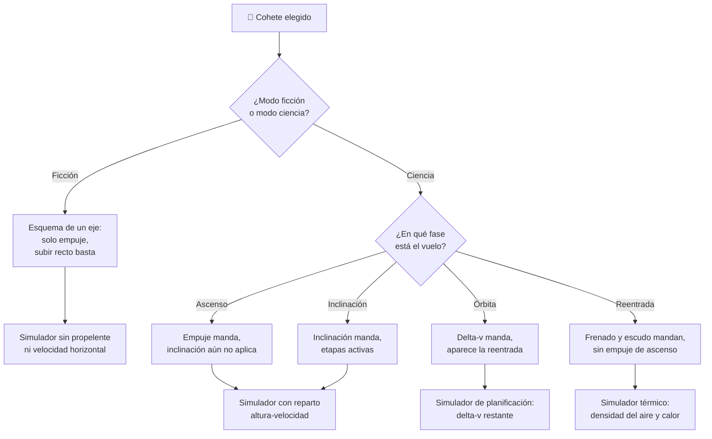

# 🧩 Modelos y variantes del Thunderbird 3

[🏠 Inicio](../../../README.md) · [🚀 Curso: Thunderbird 3](../README.md) · 🧩 Modelos

> ⚖️ Material educativo original; los derechos de las obras pertenecen a sus titulares.

El [Módulo 2](../operacion/caracteristicas-thunderbird-3.md) ya dijo qué tipos
conceptuales de cohete de rescate existen —ligero, pesado y reutilizable— y qué
compromiso físico acepta cada uno. Este módulo responde a lo siguiente: **en un
cohete, lo que de verdad cambia el mando no es el modelo, es la fase**. Un mismo
vehículo se opera de formas incompatibles entre la rampa y la órbita, y esa
diferencia decide qué debe modelar el simulador.

> 🎯 **La idea que sostiene el módulo.** Conviene ser honesto: aquí no hay una
> familia de modelos que se pilote distinto, como pasaría con vehículos de
> carretera. Hay **un** cohete que atraviesa fases —ascenso, inclinación,
> órbita, regreso— y en cada una manda un control distinto de la misma máquina.
> La ficción borra ese reparto porque su cohete "sube recto y ya está"; el
> cohete real necesita velocidad horizontal, y ahí es donde aparecen los mandos
> que la ficción no necesita tener.

---

## 🧭 Por qué el modelo decide el simulador

El [Módulo 5](../mandos/manual-mandos-thunderbird-3.md) describe un puesto de
mando con palanca de empuje, control de inclinación de 2 ejes, botonera de
separación de etapas y gestión de propelente. El
[Módulo 9](../simulacion/diseno-simulador-thunderbird-3.md) expone variables como
`Ángulo de inclinación` (0-90 grados), `Velocidad horizontal`, `Propelente
restante` y `Delta-v disponible`. Ambos describen un cohete que **debe inclinarse
para orbitar**.

En el cohete de la ficción esa inclinación no existe: subir muy alto basta, y el
propelente casi no cuenta. Las variables `Ángulo de inclinación` y `Propelente
restante` dejan de decidir nada. Por eso el Módulo 9 no trata la ficción como un
ajuste de dificultad, sino como el **modo**, su variable más importante: son dos
esquemas de reglas, no dos niveles del mismo.

Y dentro del modo ciencia, el reparto vuelve a cambiar por fase. Los estados que
enumera el Módulo 5 —en rampa, ascenso vertical, inclinación, en órbita,
reentrada— no son decorado: cada uno declara sus propias acciones disponibles.

---

## 🗂️ Qué cambia en el manejo

| Modelo o fase | Qué cambia en su operación |
| --- | --- |
| Modo ficción | Despegue instantáneo, subir alto basta y el combustible casi no cuenta. No hay recurso que administrar ni reparto que decidir. |
| Modo ciencia · En rampa | Cohete lleno y en su peso máximo. Motor apagado, velocidad cero: se revisan sistemas y se inicia la cuenta atrás. |
| Modo ciencia · Ascenso vertical | Se sube casi recto para salir del aire denso. El aire frena y calienta, así que no conviene acelerar a fondo. |
| Modo ciencia · Inclinación | Se empuja hacia la horizontal en aire fino. Se deja de comprar altura y se compra velocidad lateral, que es lo que cuesta. |
| Modo ciencia · En órbita | Velocidad lateral suficiente y delta-v estable. Ya no se asciende: se planifica el regreso con lo que quede. |
| Modo ciencia · Reentrada | Se frena contra el aire y el escudo se calienta. La energía a disipar es enorme y la temperatura pasa a mandar. |
| Cohete ligero | Poca carga y estructura mínima: alcanza órbita antes, pero rescata poco. |
| Cohete pesado | Más equipo y más propelente: más masa exige más empuje y más combustible. |
| Cohete reutilizable | Recupera etapas: ahorra a la larga, pero añade peso y complejidad al mismo vuelo. |

---

## 🎛️ Qué cambia en el mando

| Modelo o fase | Qué mando aparece o desaparece | Consecuencia |
| --- | --- | --- |
| Modo ficción | **Dejan de mandar** el control de inclinación y la gestión de propelente. La palanca de empuje basta. | El puesto de mando del Módulo 5 se reduce a un solo eje: arriba. Es otro esquema, no uno más fácil. |
| Modo ciencia · En rampa | Solo está viva la cuenta atrás; empuje e inclinación aún no reparten nada. | El puesto entero está presente pero inerte. |
| Modo ciencia · Ascenso vertical | La palanca de empuje es el mando principal. El control de inclinación **todavía no aplica**. | Se regula potencia y se prepara la inclinación; el aire denso castiga el exceso. |
| Modo ciencia · Inclinación | **Entra en juego** el control de inclinación de 2 ejes; la botonera de etapas se vuelve activa. | El mando decisivo pasa de la mano derecha a la izquierda: se deja de mandar "cuánto" para mandar "hacia dónde". |
| Modo ciencia · En órbita | **Desaparece** el ascenso: la palanca de empuje ya no reparte altura ni velocidad. **Aparece** iniciar reentrada. | El mando pasa a ser de planificación: lo que queda es delta-v, no potencia. |
| Modo ciencia · Reentrada | **Desaparecen** empuje de ascenso y separación de etapas. Manda controlar el frenado y desplegar frenos. | El instrumento crítico ya no es la velocidad horizontal, sino la temperatura del escudo. |
| Separación de etapas | El mando **se consume**: cada etapa se suelta una sola vez y es irreversible. | No es un control que se pueda ensayar; por eso el Módulo 5 pide confirmación. |
| Modo de guiado automático | **Sustituye** al operador en el reparto empuje-inclinación. | Los mandos siguen ahí, pero deja de decidirlos la tripulación. |

---

## 🎮 Qué cambia en el simulador

Contrastado con las variables del
[Módulo 9](../simulacion/diseno-simulador-thunderbird-3.md):

| Modelo o fase | Variables que cambian | Esquema de control |
| --- | --- | --- |
| Modo ficción | `Propelente restante` se ignora y `Ángulo de inclinación` deja de afectar a `Velocidad horizontal`. | Solo empuje: sin reparto ni recurso. |
| Modo ciencia · En rampa | `Masa total` en su máximo, `Densidad del aire` alta, `Velocidad horizontal` en cero. | El del Módulo 5, aún sin efecto. |
| Modo ciencia · Ascenso vertical | `Ángulo de inclinación` cerca de 0 grados; `Densidad del aire` domina el frenado y el calor. | Empuje como entrada única útil. |
| Modo ciencia · Inclinación | `Ángulo de inclinación` recorre hacia 90 grados; `Velocidad horizontal` crece; `Delta-v disponible` sube al soltar etapas. | Empuje **más** inclinación **más** etapas. |
| Modo ciencia · En órbita | `Empuje del motor` deja de ser el eje del cálculo; `Delta-v disponible` pasa a ser la variable que decide. | Sin entrada de ascenso; entrada de reentrada. |
| Modo ciencia · Reentrada | `Densidad del aire` vuelve a crecer y alimenta el calor; el instrumento de temperatura del escudo se vuelve crítico. | Sin empuje de ascenso ni etapas. |
| Cohete ligero | `Masa total` menor de salida: más `Delta-v disponible` con el mismo propelente. | El mismo, con margen más amplio. |
| Cohete pesado | `Masa total` mayor: exige más `Empuje del motor` y más `Propelente restante` para el mismo delta-v. | El mismo, con margen más estrecho. |
| Cohete reutilizable | `Masa total` no baja tanto al separar, porque la etapa recuperable conserva estructura. | El mismo, con la separación condicionada. |

---

## 🗺️ Del modelo al esquema de control

---

## ⚠️ Qué modelos no comparten simulador

Dos separaciones no se resuelven con un ajuste de parámetros, porque su esquema
de control es otro:

- **El modo ficción frente al modo ciencia**: no es una dificultad menor, es un
  esquema con menos entradas. Sin propelente que administrar y sin inclinación
  que repartir, dos mandos del Módulo 5 no tienen nada que hacer. Por eso el
  Módulo 9 lo trata como el interruptor central del aprendizaje y avisa en
  pantalla de qué reglas se activan, y el
  [Módulo 8](../reglamentos/reglas-universo-thunderbird-3.md) recuerda que esas
  reglas internas de la ficción son licencia narrativa, no ley física.
- **La órbita y la reentrada frente al ascenso**: allí el mando de ascenso ya no
  tiene función, la separación de etapas se ha consumido y el instrumento
  crítico cambia de la velocidad horizontal a la temperatura del escudo. Es una
  fase de gestión, no de pilotaje.

En cambio, ligero, pesado y reutilizable **sí** caben en un mismo simulador
ajustando `Masa total`, `Empuje del motor` y `Delta-v disponible`: cambian los
márgenes, no los controles. Es coherente con los
[niveles de realismo](../../../docs/03-niveles-de-realismo.md) que recoge el
[Módulo 6](../operacion/principios-thunderbird-3.md): en el nivel 1 solo se sube
y se descubre que la altura no basta, y las diferencias de mando emergen a
medida que el nivel sube.

> ⚖️ **El principio detrás de todo esto.** Cuánto pesa la carga y dónde va no cambia
> solo los números: cambia qué puede hacer el operador. La física común a todas las
> máquinas del catálogo —sostener, girar, equilibrar y la masa que cambia en
> marcha— está en [⚖️ carga y manejo](../../../docs/09-carga-y-manejo.md).

---

[⬅️ Anterior: Características](../operacion/caracteristicas-thunderbird-3.md) · [➡️ Siguiente: Sistemas mecánicos](../operacion/sistemas-mecanicos-thunderbird-3.md)
