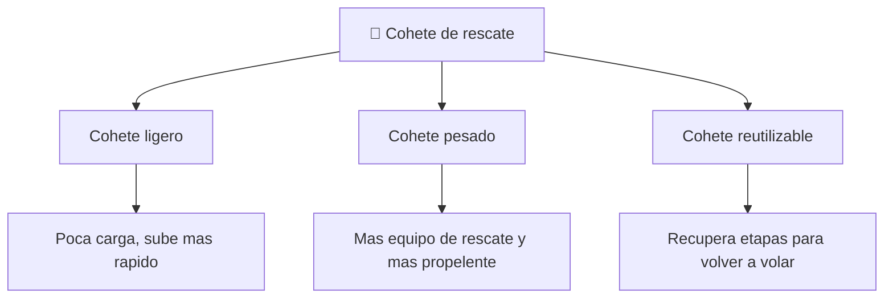

# 📋 Caracteristicas del Thunderbird 3

[🏠 Inicio](../../../README.md) · [🚀 Curso: Thunderbird 3](../README.md) · 📋 Caracteristicas

> ⚖️ Material educativo original; los derechos de las obras pertenecen a sus titulares.

Que es un cohete de rescate generico, que rasgos lo definen en la ficcion y cuales
tendrian sentido fisico real. Este modulo da el contexto antes de abrir la
tecnologia por dentro en el Modulo 3.

---

## 🧭 Definicion

Un cohete de rescate, en la ficcion estilo "Thunderbirds", es un vehiculo capaz
de despegar deprisa, llegar al espacio y regresar para socorrer a quien lo
necesite. Lo imaginamos potente, veloz y siempre listo. En este curso lo usamos
como excusa para estudiar como subiria de verdad un vehiculo asi hasta la orbita.

---

## 🧬 Caracteristicas clave

| Caracteristica | Como la muestra la ficcion | Lectura fisica real |
| --- | --- | --- |
| Despegue instantaneo | Sube en segundos y sin preparativos | Falso: el ascenso dura minutos y exige mucho propelente. |
| Ascenso vertical | Sube recto como una flecha | Solo al principio; luego debe inclinarse hacia la horizontal. |
| Llegar al espacio | Basta con subir muy alto | Insuficiente: sin velocidad lateral se vuelve a caer. |
| Cohete de una pieza | Sube y baja entero | Conviene soltar etapas vacias para no cargar peso muerto. |
| Combustible discreto | Deposito pequeno y suficiente | Real: el combustible es casi toda la masa del cohete. |
| Regreso suave | Aterriza como si nada | La reentrada libera enorme energia y calor. |

---

## 🗂️ Tipos conceptuales de cohete de rescate

| Tipo | Idea de diseno | Compromiso fisico |
| --- | --- | --- |
| Cohete ligero | Poca carga util, estructura minima | Alcanza orbita antes pero rescata poco. |
| Cohete pesado | Mucho equipo y propelente | Mas masa exige mas empuje y mas combustible. |
| Cohete reutilizable | Etapas que se recuperan | Ahorra a la larga pero anade peso y complejidad. |

---

## 🎯 Para que sirve en el relato

- Dar espectaculo con despegues potentes y urgentes.
- Representar el rescate rapido como una hazaña heroica.
- Simplificar el viaje al espacio a un simple "subir muy alto".

En cambio, para este curso sirve como laboratorio: cada rasgo llamativo nos
deja preguntar si seria posible y por que.

---

[⬅️ Anterior: Historia](../historia/historia-thunderbird-3.md) · [➡️ Siguiente: Sistemas mecanicos](sistemas-mecanicos-thunderbird-3.md)
