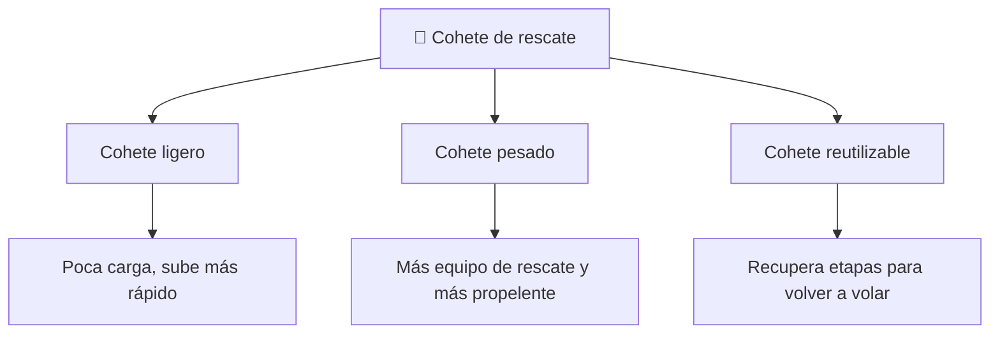

# 📋 Características del Thunderbird 3

[🏠 Inicio](../../../README.md) · [🚀 Curso: Thunderbird 3](../README.md) · 📋 Características

> ⚖️ Material educativo original; los derechos de las obras pertenecen a sus titulares.

Que es un cohete de rescate genérico, que rasgos lo definen en la ficción y cuales
tendrían sentido físico real. Este módulo da el contexto antes de abrir la
tecnología por dentro en el Módulo 4.

---

## 🧭 Definición

Un cohete de rescate, en la ficción estilo "Thunderbirds", es un vehículo capaz
de despegar deprisa, llegar al espacio y regresar para socorrer a quien lo
necesite. Lo imaginamos potente, veloz y siempre listo. En este curso lo usamos
como excusa para estudiar como subiría de verdad un vehículo así hasta la órbita.

---

## 🧬 Características clave

| Característica | Como la muestra la ficción | Lectura física real |
| --- | --- | --- |
| Despegue instantáneo | Sube en segundos y sin preparativos | Falso: el ascenso dura minutos y exige mucho propelente. |
| Ascenso vertical | Sube recto como una flecha | Solo al principio; luego debe inclinarse hacia la horizontal. |
| Llegar al espacio | Basta con subir muy alto | Insuficiente: sin velocidad lateral se vuelve a caer. |
| Cohete de una pieza | Sube y baja entero | Conviene soltar etapas vacías para no cargar peso muerto. |
| Combustible discreto | Depósito pequeño y suficiente | Real: el combustible es casi toda la masa del cohete. |
| Regreso suave | Aterriza como si nada | La reentrada libera enorme energía y calor. |

---

## 🗂️ Tipos conceptuales de cohete de rescate

```mermaid
flowchart TD
    Cohete[🚀 Cohete de rescate] --> Ligero[Cohete ligero]
    Cohete --> Pesado[Cohete pesado]
    Cohete --> Reutilizable[Cohete reutilizable]
    Ligero --> Rapido[Poca carga, sube más rápido]
    Pesado --> Carga[Más equipo de rescate y más propelente]
    Reutilizable --> Ahorro[Recupera etapas para volver a volar]
```

| Tipo | Idea de diseño | Compromiso físico |
| --- | --- | --- |
| Cohete ligero | Poca carga útil, estructura mínima | Alcanza órbita antes pero rescata poco. |
| Cohete pesado | Mucho equipo y propelente | Más masa exige más empuje y más combustible. |
| Cohete reutilizable | Etapas que se recuperan | Ahorra a la larga pero añade peso y complejidad. |

---

## 🎯 Para qué sirve en el relato

- Dar espectáculo con despegues potentes y urgentes.
- Representar el rescate rápido como una hazaña heroica.
- Simplificar el viaje al espacio a un simple "subir muy alto".

En cambio, para este curso sirve como laboratorio: cada rasgo llamativo nos
deja preguntar si sería posible y por qué.

## 🎓 Cierre de clase

- **Actividad:** Compara variantes de Thunderbird 3 mediante los ejes «definición, rasgos funcionales, tipos y usos» y elige una para un caso de uso razonado.
- **Evidencia:** Matriz comparativa y decisión justificada.
- **Criterio de aprobación:** La elección considera función, límites, mando y efecto en la simulación; no se apoya solo en preferencias.
- **Transferencia:** explica qué cambiaría al pasar a otra variante de esta máquina.

### Fuentes de esta clase

- [THUNDERBIRDS-OFFICIAL](https://www.thunderbirds.com/): Thunderbirds Vehicles, ITV. Uso: referencia oficial de vehículos de rescate.
- [NASA-ROCKETS](https://www.nasa.gov/wp-content/uploads/2012/07/rockets-educator-guide-20.pdf): Rockets Educator Guide, NASA. Uso: propulsión, estabilidad y trayectoria.
- [NASA-FLIGHT](https://www1.grc.nasa.gov/beginners-guide-to-aeronautics/): Beginner's Guide to Aeronautics, NASA. Uso: contraste con física y vuelo reales.

> Las fuentes sostienen el marco conceptual y normativo; esta clase no reemplaza el manual
> del fabricante, la formación certificada ni la habilitación exigida para operar equipos reales.

---

[⬅️ Anterior: Historia](../historia/historia-thunderbird-3.md) · [➡️ Siguiente: Modelos y variantes](../modelos/modelos-thunderbird-3.md)
