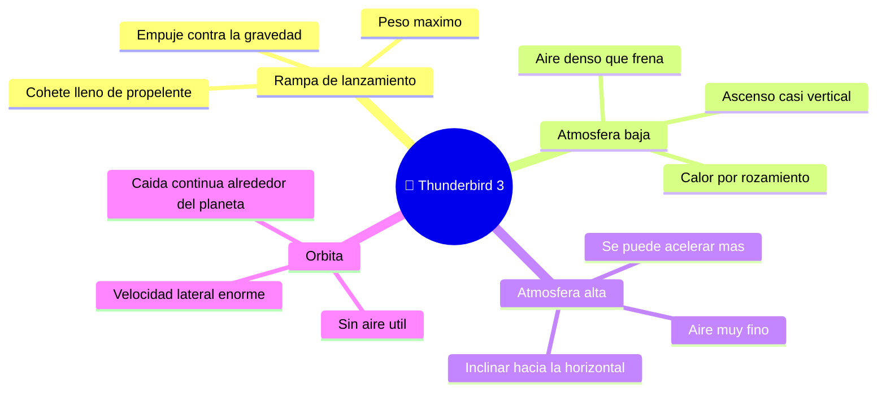

# 🌍 Entornos del Thunderbird 3

[🏠 Inicio](../../../README.md) · [🚀 Curso: Thunderbird 3](../README.md) · 🌍 Entornos

> ⚖️ Material educativo original; los derechos de las obras pertenecen a sus titulares.

Por donde pasa un cohete de rescate durante su vuelo y cómo cambia su
comportamiento en cada tramo. Cada fase implica reglas físicas distintas, y en
simulación se traduce en condiciones diferentes de gravedad, aire y velocidad.

---

## 🗺️ Entornos principales

| Entorno | Características | Riesgos típicos | Ajuste de maniobra |
| --- | --- | --- | --- |
| Rampa de lanzamiento | Cohete lleno y pesado. | Volcar, empuje insuficiente. | Empuje firme y ascenso vertical inicial. |
| Atmósfera baja | Aire denso que frena y calienta. | Recalentar, esfuerzo estructural. | Subir con cuidado sin correr demasiado. |
| Atmósfera alta | Aire fino, menos resistencia. | Inclinar antes o después de tiempo. | Empezar a ganar velocidad lateral. |
| Órbita | Sin aire útil, gran velocidad. | Velocidad lateral insuficiente. | Mantener el rumbo y planificar el regreso. |

---

## 🌡️ Factores del entorno

- **Gravedad**: tira del cohete hacia abajo en todo el ascenso; parte del empuje
  se emplea solo en sostener el peso mientras se sube despacio.
- **Aire**: denso abajo y fino arriba; frena y calienta cerca del suelo, por eso
  no conviene acelerar a fondo en los primeros kilómetros.
- **Velocidad lateral**: es la que decide si se órbita; se gana sobre todo en la
  atmósfera alta y por encima, inclinando la trayectoria.
- **Calor**: aparece con fuerza tanto en el ascenso rápido como, sobre todo, en
  la reentrada, cuando la nave frena contra el aire.

---

## 🎮 Traducción a simulación

Cada tramo es un escenario con su gravedad, densidad de aire y objetivo de
velocidad. El paso del aire denso al vacío de la órbita cambia por completo las
reglas y es una gran lección de física. Ver cómo se modela en el
[Módulo 8: Diseño de simulación](../simulacion/diseno-simulador-thunderbird-3.md).

---

[⬅️ Anterior: Principios y operación](principios-thunderbird-3.md) · [➡️ Siguiente: Reglas del universo](../reglamentos/reglas-universo-thunderbird-3.md)
