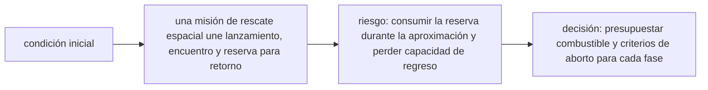

<!-- clase-meta
tipo_documento: clase
clase: 6
codigo: THUNDERBIRD3-06
curso: thunderbird-3
titulo: "Principios y operación del Thunderbird 3"
modalidad: "resolución de problemas"
duracion_minutos: 90
nivel: introductorio
prerrequisito: THUNDERBIRD3-05
competencia: "razonamiento_operacional"
resultados_aprendizaje:
  - "Explicar principios físicos, fases de operación, decisiones y errores frecuentes con vocabulario propio de Thunderbird 3."
  - "Aplicar esos conceptos a una decisión segura o a un escenario de simulación de Thunderbird 3."
evidencia: "Resolución argumentada de un escenario operacional."
criterio_aprobacion: "Aplica los principios correctos, anticipa consecuencias y respeta los límites del curso."
fuentes: manuales/fuentes.md
ultima_revision: 2026-09-10
-->

# 🧪 Principios y operación del Thunderbird 3

[🏠 Inicio](../../../README.md) · [🚀 Curso: Thunderbird 3](../README.md) · 🧪 Principios

> ⚖️ Material educativo original; los derechos de las obras pertenecen a sus titulares.

Documento educativo y de divulgación. Aquí está el corazón del curso: por qué
llegar al espacio exige velocidad orbital lateral, por qué ayudan las etapas y
que dice la ecuación del cohete sobre el combustible. Explica que si sería
posible, que no, y sobre todo por qué.

## Llegar a órbita no es solo subir

El error más común es creer que el espacio es "estar muy alto". Puedes subir un
cohete recto, apagar el motor arriba y aun así caerás de vuelta al suelo. Para
quedarte en órbita hay que moverse tan rápido de lado que, mientras caes hacia el
planeta, este se curva bajo tus pies y nunca lo alcanzas. Orbitar es, en el
fondo, caer sin parar y fallar el suelo por ir muy rápido en horizontal.

Por eso un cohete arranca casi vertical, para salir cuanto antes del aire denso,
y luego se inclina para dedicar la mayor parte de su empuje a ganar esa enorme
velocidad horizontal. La altura es la parte fácil; la velocidad lateral es la
que cuesta de verdad.

## Gravedad y aire durante el ascenso

- **Gravedad**: tira del cohete hacia abajo todo el rato. Mientras el cohete sube
  despacio, parte del empuje se "malgasta" solo en sostener su peso; conviene no
  demorarse subiendo recto más de lo necesario.
- **Aire**: cerca del suelo la atmósfera es densa y frena el cohete; ir demasiado
  rápido abajo desperdicia energía y castiga la estructura. Por eso se sube con
  cuidado hasta que el aire se hace fino y ya se puede acelerar de verdad.

## Por qué ayudan las etapas

Un cohete gasta su propelente muy deprisa, y los tanques que lo contenian quedan
vacíos. Seguir cargando esos tanques vacíos significa acelerar peso muerto que no
aporta nada. Al dividir el cohete en etapas y soltar cada una cuando se vacía, el
resto continua más ligero y por tanto acelera mejor con el propelente que queda.
Es la forma práctica de esquivar el límite que impone la ecuación del cohete.

## La ecuación del cohete

La relación clave del vuelo espacial une tres cosas: el cambio de velocidad que
quieres lograr (delta-v), la velocidad a la que el motor expulsa su propelente y
la fracción entre la masa llena y la masa vacía del cohete. La consecuencia es
dura: para conseguir más delta-v necesitas mucho más propelente, y no de forma
proporcional, sino **exponencial**.

- Duplicar el delta-v no duplica el combustible: lo multiplica mucho más.
- Un motor que expulsa su masa más rápido rinde más delta-v con el mismo tanque.
- Cada kilo de estructura o carga obliga a llevar aún más propelente para moverlo.

Por eso los cohetes reales son casi por completo combustible, con una fracción
mínima de carga útil. La ecuación del cohete explica de un plumazo por qué llegar
a órbita es tan caro y por qué las etapas son casi obligatorias.

## Que si y que no

| Idea de la ficción | Que si es real | Que no es real |
| --- | --- | --- |
| Subir muy alto llega al espacio | Se puede alcanzar gran altura | Sin velocidad lateral se vuelve a caer. |
| Despegue instantáneo | El cohete si puede acelerar fuerte | El ascenso tarda minutos y gasta casi todo el propelente. |
| Cohete de una sola pieza | Un cohete puede llevar todo junto | Sin soltar etapas es difícil llegar a órbita. |
| Depósito pequeño y de sobra | El propelente da el empuje | El combustible es casi toda la masa del cohete. |
| Regreso suave inmediato | Se puede volver a tierra | La reentrada libera muchísima energía y calor. |
| Subir siempre recto | Al inicio conviene ir vertical | Luego hay que inclinar para ganar velocidad lateral. |

## Cómo sería una misión realista

- El cohete subiría vertical unos segundos y luego se inclinaría poco a poco.
- Iría soltando etapas vacías para no arrastrar peso muerto.
- Dedicaría la mayor parte del esfuerzo a ganar velocidad horizontal, no altura.
- El regreso exigiría frenar en el momento justo y disipar el calor con un escudo.

## Relación con los niveles de realismo

- **Nivel 1 (educativo)**: subir el cohete y descubrir que la altura no basta.
- **Nivel 2 (simplificado)**: sumar velocidad lateral, inclinación y etapas.
- **Nivel 3 (técnico)**: gestionar delta-v, masa de propelente, gravedad y aire.

Ver [`docs/03-niveles-de-realismo.md`](../../../docs/03-niveles-de-realismo.md)
para el detalle de cada nivel.

## 🧭 Guía de estudio aplicada

### Pregunta guía

¿Cómo ayuda **Llegar a órbita no es solo subir, Gravedad y aire durante el ascenso, Por qué ayudan las etapas y La ecuación del cohete** a **resolver intercepción de una nave averiada con ventana temporal corta sin agotar el margen operacional**?

### Explicación razonada

El principio rector puede resumirse así: una misión de rescate espacial une lanzamiento, encuentro y reserva para retorno. Esto explica por qué una misma orden produce resultados distintos cuando cambian velocidad, carga, configuración o entorno. Operar bien consiste en leer la tendencia antes de agotar el margen y tomar esta decisión: presupuestar combustible y criterios de aborto para cada fase.

Esta clase se conecta con el resto del curso mediante **una misión de rescate espacial une lanzamiento, encuentro y reserva para retorno**. El hilo de
seguridad consiste en reconocer a tiempo **consumir la reserva durante la aproximación y perder capacidad de regreso** y poder justificar la decisión
**presupuestar combustible y criterios de aborto para cada fase**; en clases posteriores cambiará el ángulo de análisis, no esa relación causal.
La lectura funcional común sigue **propelentes ficticios → motores → guiado → trayectoria espacial**, de modo que cada concepto pueda
ubicarse dentro del funcionamiento completo y no quede como un dato aislado.

**Apoyo documental:** [Thunderbirds Vehicles](https://www.thunderbirds.com/) aporta referencia oficial de vehículos de rescate;
[Rockets Educator Guide](https://www.nasa.gov/wp-content/uploads/2012/07/rockets-educator-guide-20.pdf) se usa para propulsión, estabilidad y trayectoria. Estas fuentes
se contrastan con el alcance de la clase y no sustituyen un manual de equipo concreto.

### Caso resuelto: de la observación a la decisión

1. **Datos:** reconoce condiciones, configuración y margen disponibles en **intercepción de una nave averiada con ventana temporal corta**.
2. **Modelo:** aplica **una misión de rescate espacial une lanzamiento, encuentro y reserva para retorno** para predecir una tendencia antes de actuar.
3. **Riesgo:** explica mediante qué cadena de causas podría ocurrir **consumir la reserva durante la aproximación y perder capacidad de regreso**.
4. **Decisión:** ejecuta mentalmente **presupuestar combustible y criterios de aborto para cada fase** y define qué observación confirmaría que funcionó.

### Comprueba tu comprensión

1. ¿Qué variable del principio «una misión de rescate espacial une lanzamiento, encuentro y reserva para retorno» cambia primero en el caso?
2. ¿Cómo se propaga ese cambio hasta **trayectoria espacial**?
3. ¿Qué evidencia confirmaría que **presupuestar combustible y criterios de aborto para cada fase** conservó margen operacional?

Orientación para revisar tus respuestas

- La primera respuesta debe relacionar el eslabón elegido con un efecto posterior, no solo nombrarlo.
- La segunda debe proponer una señal medible u observable y explicar qué tendencia sería preocupante.
- La tercera debe cambiar al menos una variable de capacidad, mando, entorno o margen de seguridad.

## 🎓 Cierre de clase

- **Actividad:** Resuelve un escenario de Thunderbird 3 explicando, paso a paso, cómo intervienen principios físicos, fases de operación, decisiones y errores frecuentes.
- **Evidencia:** Resolución argumentada de un escenario operacional.
- **Criterio de aprobación:** Aplica los principios correctos, anticipa consecuencias y respeta los límites del curso.
- **Transferencia:** explica qué cambiaría al pasar a otra variante de esta máquina.

### Fuentes de esta clase

- [THUNDERBIRDS-OFFICIAL](https://www.thunderbirds.com/): Thunderbirds Vehicles, ITV. Uso: referencia oficial de vehículos de rescate.
- [NASA-ROCKETS](https://www.nasa.gov/wp-content/uploads/2012/07/rockets-educator-guide-20.pdf): Rockets Educator Guide, NASA. Uso: propulsión, estabilidad y trayectoria.
- [NASA-FLIGHT](https://www1.grc.nasa.gov/beginners-guide-to-aeronautics/): Beginner's Guide to Aeronautics, NASA. Uso: contraste con física y vuelo reales.

> Las fuentes sostienen el marco conceptual y normativo; esta clase no reemplaza el manual
> del fabricante, la formación certificada ni la habilitación exigida para operar equipos reales.

---

[⬅️ Anterior: Mandos](../mandos/manual-mandos-thunderbird-3.md) · [➡️ Siguiente: Entornos](entornos-thunderbird-3.md)
