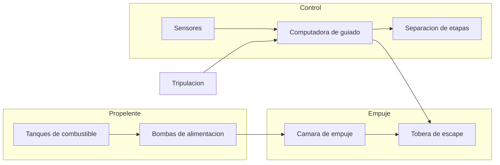
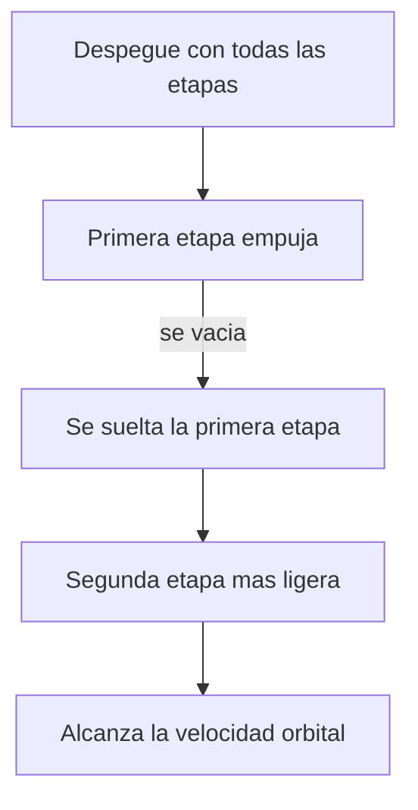

# 🔧 Sistemas mecanicos del Thunderbird 3

[🏠 Inicio](../../../README.md) · [🚀 Curso: Thunderbird 3](../README.md) · 🔧 Sistemas mecanicos

> ⚖️ Material educativo original; los derechos de las obras pertenecen a sus titulares.

Este modulo abre el cohete de rescate por dentro. Compara la tecnologia imaginaria
de la ficcion con la fisica real que la haria funcionar (o que la desmiente).
La regla del curso es clara: describimos conceptos con nuestras palabras, sin
copiar planos ni especificaciones oficiales.

---

## 1. 🚀 Motores y propelente

En la ficcion, un motor compacto entrega potencia sin apenas gastar nada. En la
realidad, el motor de cohete funciona expulsando masa (propelente) a gran
velocidad hacia atras: por la tercera ley de Newton, la nave recibe empuje hacia
adelante. Lo decisivo es que ese propelente se agota, y en un cohete real es la
mayor parte de la masa total al despegar.

| Concepto de ficcion | Fisica real que evoca | Veredicto |
| --- | --- | --- |
| Motor que casi no gasta | Motor de cohete que expulsa propelente | No fisico: el propelente es finito y se gasta rapido. |
| Empuje instantaneo a tope | Empuje limitado por el flujo de propelente | Parcial: hay empuje, pero con un maximo. |
| Deposito pequeno | El propelente domina la masa del cohete | Falso: el combustible pesa mas que el resto junto. |
| Chorro decorativo | Chorro de escape que produce el empuje | Real: sin chorro de masa no hay empuje. |

---

## 2. 🪜 Etapas y separacion

Aqui aparece una de las grandes ideas de la ingenieria espacial. Un cohete carga
enormes tanques que se van vaciando. Seguir arrastrando esos tanques vacios seria
peso muerto que hay que acelerar en balde. Por eso los cohetes reales se dividen
en etapas: cuando una agota su propelente, se suelta, y el cohete continua mas
ligero. La ficcion suele mostrar un cuerpo unico que sube y baja entero.

| Idea de la ficcion | Que dice la fisica real |
| --- | --- |
| El cohete sube y baja de una pieza | Conviene soltar masa vacia por el camino. |
| El peso no importa una vez arriba | Cada kilo de mas exige mas propelente para acelerar. |
| Las etapas son un adorno | Son clave para alcanzar la velocidad orbital. |
| Todo el cohete llega al espacio | Solo una fraccion pequena llega de verdad a orbita. |

---

## 3. 🎯 Guiado del ascenso

En la ficcion el cohete sube recto y ya esta. En la realidad, subir recto todo el
rato seria un error: para orbitar hace falta muchisima velocidad horizontal. Por
eso el cohete arranca casi vertical para salir del aire denso y luego se inclina
poco a poco hasta empujar casi en horizontal. A esa maniobra suave se la suele
llamar giro de inclinacion, y la coordina la computadora de guiado.

| Sistema | En la ficcion | En la realidad |
| --- | --- | --- |
| Trayectoria | Sube recto hacia arriba | Arranca vertical y se inclina hacia la horizontal. |
| Direccion del empuje | Fija hacia abajo | Se orienta la tobera para dirigir el ascenso. |
| Objetivo | Ganar altura | Ganar sobre todo velocidad lateral. |
| Control | Instinto del piloto | Computadora que dosifica empuje y direccion. |

---

## 4. 🛢️ Estructura y tanques

Las paredes de un cohete real son sorprendentemente finas para ahorrar peso: casi
todo el volumen son tanques de propelente. La ficcion imagina cascos macizos y
resistentes, pero cada gramo de estructura de mas obliga a llevar aun mas
combustible. El diseno real busca el equilibrio entre aguantar el esfuerzo del
despegue y pesar lo menos posible.

| Elemento | Funcion en la ficcion | Funcion util real |
| --- | --- | --- |
| Casco grueso | Aguantar cualquier golpe | Anade masa; se busca lo mas ligero posible. |
| Tanques | Detalle secundario | Ocupan casi todo el cohete. |
| Aletas | Estilo y velocidad | Ayudan a estabilizar dentro del aire. |
| Escudo | Adorno | Protege del calor en la reentrada. |

---

## 5. 🪂 Sistema de rescate y reentrada

El rescate implica volver, y volver desde orbita libera muchisima energia. La
nave viaja tan rapido que, al rozar el aire, se calienta de forma extrema. La
ficcion muestra aterrizajes suaves e inmediatos; la fisica exige un escudo
termico, una trayectoria de frenado cuidadosa y a menudo paracaidas o motores
para posarse.

| Fase | En la ficcion | En la realidad |
| --- | --- | --- |
| Salida de orbita | Instantanea | Requiere frenar con el motor en el momento justo. |
| Descenso | Suave y sin calor | El aire frena pero calienta el escudo al rojo. |
| Aterrizaje | Aterriza como si nada | Necesita paracaidas o empuje para tocar suave. |

---

## 🔁 Como se conecta todo

1. El **propelente** alimenta el motor que genera el empuje.
2. El **motor** acelera el cohete expulsando masa hacia abajo.
3. Las **etapas** se sueltan al vaciarse para no cargar peso muerto.
4. El **guiado** inclina la trayectoria para ganar velocidad lateral.
5. El **sistema de reentrada** disipa la energia para regresar con seguridad.

Con esto claro, el [Modulo 4: Mandos](../mandos/manual-mandos-thunderbird-3.md)
muestra como la tripulacion operaria cada sistema.

---

[⬅️ Anterior: Caracteristicas](caracteristicas-thunderbird-3.md) · [➡️ Siguiente: Mandos e instrumentos](../mandos/manual-mandos-thunderbird-3.md)
