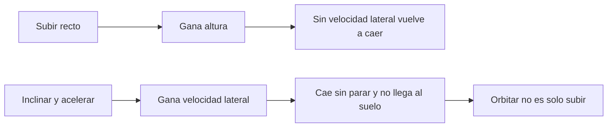

# 🧰 Recursos del Thunderbird 3

[🏠 Inicio](../../../README.md) · [🚀 Curso: Thunderbird 3](../README.md) · 🧰 Recursos

> ⚖️ Material educativo original; los derechos de las obras pertenecen a sus titulares.

Glosario específico, enlaces y diagramas de apoyo del curso del Thunderbird 3.
Amplia el [glosario general](../../../docs/05-glosario-general.md).

---

## 📖 Glosario específico

| Término | Definición |
| --- | --- |
| Órbita | Estado de caer sin parar alrededor de un planeta por ir muy rápido de lado. |
| Velocidad orbital | Velocidad horizontal necesaria para no volver a caer al suelo. |
| Delta-v | Cambio total de velocidad que el cohete puede lograr con su propelente. |
| Propelente | Masa que el motor expulsa para generar empuje por reacción. |
| Empuje | Fuerza que impulsa el cohete, resultado de expulsar masa hacia atrás. |
| Etapa | Parte del cohete que se suelta al vaciarse para no cargar peso muerto. |
| Ecuación del cohete | Relación que liga delta-v, velocidad de escape y fracción de masa. |
| Giro de inclinación | Maniobra de pasar de subir vertical a empujar hacia la horizontal. |
| Reentrada | Regreso a la atmósfera, donde el aire frena y calienta la nave. |
| Escudo térmico | Protección que disipa el calor extremo de la reentrada. |

---

## 🗺️ Diagrama: subir frente a orbitar

---

## 🔗 Enlaces y fuentes

- Portada del curso: [🚀 Curso: Thunderbird 3](../README.md)
- Catálogo de naves de ficción: [🌌 Naves de ficción](../../README.md)
- Glosario general: [📖 docs/05-glosario-general.md](../../../docs/05-glosario-general.md)
- Niveles de realismo: [🎚️ docs/03-niveles-de-realismo.md](../../../docs/03-niveles-de-realismo.md)
- Registro de fuentes: [📚 manuales/fuentes.md](../../../manuales/fuentes.md)

Registrar cada recurso nuevo con su origen y licencia, respetando el aviso de
derechos del catálogo de naves de ficción.

---

[🎓 Portada del curso](../README.md) · [⬅️ Anterior: Diseño de simulación](../simulacion/diseno-simulador-thunderbird-3.md) · [➡️ Siguiente: Ejercicios](../ejercicios/ejercicios-thunderbird-3.md)
