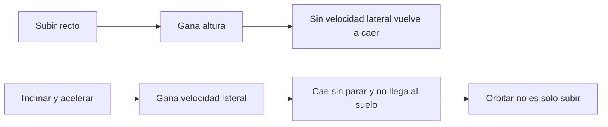

<!-- clase-meta
tipo_documento: clase
clase: 10
codigo: THUNDERBIRD3-10
curso: thunderbird-3
titulo: "Recursos del Thunderbird 3"
modalidad: "taller documental"
duracion_minutos: 45
nivel: introductorio
prerrequisito: THUNDERBIRD3-09
competencia: "alfabetizacion_tecnica"
resultados_aprendizaje:
  - "Explicar glosario, esquemas y trazabilidad de fuentes con vocabulario propio de Thunderbird 3."
  - "Aplicar esos conceptos a una decisión segura o a un escenario de simulación de Thunderbird 3."
evidencia: "Glosario aplicado y ficha breve de trazabilidad."
criterio_aprobacion: "Los términos permiten interpretar el curso y las fuentes se distinguen por autoridad, alcance y vigencia."
fuentes: manuales/fuentes.md
ultima_revision: 2026-09-10
-->

# 🧰 Recursos del Thunderbird 3

[🏠 Inicio](../../../README.md) · [🚀 Curso: Thunderbird 3](../README.md) · 🧰 Recursos

> ⚖️ Material educativo original; los derechos de las obras pertenecen a sus titulares.

Glosario específico, enlaces y diagramas de apoyo del curso del Thunderbird 3.
Amplia el [glosario general](../../../docs/05-glosario-general.md).

---

## 📖 Glosario específico

| Término | Definición |
| --- | --- |
| Órbita | Estado de caer sin parar alrededor de un planeta por ir muy rápido de lado. |
| Velocidad orbital | Velocidad horizontal necesaria para no volver a caer al suelo. |
| Delta-v | Cambio total de velocidad que el cohete puede lograr con su propelente. |
| Propelente | Masa que el motor expulsa para generar empuje por reacción. |
| Empuje | Fuerza que impulsa el cohete, resultado de expulsar masa hacia atrás. |
| Etapa | Parte del cohete que se suelta al vaciarse para no cargar peso muerto. |
| Ecuación del cohete | Relación que liga delta-v, velocidad de escape y fracción de masa. |
| Giro de inclinación | Maniobra de pasar de subir vertical a empujar hacia la horizontal. |
| Reentrada | Regreso a la atmósfera, donde el aire frena y calienta la nave. |
| Escudo térmico | Protección que disipa el calor extremo de la reentrada. |

---

## 🗺️ Diagrama: subir frente a orbitar

```mermaid
flowchart LR
    Vertical[Subir recto] --> Altura[Gana altura]
    Altura --> Cae[Sin velocidad lateral vuelve a caer]
    Horizontal[Inclinar y acelerar] --> Lateral[Gana velocidad lateral]
    Lateral --> Orbita[Cae sin parar y no llega al suelo]
    Orbita --> Idea[Orbitar no es solo subir]
```

---

## 🔗 Enlaces y fuentes

- Portada del curso: [🚀 Curso: Thunderbird 3](../README.md)
- Catálogo de naves de ficción: [🌌 Naves de ficción](../../README.md)
- Glosario general: [📖 docs/05-glosario-general.md](../../../docs/05-glosario-general.md)
- Niveles de realismo: [🎚️ docs/03-niveles-de-realismo.md](../../../docs/03-niveles-de-realismo.md)
- Registro de fuentes: [📚 manuales/fuentes.md](../../../manuales/fuentes.md)

Registrar cada recurso nuevo con su origen y licencia, respetando el aviso de
derechos del catálogo de naves de ficción.

## 🧭 Guía de estudio aplicada

### Pregunta guía

¿Cómo ayuda **Glosario específico, Diagrama: subir frente a orbitar, Enlaces y fuentes y Guía de estudio aplicada** a **explicar con fuentes los términos propelentes ficticios, motores, guiado y trayectoria espacial**?

### Explicación razonada

El vocabulario técnico organiza relaciones: propelentes ficticios, motores, guiado y trayectoria espacial nombran partes distintas de una misma cadena funcional. Una fuente se usa para sostener una afirmación concreta —principio, límite, procedimiento o contexto— y debe distinguirse del manual particular de un fabricante o de una regla narrativa.

Esta clase se conecta con el resto del curso mediante **una misión de rescate espacial une lanzamiento, encuentro y reserva para retorno**. El hilo de
seguridad consiste en reconocer a tiempo **consumir la reserva durante la aproximación y perder capacidad de regreso** y poder justificar la decisión
**presupuestar combustible y criterios de aborto para cada fase**; en clases posteriores cambiará el ángulo de análisis, no esa relación causal.
La lectura funcional común sigue **propelentes ficticios → motores → guiado → trayectoria espacial**, de modo que cada concepto pueda
ubicarse dentro del funcionamiento completo y no quede como un dato aislado.

**Apoyo documental:** [Thunderbirds Vehicles](https://www.thunderbirds.com/) aporta referencia oficial de vehículos de rescate;
[Rockets Educator Guide](https://www.nasa.gov/wp-content/uploads/2012/07/rockets-educator-guide-20.pdf) se usa para propulsión, estabilidad y trayectoria. Estas fuentes
se contrastan con el alcance de la clase y no sustituyen un manual de equipo concreto.

### Caso resuelto: de la observación a la decisión

1. **Definir en contexto:** explica **propelentes ficticios**, **motores**, **guiado** y **trayectoria espacial** por su función y relación.
2. **Respaldar:** enlaza cada afirmación importante con una fuente identificable y declara su alcance.
3. **Contrastar:** separa principios generales, requisitos locales, manual de fabricante y —si aplica— canon ficticio.
4. **Reformular:** convierte una definición copiada en una explicación propia con un ejemplo de **Thunderbird 3**.

### Comprueba tu comprensión

1. Explica la diferencia funcional entre **motores** y **guiado** sin copiar una definición.
2. ¿Qué fuente respalda el principio «una misión de rescate espacial une lanzamiento, encuentro y reserva para retorno» y cuál es su alcance?
3. ¿Qué dato exigiría un manual de fabricante en vez de una fuente general?

Orientación para revisar tus respuestas

- La primera respuesta debe relacionar el eslabón elegido con un efecto posterior, no solo nombrarlo.
- La segunda debe proponer una señal medible u observable y explicar qué tendencia sería preocupante.
- La tercera debe cambiar al menos una variable de capacidad, mando, entorno o margen de seguridad.

## 🎓 Cierre de clase

- **Actividad:** Selecciona términos de glosario, esquemas y trazabilidad de fuentes, explícalos en contexto de Thunderbird 3 y verifica la procedencia de las fuentes utilizadas.
- **Evidencia:** Glosario aplicado y ficha breve de trazabilidad.
- **Criterio de aprobación:** Los términos permiten interpretar el curso y las fuentes se distinguen por autoridad, alcance y vigencia.
- **Transferencia:** explica qué cambiaría al pasar a otra variante de esta máquina.

### Fuentes de esta clase

- [THUNDERBIRDS-OFFICIAL](https://www.thunderbirds.com/): Thunderbirds Vehicles, ITV. Uso: referencia oficial de vehículos de rescate.
- [NASA-ROCKETS](https://www.nasa.gov/wp-content/uploads/2012/07/rockets-educator-guide-20.pdf): Rockets Educator Guide, NASA. Uso: propulsión, estabilidad y trayectoria.
- [NASA-FLIGHT](https://www1.grc.nasa.gov/beginners-guide-to-aeronautics/): Beginner's Guide to Aeronautics, NASA. Uso: contraste con física y vuelo reales.

> Las fuentes sostienen el marco conceptual y normativo; esta clase no reemplaza el manual
> del fabricante, la formación certificada ni la habilitación exigida para operar equipos reales.

---

[🎓 Portada del curso](../README.md) · [⬅️ Anterior: Diseño de simulación](../simulacion/diseno-simulador-thunderbird-3.md) · [➡️ Siguiente: Ejercicios](../ejercicios/ejercicios-thunderbird-3.md)
