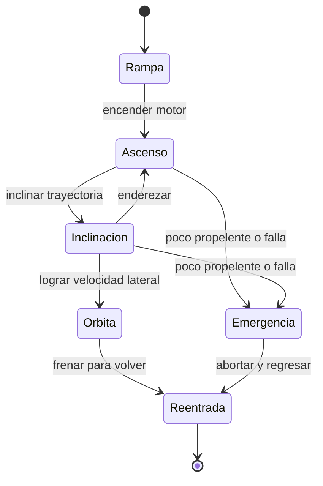

# 🎮 Diseno de simulacion del Thunderbird 3

[🏠 Inicio](../../../README.md) · [🚀 Curso: Thunderbird 3](../README.md) · 🎮 Simulacion

> ⚖️ Material educativo original; los derechos de las obras pertenecen a sus titulares.

Como modelar de forma educativa y divertida un cohete de rescate. La idea central
es poder alternar entre la version espectacular de la ficcion y la version fiel a
la fisica, para que el usuario compare ambas con el mismo cohete.

## Objetivo de la simulacion

Que el usuario comprenda, jugando, que llegar al espacio no es solo subir, que la
velocidad lateral es lo que cuesta, que las etapas ayudan a soltar peso muerto y
que cada maniobra gasta un propelente finito. El modo ficcion sirve para
engancharse; el modo ciencia, para aprender.

## Modo ciencia o ficcion

La variable mas importante del simulador es el **modo**:

- **Modo ficcion**: el cohete despega al instante, subir alto basta y el
  combustible casi no cuenta. Es divertido y familiar.
- **Modo ciencia**: se aplican la gravedad, la resistencia del aire, la necesidad
  de velocidad lateral y la ecuacion del cohete. El propelente es escaso y manda.

Al cambiar de modo, la interfaz avisa que reglas se activan o desactivan, para
que la comparacion sea explicita y educativa.

## Variables principales

| Variable | Tipo | Rango | Afecta a | Comentarios |
| --- | --- | --- | --- | --- |
| Modo | discreta | ciencia / ficcion | Todas las reglas | Interruptor central del aprendizaje. |
| Empuje del motor | numerica | 0-100% | Aceleracion | Limitado por el flujo de propelente. |
| Propelente restante | numerica | 0-100% | Autonomia de ascenso | En ficcion puede ignorarse. |
| Delta-v disponible | numerica | 0-varios km/s | Alcance de maniobra | Crece al soltar etapas vacias. |
| Angulo de inclinacion | numerica | 0-90 grados | Reparto altura-velocidad | Cero es vertical, 90 es horizontal. |
| Velocidad horizontal | numerica | 0-varios km/s | Llegar a orbita | Es la meta real del ascenso. |
| Masa total | numerica | baja al gastar y soltar | Aceleracion | Menos masa, mas aceleracion. |
| Densidad del aire | numerica | alta abajo, cero arriba | Frenado y calor | Cambia con la altura. |

## Ciclo basico

1. Leer entrada del usuario (empuje, inclinacion, soltar etapa, reentrada).
2. Comprobar el modo activo (ciencia o ficcion).
3. Calcular fuerzas: empuje del motor, gravedad y resistencia del aire.
4. Aplicar reglas del modo: en ciencia, descontar propelente y exigir velocidad lateral.
5. Aplicar el entorno: densidad del aire segun la altura y calor asociado.
6. Actualizar velocidad, altura, masa y orientacion del cohete.
7. Refrescar instrumentos (velocidad horizontal, propelente, delta-v, temperatura).

## Modos de juego futuros

- Tutorial de ascenso: descubrir que subir recto no llega a orbita.
- Reto de etapas: soltar cada etapa en el momento justo para ahorrar masa.
- Comparador lado a lado: mismo despegue en modo ciencia y en modo ficcion.
- Gestion de propelente en una mision de rescate con delta-v limitado.
- Escenario de reentrada donde hay que frenar y controlar el calor.

## Elementos fuera de alcance

- Presentar la version de ficcion como si fuera fisica real sin avisarlo.
- Detalles del cohete presentados como datos tecnicos oficiales.
- Cualquier contenido que confunda espectaculo con ciencia sin distinguirlos.

## Pendientes

- [ ] Definir valores por defecto de cada variable por tipo de cohete.
- [ ] Prototipar el ciclo basico con gravedad y resistencia del aire.
- [ ] Ajustar el descuento de propelente segun la ecuacion del cohete.
- [ ] Agregar fuentes de divulgacion a [`manuales/fuentes.md`](../../../manuales/fuentes.md).

---

[⬅️ Anterior: Reglas del universo](../reglamentos/reglas-universo-thunderbird-3.md) · [➡️ Siguiente: Recursos](../recursos/recursos-thunderbird-3.md)
