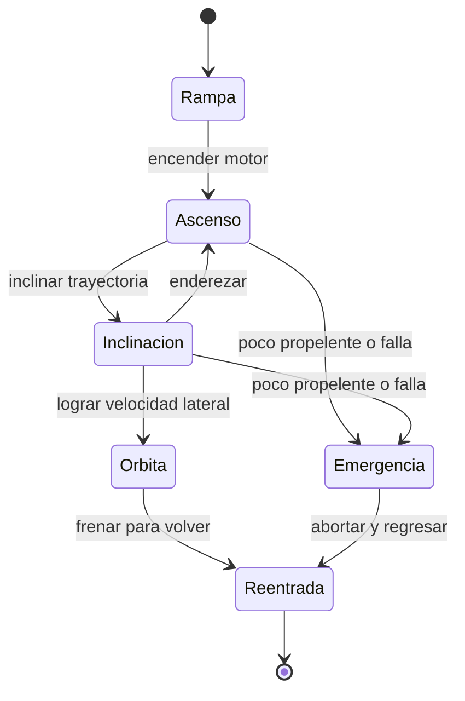

# 🎮 Diseño de simulación del Thunderbird 3

[🏠 Inicio](../../../README.md) · [🚀 Curso: Thunderbird 3](../README.md) · 🎮 Simulación

> ⚖️ Material educativo original; los derechos de las obras pertenecen a sus titulares.

Como modelar de forma educativa y divertida un cohete de rescate. La idea central
es poder alternar entre la versión espectacular de la ficción y la versión fiel a
la física, para que el usuario compare ambas con el mismo cohete.

## Objetivo de la simulación

Que el usuario comprenda, jugando, que llegar al espacio no es solo subir, que la
velocidad lateral es lo que cuesta, que las etapas ayudan a soltar peso muerto y
que cada maniobra gasta un propelente finito. El modo ficción sirve para
engancharse; el modo ciencia, para aprender.

## Modo ciencia o ficción

La variable más importante del simulador es el **modo**:

- **Modo ficción**: el cohete despega al instante, subir alto basta y el
  combustible casi no cuenta. Es divertido y familiar.
- **Modo ciencia**: se aplican la gravedad, la resistencia del aire, la necesidad
  de velocidad lateral y la ecuación del cohete. El propelente es escaso y manda.

Al cambiar de modo, la interfaz avisa que reglas se activan o desactivan, para
que la comparación sea explícita y educativa.

## Variables principales

| Variable | Tipo | Rango | Afecta a | Comentarios |
| --- | --- | --- | --- | --- |
| Modo | discreta | ciencia / ficción | Todas las reglas | Interruptor central del aprendizaje. |
| Empuje del motor | numérica | 0-100% | Aceleración | Limitado por el flujo de propelente. |
| Propelente restante | numérica | 0-100% | Autonomía de ascenso | En ficción puede ignorarse. |
| Delta-v disponible | numérica | 0-varios km/s | Alcance de maniobra | Crece al soltar etapas vacías. |
| Ángulo de inclinación | numérica | 0-90 grados | Reparto altura-velocidad | Cero es vertical, 90 es horizontal. |
| Velocidad horizontal | numérica | 0-varios km/s | Llegar a órbita | Es la meta real del ascenso. |
| Masa total | numérica | baja al gastar y soltar | Aceleración | Menos masa, más aceleración. |
| Densidad del aire | numérica | alta abajo, cero arriba | Frenado y calor | Cambia con la altura. |

## Ciclo básico

1. Leer entrada del usuario (empuje, inclinación, soltar etapa, reentrada).
2. Comprobar el modo activo (ciencia o ficción).
3. Calcular fuerzas: empuje del motor, gravedad y resistencia del aire.
4. Aplicar reglas del modo: en ciencia, descontar propelente y exigir velocidad lateral.
5. Aplicar el entorno: densidad del aire según la altura y calor asociado.
6. Actualizar velocidad, altura, masa y orientación del cohete.
7. Refrescar instrumentos (velocidad horizontal, propelente, delta-v, temperatura).

## Modos de juego futuros

- Tutorial de ascenso: descubrir que subir recto no llega a órbita.
- Reto de etapas: soltar cada etapa en el momento justo para ahorrar masa.
- Comparador lado a lado: mismo despegue en modo ciencia y en modo ficción.
- Gestión de propelente en una misión de rescate con delta-v limitado.
- Escenario de reentrada donde hay que frenar y controlar el calor.

## Elementos fuera de alcance

- Presentar la versión de ficción como si fuera física real sin avisarlo.
- Detalles del cohete presentados como datos técnicos oficiales.
- Cualquier contenido que confunda espectáculo con ciencia sin distinguirlos.

## Pendientes

- [ ] Definir valores por defecto de cada variable por tipo de cohete.
- [ ] Prototipar el ciclo básico con gravedad y resistencia del aire.
- [ ] Ajustar el descuento de propelente según la ecuación del cohete.
- [ ] Agregar fuentes de divulgación a [`manuales/fuentes.md`](../../../manuales/fuentes.md).

---

[⬅️ Anterior: Reglas del universo](../reglamentos/reglas-universo-thunderbird-3.md) · [➡️ Siguiente: Recursos](../recursos/recursos-thunderbird-3.md)
