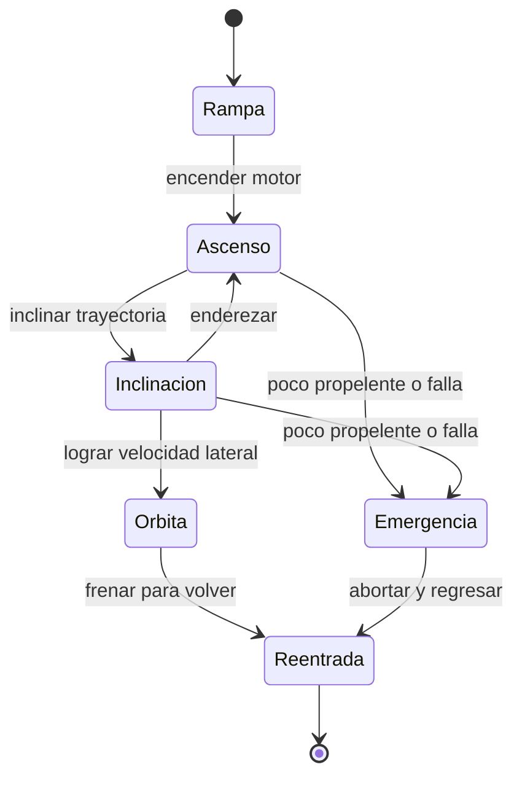
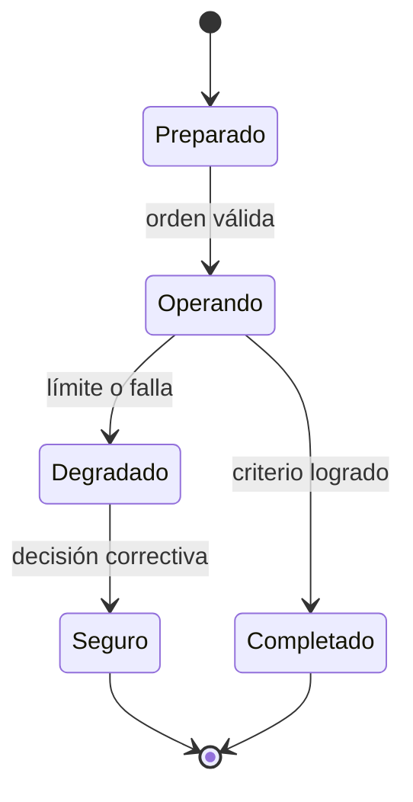

<!-- clase-meta
tipo_documento: clase
clase: 9
codigo: THUNDERBIRD3-09
curso: thunderbird-3
titulo: "Diseño de simulación del Thunderbird 3"
modalidad: "laboratorio de diseño"
duracion_minutos: 90
nivel: introductorio
prerrequisito: THUNDERBIRD3-08
competencia: "modelado_de_simulacion"
resultados_aprendizaje:
  - "Explicar objetivo, variables, estados, ciclo y escenarios de simulación con vocabulario propio de Thunderbird 3."
  - "Aplicar esos conceptos a una decisión segura o a un escenario de simulación de Thunderbird 3."
evidencia: "Ficha de escenario y diagrama de estados."
criterio_aprobacion: "El modelo es específico de la máquina, medible, seguro y trazable a clases anteriores."
fuentes: manuales/fuentes.md
ultima_revision: 2026-09-10
-->

# 🎮 Diseño de simulación del Thunderbird 3

[🏠 Inicio](../../../README.md) · [🚀 Curso: Thunderbird 3](../README.md) · 🎮 Simulación

> ⚖️ Material educativo original; los derechos de las obras pertenecen a sus titulares.

Como modelar de forma educativa y divertida un cohete de rescate. La idea central
es poder alternar entre la versión espectacular de la ficción y la versión fiel a
la física, para que el usuario compare ambas con el mismo cohete.

```mermaid
stateDiagram-v2
    [*] --> Rampa
    Rampa --> Ascenso: encender motor
    Ascenso --> Inclinacion: inclinar trayectoria
    Inclinacion --> Ascenso: enderezar
    Inclinacion --> Orbita: lograr velocidad lateral
    Ascenso --> Emergencia: poco propelente o falla
    Inclinacion --> Emergencia: poco propelente o falla
    Orbita --> Reentrada: frenar para volver
    Emergencia --> Reentrada: abortar y regresar
    Reentrada --> [*]
```

## Objetivo de la simulación

Que el usuario comprenda, jugando, que llegar al espacio no es solo subir, que la
velocidad lateral es lo que cuesta, que las etapas ayudan a soltar peso muerto y
que cada maniobra gasta un propelente finito. El modo ficción sirve para
engancharse; el modo ciencia, para aprender.

## Modo ciencia o ficción

La variable más importante del simulador es el **modo**:

- **Modo ficción**: el cohete despega al instante, subir alto basta y el
  combustible casi no cuenta. Es divertido y familiar.
- **Modo ciencia**: se aplican la gravedad, la resistencia del aire, la necesidad
  de velocidad lateral y la ecuación del cohete. El propelente es escaso y manda.

Al cambiar de modo, la interfaz avisa que reglas se activan o desactivan, para
que la comparación sea explícita y educativa.

## Variables principales

| Variable | Tipo | Rango | Afecta a | Comentarios |
| --- | --- | --- | --- | --- |
| Modo | discreta | ciencia / ficción | Todas las reglas | Interruptor central del aprendizaje. |
| Empuje del motor | numérica | 0-100% | Aceleración | Limitado por el flujo de propelente. |
| Propelente restante | numérica | 0-100% | Autonomía de ascenso | En ficción puede ignorarse. |
| Delta-v disponible | numérica | 0-varios km/s | Alcance de maniobra | Crece al soltar etapas vacías. |
| Ángulo de inclinación | numérica | 0-90 grados | Reparto altura-velocidad | Cero es vertical, 90 es horizontal. |
| Velocidad horizontal | numérica | 0-varios km/s | Llegar a órbita | Es la meta real del ascenso. |
| Masa total | numérica | baja al gastar y soltar | Aceleración | Menos masa, más aceleración. |
| Densidad del aire | numérica | alta abajo, cero arriba | Frenado y calor | Cambia con la altura. |

## Ciclo básico

1. Leer entrada del usuario (empuje, inclinación, soltar etapa, reentrada).
2. Comprobar el modo activo (ciencia o ficción).
3. Calcular fuerzas: empuje del motor, gravedad y resistencia del aire.
4. Aplicar reglas del modo: en ciencia, descontar propelente y exigir velocidad lateral.
5. Aplicar el entorno: densidad del aire según la altura y calor asociado.
6. Actualizar velocidad, altura, masa y orientación del cohete.
7. Refrescar instrumentos (velocidad horizontal, propelente, delta-v, temperatura).

## Modos de juego futuros

- Tutorial de ascenso: descubrir que subir recto no llega a órbita.
- Reto de etapas: soltar cada etapa en el momento justo para ahorrar masa.
- Comparador lado a lado: mismo despegue en modo ciencia y en modo ficción.
- Gestión de propelente en una misión de rescate con delta-v limitado.
- Escenario de reentrada donde hay que frenar y controlar el calor.

## Elementos fuera de alcance

- Presentar la versión de ficción como si fuera física real sin avisarlo.
- Detalles del cohete presentados como datos técnicos oficiales.
- Cualquier contenido que confunda espectáculo con ciencia sin distinguirlos.

## Pendientes

- [ ] Definir valores por defecto de cada variable por tipo de cohete.
- [ ] Prototipar el ciclo básico con gravedad y resistencia del aire.
- [ ] Ajustar el descuento de propelente según la ecuación del cohete.
- [ ] Agregar fuentes de divulgación a [`manuales/fuentes.md`](../../../manuales/fuentes.md).

## 🧭 Guía de estudio aplicada

### Pregunta guía

¿Cómo ayuda **Objetivo de la simulación, Modo ciencia o ficción, Variables principales y Ciclo básico** a **modelar intercepción de una nave averiada con ventana temporal corta como estados, variables y decisiones observables**?

### Explicación razonada

Una simulación de Thunderbird 3 es educativa si representa decisiones y consecuencias. Como mínimo debe modelar el estado de propelentes ficticios, la respuesta de motores, la transición en guiado y el resultado en trayectoria espacial. El escenario «intercepción de una nave averiada con ventana temporal corta» es valioso porque obliga a observar, formular una hipótesis, actuar y comprobar.

```mermaid
stateDiagram-v2
    [*] --> Preparado
    Preparado --> Operando: orden válida
    Operando --> Degradado: límite o falla
    Degradado --> Seguro: decisión correctiva
    Operando --> Completado: criterio logrado
    Seguro --> [*]
    Completado --> [*]
```

Esta clase se conecta con el resto del curso mediante **una misión de rescate espacial une lanzamiento, encuentro y reserva para retorno**. El hilo de
seguridad consiste en reconocer a tiempo **consumir la reserva durante la aproximación y perder capacidad de regreso** y poder justificar la decisión
**presupuestar combustible y criterios de aborto para cada fase**; en clases posteriores cambiará el ángulo de análisis, no esa relación causal.
La lectura funcional común sigue **propelentes ficticios → motores → guiado → trayectoria espacial**, de modo que cada concepto pueda
ubicarse dentro del funcionamiento completo y no quede como un dato aislado.

**Apoyo documental:** [Thunderbirds Vehicles](https://www.thunderbirds.com/) aporta referencia oficial de vehículos de rescate;
[Rockets Educator Guide](https://www.nasa.gov/wp-content/uploads/2012/07/rockets-educator-guide-20.pdf) se usa para propulsión, estabilidad y trayectoria. Estas fuentes
se contrastan con el alcance de la clase y no sustituyen un manual de equipo concreto.

### Caso resuelto: de la observación a la decisión

1. **Estado inicial:** representa intercepción de una nave averiada con ventana temporal corta con valores observables para **propelentes ficticios**, **motores**, **guiado** y **trayectoria espacial**.
2. **Decisión del estudiante:** ofrece una elección que cambie el estado, no una animación automática.
3. **Consecuencia:** modela la tendencia hacia **consumir la reserva durante la aproximación y perder capacidad de regreso** y una señal previa que permita corregir.
4. **Cierre:** evalúa la explicación de la decisión, además de si el estudiante “ganó” el escenario.

### Comprueba tu comprensión

1. ¿Qué cuatro estados mínimos necesita el escenario «intercepción de una nave averiada con ventana temporal corta»?
2. ¿Qué variable anticipa **consumir la reserva durante la aproximación y perder capacidad de regreso** antes de llegar al estado de falla?
3. ¿Cómo evaluarías la explicación del estudiante y no solo el resultado final?

Orientación para revisar tus respuestas

- La primera respuesta debe relacionar el eslabón elegido con un efecto posterior, no solo nombrarlo.
- La segunda debe proponer una señal medible u observable y explicar qué tendencia sería preocupante.
- La tercera debe cambiar al menos una variable de capacidad, mando, entorno o margen de seguridad.

## 🎓 Cierre de clase

- **Actividad:** Diseña un escenario educativo de Thunderbird 3 basado en objetivo, variables, estados, ciclo y escenarios de simulación, con entradas, estados, variables y criterio de cierre.
- **Evidencia:** Ficha de escenario y diagrama de estados.
- **Criterio de aprobación:** El modelo es específico de la máquina, medible, seguro y trazable a clases anteriores.
- **Transferencia:** explica qué cambiaría al pasar a otra variante de esta máquina.

### Fuentes de esta clase

- [THUNDERBIRDS-OFFICIAL](https://www.thunderbirds.com/): Thunderbirds Vehicles, ITV. Uso: referencia oficial de vehículos de rescate.
- [NASA-ROCKETS](https://www.nasa.gov/wp-content/uploads/2012/07/rockets-educator-guide-20.pdf): Rockets Educator Guide, NASA. Uso: propulsión, estabilidad y trayectoria.
- [NASA-FLIGHT](https://www1.grc.nasa.gov/beginners-guide-to-aeronautics/): Beginner's Guide to Aeronautics, NASA. Uso: contraste con física y vuelo reales.

> Las fuentes sostienen el marco conceptual y normativo; esta clase no reemplaza el manual
> del fabricante, la formación certificada ni la habilitación exigida para operar equipos reales.

---

[⬅️ Anterior: Reglas del universo](../reglamentos/reglas-universo-thunderbird-3.md) · [➡️ Siguiente: Recursos](../recursos/recursos-thunderbird-3.md)
