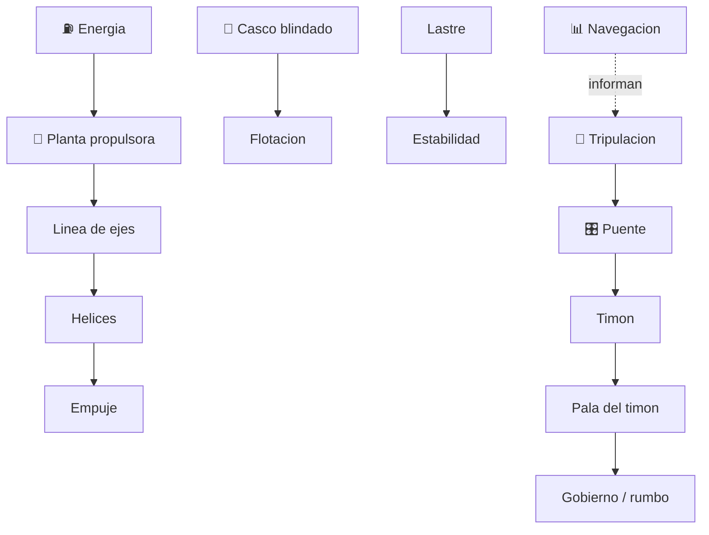

# 🛡️ Curso: Acorazados

[🏠 Inicio](../../README.md) · [🚙 Catalogo de vehiculos](../README.md) · [🎓 Guia de curso](../../docs/08-guia-de-estilo-y-curso.md)

> **Curso divulgativo e historico.** Documenta el acorazado solo con informacion
> publica: historia, caracteristicas generales, principios fisicos de flotacion,
> blindaje y estabilidad, puente a nivel educativo, entornos y marco publico.
> No incluye tactica, doctrina ni sistemas de armas. Ver
> [🦺 docs/04-seguridad-y-limites.md](../../docs/04-seguridad-y-limites.md).

---

## 🎯 Objetivos de aprendizaje

Al terminar este curso deberias poder:

- Explicar como un gran buque blindado flota, avanza y mantiene estabilidad.
- Identificar sus sistemas generales (casco, blindaje, propulsion, gobierno).
- Reconocer, a nivel educativo, el puente y los instrumentos de navegacion.
- Comprender la fisica publica de flotacion, blindaje y estabilidad.
- Conocer el marco institucional e internacional publico aplicable.
- Traducir todo lo anterior en variables de un simulador educativo responsable.

---

## 🗺️ Mapa del vehiculo

---

## 📚 Modulos del curso

| # | Modulo | Contenido | Enlace |
| :-: | --- | --- | --- |
| 1 | 📜 Historia | Origen y evolucion publica del acorazado. | [Abrir](historia/historia-acorazado.md) |
| 2 | 📋 Caracteristicas | Que es, tipos historicos y su papel general. | [Abrir](operacion/caracteristicas-acorazado.md) |
| 3 | 🔧 Sistemas mecanicos | Casco, blindaje, propulsion, gobierno y estabilidad. | [Abrir](operacion/sistemas-mecanicos-acorazado.md) |
| 4 | 🎛️ Mandos e instrumentos | Puente y navegacion, a nivel educativo. | [Abrir](mandos/manual-mandos-acorazado.md) |
| 5 | 🧪 Principios y operacion | Fisica de flotacion, blindaje y estabilidad. | [Abrir](operacion/principios-acorazado.md) |
| 6 | 🌍 Entornos de trabajo | Puerto, costa, mar abierto y clima. | [Abrir](operacion/entornos-acorazado.md) |
| 7 | ⚖️ Reglamentos | Marco publico institucional e internacional. | [Abrir](reglamentos/reglamentos-acorazado.md) |
| 8 | 🎮 Diseno de simulacion | Variables, ciclo y modos de simulacion. | [Abrir](simulacion/diseno-simulador-acorazado.md) |
| 9 | 🧰 Recursos | Glosario nautico, enlaces y diagramas. | [Abrir](recursos/recursos-acorazado.md) |

---

## 🧩 Requisitos previos

Conviene haber visto antes el curso de
[🚢 Barcos mercantes](../barcos-mercantes/README.md) para dominar flotacion,
inercia y gobierno. El acorazado agrega el blindaje y la escala, siempre desde un
enfoque historico y publico. Limites en
[🦺 docs/04-seguridad-y-limites.md](../../docs/04-seguridad-y-limites.md).

---

[➡️ Empezar por el Modulo 1: Historia](historia/historia-acorazado.md)
