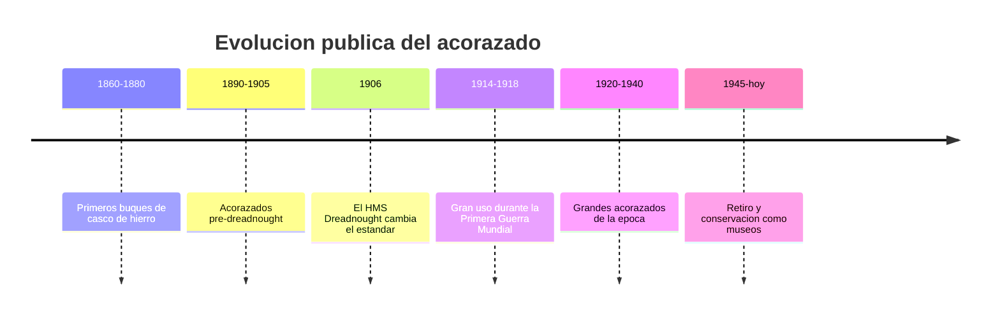

# 📜 Historia del acorazado

[🏠 Inicio](../../../README.md) · [🛡️ Curso: Acorazados](../README.md) · 📜 Historia

## Origen

El acorazado surge en el siglo XIX cuando el casco de hierro y luego de acero
reemplazo a la madera, permitiendo buques mucho mas resistentes. Este modulo
trata solo la evolucion **historica y publica** del tipo de buque, sin entrar en
tactica ni sistemas de combate.

## Linea de tiempo

| Periodo | Hito | Importancia |
| --- | --- | --- |
| 1860-1880 | Cascos de hierro | Fin de los buques de madera. |
| 1890-1905 | Pre-dreadnought | Estandarizacion del gran buque blindado. |
| 1906 | HMS Dreadnought | Marca un antes y un despues de diseno. |
| 1914-1918 | Primera Guerra Mundial | Gran protagonismo naval. |
| 1920-1940 | Grandes acorazados | Cuspide de tamano y blindaje. |
| 1945-presente | Retiro y museos | Conservacion como patrimonio. |

## Evolucion tecnologica

- **Casco**: del hierro al acero soldado, con creciente compartimentacion.
- **Blindaje**: distribucion del acero de proteccion segun zonas vitales.
- **Propulsion**: de la maquina de vapor a las turbinas.
- **Navegacion**: mejora progresiva de instrumentos de rumbo y posicion.
- **Escala**: aumento del desplazamiento y de la tripulacion.
- **Fin de era**: sustituidos por otros tipos de buque tras 1945.

## Tipos representativos

| Tipo | Epoca | Caracteristica destacada |
| --- | --- | --- |
| Ironclad | Siglo XIX | Primer casco blindado. |
| Pre-dreadnought | 1890-1905 | Diseno previo al estandar moderno. |
| Dreadnought | Desde 1906 | Nuevo estandar de gran buque. |
| Acorazado tardio | 1920-1940 | Maxima escala y blindaje. |

## Impacto historico y patrimonial

El acorazado fue simbolo del poderio naval de su epoca y motor de avances en
metalurgia, propulsion e ingenieria naval. Hoy varios se conservan como buques
museo, con valor educativo e historico.

## Fuentes

- Registrar aqui las fuentes publicas consultadas.
- Enlazar cada fuente tambien en [`manuales/fuentes.md`](../../../manuales/fuentes.md).

---

[🎓 Portada del curso](../README.md) · [➡️ Siguiente: Caracteristicas](../operacion/caracteristicas-acorazado.md)
