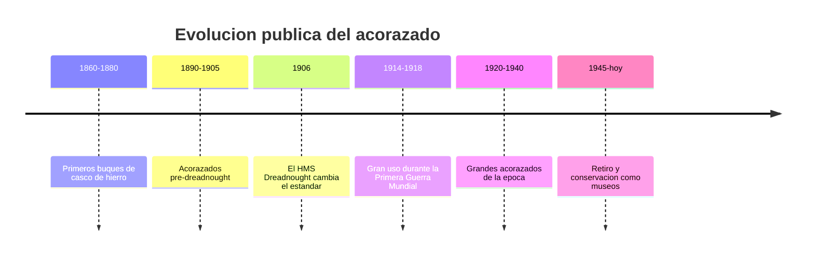

# 📜 Historia del acorazado

[🏠 Inicio](../../../README.md) · [🛡️ Curso: Acorazados](../README.md) · 📜 Historia

## Origen

El acorazado surge en el siglo XIX cuando el casco de hierro y luego de acero
reemplazó a la madera, permitiendo buques mucho más resistentes. Este módulo
trata solo la evolución **histórica y pública** del tipo de buque, sin entrar en
táctica ni sistemas de combate.

## Línea de tiempo

| Periodo | Hito | Importancia |
| --- | --- | --- |
| 1860-1880 | Cascos de hierro | Fin de los buques de madera. |
| 1890-1905 | Pre-dreadnought | Estandarización del gran buque blindado. |
| 1906 | HMS Dreadnought | Marca un antes y un después de diseño. |
| 1914-1918 | Primera Guerra Mundial | Gran protagonismo naval. |
| 1920-1940 | Grandes acorazados | Cúspide de tamaño y blindaje. |
| 1945-presente | Retiro y museos | Conservación como patrimonio. |

## Evolución tecnológica

- **Casco**: del hierro al acero soldado, con creciente compartimentación.
- **Blindaje**: distribución del acero de protección según zonas vitales.
- **Propulsión**: de la máquina de vapor a las turbinas.
- **Navegación**: mejora progresiva de instrumentos de rumbo y posición.
- **Escala**: aumento del desplazamiento y de la tripulación.
- **Fin de era**: sustituidos por otros tipos de buque tras 1945.

## Tipos representativos

| Tipo | Época | Característica destacada |
| --- | --- | --- |
| Ironclad | Siglo XIX | Primer casco blindado. |
| Pre-dreadnought | 1890-1905 | Diseño previo al estandar moderno. |
| Dreadnought | Desde 1906 | Nuevo estandar de gran buque. |
| Acorazado tardío | 1920-1940 | Máxima escala y blindaje. |

## Impacto histórico y patrimonial

El acorazado fue símbolo del poderío naval de su época y motor de avances en
metalurgia, propulsión e ingeniería naval. Hoy varios se conservan como buques
museo, con valor educativo e histórico.

## Fuentes

- Registrar aquí las fuentes públicas consultadas.
- Enlazar cada fuente también en [`manuales/fuentes.md`](../../../manuales/fuentes.md).

---

[🎓 Portada del curso](../README.md) · [➡️ Siguiente: Características](../operacion/caracteristicas-acorazado.md)
