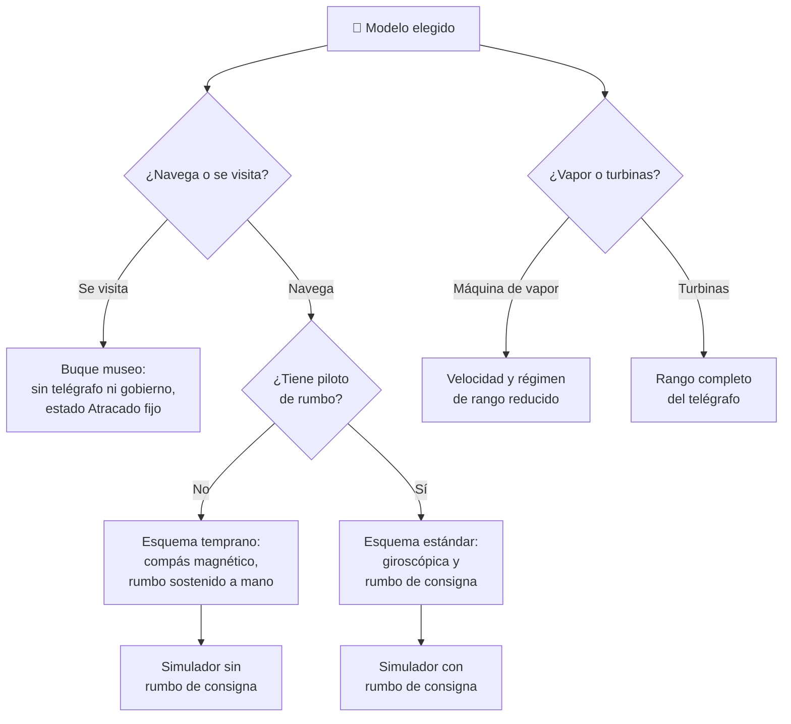

# 🧩 Modelos y variantes del acorazado

[🏠 Inicio](../../../README.md) · [🛡️ Curso: Acorazados](../README.md) · 🧩 Modelos

El [Módulo 2](../operacion/caracteristicas-acorazado.md) ya dijo qué tipos
históricos existieron y qué rasgo destacaba en cada uno. Este módulo responde a
otra cosa: **no todos se gobiernan igual**, y esa diferencia no es de matiz.
Cambia qué mandos tiene el puente y, por tanto, qué debe modelar el simulador.

> 🎯 **La idea que sostiene el módulo.** "Un acorazado" no es una sola máquina
> desde el punto de vista del gobierno. Entre un ironclad de hierro y un
> acorazado tardío hay medio siglo de evolución del casco, la propulsión y los
> instrumentos de rumbo. Un simulador que presente un solo puente está
> representando una generación concreta aunque diga representarlas todas. Todo
> lo que sigue se mantiene en el **marco público e histórico** del curso:
> generación, propulsión, gobierno y flotación. No hay táctica, doctrina ni
> sistemas de armas, tal como fija
> [`docs/04-seguridad-y-limites.md`](../../../docs/04-seguridad-y-limites.md).

---

## 🧭 Por qué el modelo decide el simulador

El [Módulo 5](../mandos/manual-mandos-acorazado.md) describe un puente con
compás giroscópico, telégrafo de máquina, **piloto de rumbo** y panel de control
de flotabilidad. El [Módulo 9](../simulacion/diseno-simulador-acorazado.md)
expone una variable `Velocidad` con rango `0-30 nudos` y una `Estabilidad (GM)`
afectada por el peso del blindaje. Ambos describen un buque de la generación
**dreadnought o posterior**, con turbinas e instrumentos maduros.

En un ironclad de hierro esa referencia no existe todavía. El
[Módulo 1](../historia/historia-acorazado.md) documenta que la propulsión pasa
de la máquina de vapor a las turbinas y que los instrumentos de rumbo mejoran de
forma **progresiva**: el puente temprano no es el mismo puente con menos lujos,
es un puente al que le faltan controles. Si el simulador se construye sobre el
esquema tardío y luego se le "añade" un pre-dreadnought, el resultado es un
pre-dreadnought con piloto de rumbo, que no corresponde a su época.

---

## 🗂️ Qué cambia en el manejo

| Modelo | Qué cambia al gobernarlo |
| --- | --- |
| Ironclad (siglo XIX) | Primer casco blindado de hierro y máquina de vapor: menos empuje disponible, así que el timón tarda más en tener flujo con el que trabajar. La compartimentación aún es incipiente. |
| Pre-dreadnought (1890-1905) | Diseño previo al estándar moderno: el gobierno ya es reconocible, pero el rumbo se sostiene con atención continua en vez de delegarse. |
| Dreadnought (desde 1906) | La referencia del curso: fija el estándar de diseño sobre el que están escritos los Módulos 5 y 9. |
| Acorazado tardío (1920-1940) | Máxima escala y protección: más masa significa más inercia, distancia de frenado mayor y giros más amplios. El peso alto del blindaje deja menos margen antes de que la escora importe. |
| Buque museo (actualidad) | No se gobierna: está amarrado. La máquina no responde a ninguna orden y el interés pasa a ser patrimonial y educativo. |

---

## 🎛️ Qué cambia en el mando

| Modelo | Qué mando aparece o desaparece | Consecuencia |
| --- | --- | --- |
| Ironclad, Pre-dreadnought | **Desaparece** el piloto de rumbo del Módulo 5, porque la referencia estable de rumbo llega con la mejora progresiva de instrumentos. El compás es magnético, no giroscópico. | El rumbo deja de poder fijarse y pasa a sostenerse a mano en toda la travesía: el estado de navegación cambia de naturaleza. |
| Ironclad | El **control de flotabilidad** cubre un casco con menos mamparos estancos. | El achique y la contrainundación tienen menos compartimentos con los que trabajar. |
| Dreadnought, Acorazado tardío | Ninguno: el mapa de controles del Módulo 5 aplica tal cual. | Cambian los rangos, no los controles. |
| Buque museo | **Desaparecen** el telégrafo de máquina, el piloto de rumbo y el control de flotabilidad como mandos activos. El timón queda como pieza expuesta. | No hay orden que dar: el puente se recorre, no se opera. |

---

## 🎮 Qué cambia en el simulador

Contrastado con las variables del
[Módulo 9](../simulacion/diseno-simulador-acorazado.md):

| Modelo | Variables que cambian | Esquema de control |
| --- | --- | --- |
| Ironclad | `Velocidad` reduce su rango útil muy por debajo del tope de 30 nudos, y con ello `Ángulo de timón` tarda más en producir giro. `Lastre` y `Estabilidad (GM)` operan sobre una compartimentación más pobre. | Sin entrada de piloto de rumbo; el rumbo se corrige de forma continua. |
| Pre-dreadnought | `Velocidad` y `Régimen de máquina` reducen su rango respecto del caso base. `Rumbo` deja de tener un valor de consigna que el sistema mantenga. | Sin entrada de piloto de rumbo. |
| Dreadnought | Ninguna: es el caso base. | El del Módulo 5. |
| Acorazado tardío | `Estabilidad (GM)` se estrecha y `Escora` gana peso en el cálculo, por la mayor masa alta de blindaje. La inercia aplicada en el paso 4 del ciclo básico crece. | El mismo, con respuesta más lenta. |
| Buque museo | `Velocidad`, `Régimen de máquina` y `Ángulo de timón` quedan fijos en cero. `Escora`, `GM` y `Lastre` pasan a ser datos de exhibición, no variables que el usuario mueva. | Sin esquema de gobierno: solo recorrido. |

Ese contraste es, además, el contenido del pendiente que el propio Módulo 9 deja
abierto: *definir valores por defecto por clase histórica de buque*.

---

## 🗺️ Del modelo al esquema de control

---

## ⚠️ Qué modelos no comparten simulador

Dos casos no se resuelven con un ajuste de parámetros, porque su esquema de
control es otro:

- **El ironclad y el pre-dreadnought** frente al resto: falta una entrada del
  puente y el rumbo deja de tener consigna. Es un modo de control distinto, no
  una dificultad distinta.
- **El buque museo** frente a todos los demás: el diagrama de estados del Módulo
  9 se colapsa en un único estado atracado, sin transiciones de maniobra ni de
  navegación. No es un buque más lento: es otra actividad.

El resto de modelos sí caben en un mismo simulador ajustando rangos, tal como
plantean los [niveles de realismo](../../../docs/03-niveles-de-realismo.md): en
el nivel 1, con rumbo, velocidad y flotación básica, un dreadnought y un
acorazado tardío se comportan casi igual, y las diferencias de inercia y
estabilidad solo emergen cuando el nivel sube al 2 y al 3.

> ⚖️ **El principio detrás de todo esto.** Cuánto pesa la carga y dónde va no cambia
> solo los números: cambia qué puede hacer el operador. La física común a todas las
> máquinas del catálogo —sostener, girar, equilibrar y la masa que cambia en
> marcha— está en [⚖️ carga y manejo](../../../docs/09-carga-y-manejo.md).

---

[⬅️ Anterior: Características](../operacion/caracteristicas-acorazado.md) · [➡️ Siguiente: Sistemas mecánicos](../operacion/sistemas-mecanicos-acorazado.md)
