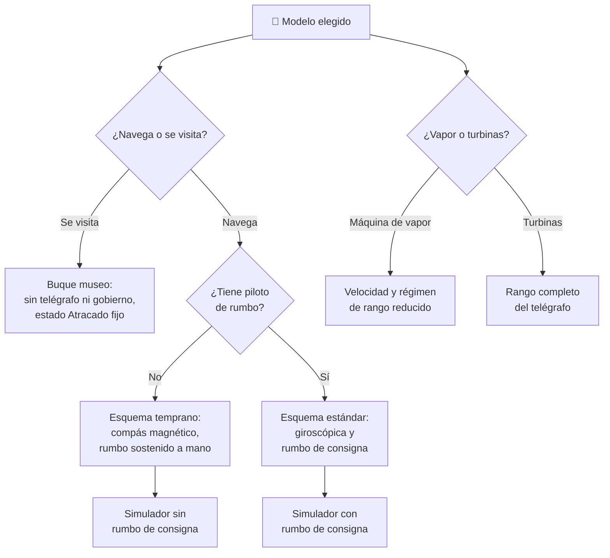

<!-- clase-meta
tipo_documento: clase
clase: 3
codigo: ACORAZADOS-03
curso: acorazados
titulo: "Modelos y variantes del acorazado"
modalidad: "comparativa guiada"
duracion_minutos: 60
nivel: introductorio
prerrequisito: ACORAZADOS-02
competencia: "seleccion_de_configuracion"
resultados_aprendizaje:
  - "Explicar manejo, arquitectura de mandos y variables de simulación con vocabulario propio de Acorazados."
  - "Aplicar esos conceptos a una decisión segura o a un escenario de simulación de Acorazados."
evidencia: "Matriz comparativa y decisión justificada."
criterio_aprobacion: "La elección considera función, límites, mando y efecto en la simulación; no se apoya solo en preferencias."
fuentes: manuales/fuentes.md
ultima_revision: 2026-09-10
-->

# 🧩 Modelos y variantes del acorazado

[🏠 Inicio](../../../README.md) · [🛡️ Curso: Acorazados](../README.md) · 🧩 Modelos

El [Clase 2](../operacion/caracteristicas-acorazado.md) ya dijo qué tipos
históricos existieron y qué rasgo destacaba en cada uno. Esta clase responde a
otra cosa: **no todos se gobiernan igual**, y esa diferencia no es de matiz.
Cambia qué mandos tiene el puente y, por tanto, qué debe modelar el simulador.

> 🎯 **La idea que sostiene el módulo.** "Un acorazado" no es una sola máquina
> desde el punto de vista del gobierno. Entre un ironclad de hierro y un
> acorazado tardío hay medio siglo de evolución del casco, la propulsión y los
> instrumentos de rumbo. Un simulador que presente un solo puente está
> representando una generación concreta aunque diga representarlas todas. Todo
> lo que sigue se mantiene en el **marco público e histórico** del curso:
> generación, propulsión, gobierno y flotación. No hay táctica, doctrina ni
> sistemas de armas, tal como fija
> [`docs/04-seguridad-y-limites.md`](../../../docs/04-seguridad-y-limites.md).

---

## 🧭 Por qué el modelo decide el simulador

El [Clase 5](../mandos/manual-mandos-acorazado.md) describe un puente con
compás giroscópico, telégrafo de máquina, **piloto de rumbo** y panel de control
de flotabilidad. El [Clase 9](../simulacion/diseno-simulador-acorazado.md)
expone una variable `Velocidad` con rango `0-30 nudos` y una `Estabilidad (GM)`
afectada por el peso del blindaje. Ambos describen un buque de la generación
**dreadnought o posterior**, con turbinas e instrumentos maduros.

En un ironclad de hierro esa referencia no existe todavía. El
[Clase 1](../historia/historia-acorazado.md) documenta que la propulsión pasa
de la máquina de vapor a las turbinas y que los instrumentos de rumbo mejoran de
forma **progresiva**: el puente temprano no es el mismo puente con menos lujos,
es un puente al que le faltan controles. Si el simulador se construye sobre el
esquema tardío y luego se le "añade" un pre-dreadnought, el resultado es un
pre-dreadnought con piloto de rumbo, que no corresponde a su época.

---

## 🗂️ Qué cambia en el manejo

| Modelo | Qué cambia al gobernarlo |
| --- | --- |
| Ironclad (siglo XIX) | Primer casco blindado de hierro y máquina de vapor: menos empuje disponible, así que el timón tarda más en tener flujo con el que trabajar. La compartimentación aún es incipiente. |
| Pre-dreadnought (1890-1905) | Diseño previo al estándar moderno: el gobierno ya es reconocible, pero el rumbo se sostiene con atención continua en vez de delegarse. |
| Dreadnought (desde 1906) | La referencia del curso: fija el estándar de diseño sobre el que están escritos los Módulos 5 y 9. |
| Acorazado tardío (1920-1940) | Máxima escala y protección: más masa significa más inercia, distancia de frenado mayor y giros más amplios. El peso alto del blindaje deja menos margen antes de que la escora importe. |
| Buque museo (actualidad) | No se gobierna: está amarrado. La máquina no responde a ninguna orden y el interés pasa a ser patrimonial y educativo. |

---

## 🎛️ Qué cambia en el mando

| Modelo | Qué mando aparece o desaparece | Consecuencia |
| --- | --- | --- |
| Ironclad, Pre-dreadnought | **Desaparece** el piloto de rumbo del Clase 5, porque la referencia estable de rumbo llega con la mejora progresiva de instrumentos. El compás es magnético, no giroscópico. | El rumbo deja de poder fijarse y pasa a sostenerse a mano en toda la travesía: el estado de navegación cambia de naturaleza. |
| Ironclad | El **control de flotabilidad** cubre un casco con menos mamparos estancos. | El achique y la contrainundación tienen menos compartimentos con los que trabajar. |
| Dreadnought, Acorazado tardío | Ninguno: el mapa de controles del Clase 5 aplica tal cual. | Cambian los rangos, no los controles. |
| Buque museo | **Desaparecen** el telégrafo de máquina, el piloto de rumbo y el control de flotabilidad como mandos activos. El timón queda como pieza expuesta. | No hay orden que dar: el puente se recorre, no se opera. |

---

## 🎮 Qué cambia en el simulador

Contrastado con las variables del
[Clase 9](../simulacion/diseno-simulador-acorazado.md):

| Modelo | Variables que cambian | Esquema de control |
| --- | --- | --- |
| Ironclad | `Velocidad` reduce su rango útil muy por debajo del tope de 30 nudos, y con ello `Ángulo de timón` tarda más en producir giro. `Lastre` y `Estabilidad (GM)` operan sobre una compartimentación más pobre. | Sin entrada de piloto de rumbo; el rumbo se corrige de forma continua. |
| Pre-dreadnought | `Velocidad` y `Régimen de máquina` reducen su rango respecto del caso base. `Rumbo` deja de tener un valor de consigna que el sistema mantenga. | Sin entrada de piloto de rumbo. |
| Dreadnought | Ninguna: es el caso base. | El del Clase 5. |
| Acorazado tardío | `Estabilidad (GM)` se estrecha y `Escora` gana peso en el cálculo, por la mayor masa alta de blindaje. La inercia aplicada en el paso 4 del ciclo básico crece. | El mismo, con respuesta más lenta. |
| Buque museo | `Velocidad`, `Régimen de máquina` y `Ángulo de timón` quedan fijos en cero. `Escora`, `GM` y `Lastre` pasan a ser datos de exhibición, no variables que el usuario mueva. | Sin esquema de gobierno: solo recorrido. |

Ese contraste es, además, el contenido del pendiente que el propio Clase 9 deja
abierto: *definir valores por defecto por clase histórica de buque*.

---

## 🗺️ Del modelo al esquema de control

```mermaid
flowchart TD
    Modelo[🧩 Modelo elegido] --> Nav{¿Navega o se visita?}
    Nav -- Se visita --> Museo[Buque museo:<br/>sin telégrafo ni gobierno,<br/>estado Atracado fijo]
    Nav -- Navega --> Rumbo{¿Tiene piloto<br/>de rumbo?}
    Rumbo -- No --> Manual[Esquema temprano:<br/>compás magnético,<br/>rumbo sostenido a mano]
    Rumbo -- Sí --> Asistido[Esquema estándar:<br/>giroscópica y<br/>rumbo de consigna]
    Manual --> Var1[Simulador sin<br/>rumbo de consigna]
    Asistido --> Var2[Simulador con<br/>rumbo de consigna]
    Modelo --> Planta{¿Vapor o turbinas?}
    Planta -- Máquina de vapor --> Lento[Velocidad y régimen<br/>de rango reducido]
    Planta -- Turbinas --> Rapido[Rango completo<br/>del telégrafo]
```

---

## ⚠️ Qué modelos no comparten simulador

Dos casos no se resuelven con un ajuste de parámetros, porque su esquema de
control es otro:

- **El ironclad y el pre-dreadnought** frente al resto: falta una entrada del
  puente y el rumbo deja de tener consigna. Es un modo de control distinto, no
  una dificultad distinta.
- **El buque museo** frente a todos los demás: el diagrama de estados del Módulo
  9 se colapsa en un único estado atracado, sin transiciones de maniobra ni de
  navegación. No es un buque más lento: es otra actividad.

El resto de modelos sí caben en un mismo simulador ajustando rangos, tal como
plantean los [niveles de realismo](../../../docs/03-niveles-de-realismo.md): en
el nivel 1, con rumbo, velocidad y flotación básica, un dreadnought y un
acorazado tardío se comportan casi igual, y las diferencias de inercia y
estabilidad solo emergen cuando el nivel sube al 2 y al 3.

> ⚖️ **El principio detrás de todo esto.** Cuánto pesa la carga y dónde va no cambia
> solo los números: cambia qué puede hacer el operador. La física común a todas las
> máquinas del catálogo —sostener, girar, equilibrar y la masa que cambia en
> marcha— está en [⚖️ carga y manejo](../../../docs/09-carga-y-manejo.md).

## 🧭 Guía de estudio aplicada

### Pregunta guía

¿Cómo ayuda **Por qué el modelo decide el simulador, Qué cambia en el manejo, Qué cambia en el mando y Qué cambia en el simulador** a **comparar acorazado pre-dreadnought frente a dreadnought frente al mismo encargo**?

### Explicación razonada

Las variantes «acorazado pre-dreadnought frente a dreadnought» resuelven prioridades distintas. Una comparación profesional sigue la cadena calderas o motores → turbinas → ejes y hélices → casco blindado: cada cambio de arquitectura modifica mandos, respuesta, mantenimiento y variables que una simulación debe representar. Elegir un modelo significa justificar qué compromiso sirve mejor al caso, no declarar un favorito.

Esta clase se conecta con el resto del curso mediante **compromiso histórico entre protección, potencia, alcance, estabilidad y potencia de fuego**. El hilo de
seguridad consiste en reconocer a tiempo **reacción lenta y exposición causada por gran radio táctico y baja aceleración** y poder justificar la decisión
**anticipar el movimiento considerando inercia, formación y campo de observación**; en clases posteriores cambiará el ángulo de análisis, no esa relación causal.
La lectura funcional común sigue **calderas o motores → turbinas → ejes y hélices → casco blindado**, de modo que cada concepto pueda
ubicarse dentro del funcionamiento completo y no quede como un dato aislado.

**Apoyo documental:** [Ships](https://www.history.navy.mil/browse-by-topic/ships.html) aporta historia pública de buques militares;
[Safety of Navigation](https://www.imo.org/en/ourwork/safety/pages/navigationdefault.aspx) se usa para navegación, SOLAS, COLREG y STCW. Estas fuentes
se contrastan con el alcance de la clase y no sustituyen un manual de equipo concreto.

### Caso resuelto: de la observación a la decisión

1. **Mantener el encargo constante:** ambas variantes deben evaluarse ante **maniobra histórica simulada de una unidad pesada en formación**.
2. **Trazar consecuencias:** para cada variante sigue el efecto desde **calderas o motores** hasta **casco blindado**.
3. **Comparar el puesto de mando:** determina qué debe percibir y controlar el operador en cada arquitectura.
4. **Justificar:** elige una variante y explica qué sacrifica; toda selección técnica contiene un compromiso.

### Comprueba tu comprensión

1. ¿Qué cambia en la cadena **calderas o motores → turbinas → ejes y hélices → casco blindado** entre las dos variantes?
2. ¿Qué indicación o mando adicional necesitaría una de ellas?
3. ¿Cuál elegirías para «maniobra histórica simulada de una unidad pesada en formación» y qué desventaja aceptarías?

Orientación para revisar tus respuestas

- La primera respuesta debe relacionar el eslabón elegido con un efecto posterior, no solo nombrarlo.
- La segunda debe proponer una señal medible u observable y explicar qué tendencia sería preocupante.
- La tercera debe cambiar al menos una variable de capacidad, mando, entorno o margen de seguridad.

## 🎓 Cierre de clase

- **Actividad:** Compara variantes de Acorazados mediante los ejes «manejo, arquitectura de mandos y variables de simulación» y elige una para un caso de uso razonado.
- **Evidencia:** Matriz comparativa y decisión justificada.
- **Criterio de aprobación:** La elección considera función, límites, mando y efecto en la simulación; no se apoya solo en preferencias.
- **Transferencia:** explica qué cambiaría al pasar a otra variante de esta máquina.

### Fuentes de esta clase

- [US-NHHC-SHIPS](https://www.history.navy.mil/browse-by-topic/ships.html): Ships, Naval History and Heritage Command. Uso: historia pública de buques militares.
- [IMO-NAV](https://www.imo.org/en/ourwork/safety/pages/navigationdefault.aspx): Safety of Navigation, International Maritime Organization. Uso: navegación, SOLAS, COLREG y STCW.

> Las fuentes sostienen el marco conceptual y normativo; esta clase no reemplaza el manual
> del fabricante, la formación certificada ni la habilitación exigida para operar equipos reales.

---

[⬅️ Anterior: Características](../operacion/caracteristicas-acorazado.md) · [➡️ Siguiente: Sistemas mecánicos](../operacion/sistemas-mecanicos-acorazado.md)
