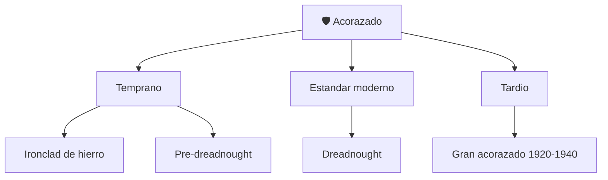

# 📋 Caracteristicas funcionales del acorazado

[🏠 Inicio](../../../README.md) · [🛡️ Curso: Acorazados](../README.md) · 📋 Caracteristicas

Que es un acorazado, que tipos historicos existieron y cual fue su papel general.
Este modulo da el contexto publico antes de abrir la fisica naval (Modulo 3). No
se documentan tactica ni sistemas de armas.

---

## 🧭 Definicion

Un acorazado es un buque de guerra historico caracterizado por su gran blindaje y
desplazamiento. Como todo buque, flota por el principio de Arquimedes, avanza por
el empuje de sus helices y gobierna con el timon. Su rasgo distintivo fue la
proteccion de acero, tratada aqui solo como concepto fisico y estructural.

---

## 🧬 Caracteristicas clave

| Caracteristica | Descripcion |
| --- | --- |
| Gran desplazamiento | Miles de toneladas; enorme inercia. |
| Blindaje | Acero de proteccion que anade peso y afecta estabilidad. |
| Compartimentacion | Mamparos estancos para limitar inundaciones. |
| Estabilidad | Depende del reparto de peso, blindaje y lastre. |
| Autonomia | Disenado para largas travesias oceanicas. |
| Tripulacion numerosa | Muchos roles coordinados a bordo. |

---

## 🗂️ Tipos historicos

| Tipo | Epoca | Rasgo destacado |
| --- | --- | --- |
| Ironclad | Siglo XIX | Primer casco blindado de hierro. |
| Pre-dreadnought | 1890-1905 | Diseno previo al estandar moderno. |
| Dreadnought | Desde 1906 | Fija el nuevo estandar de diseno. |
| Acorazado tardio | 1920-1940 | Maxima escala y proteccion. |
| Buque museo | Actualidad | Uso patrimonial y educativo. |

---

## 🎯 Para que se uso

- Representar el poderio naval de su epoca (contexto historico).
- Impulsar avances en metalurgia, propulsion e ingenieria naval.
- Hoy, valor patrimonial como buques museo.
- En este repositorio: base para simulacion educativa de navegacion.

---

[⬅️ Anterior: Historia](../historia/historia-acorazado.md) · [➡️ Siguiente: Sistemas mecanicos](sistemas-mecanicos-acorazado.md)
