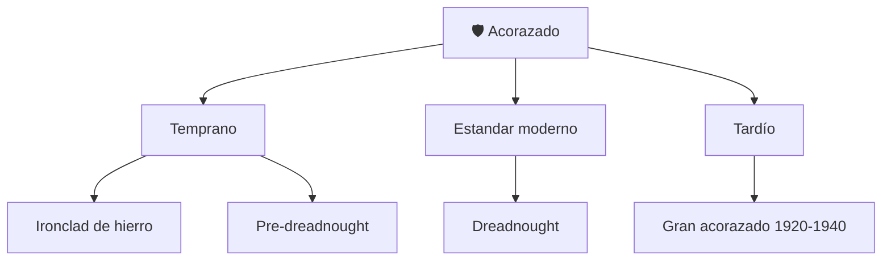

<!-- clase-meta
tipo_documento: clase
clase: 2
codigo: ACORAZADOS-02
curso: acorazados
titulo: "Características funcionales del acorazado"
modalidad: "teórica aplicada"
duracion_minutos: 45
nivel: introductorio
prerrequisito: ACORAZADOS-01
competencia: "identificacion_funcional"
resultados_aprendizaje:
  - "Explicar definición, rasgos funcionales, tipos y usos con vocabulario propio de Acorazados."
  - "Aplicar esos conceptos a una decisión segura o a un escenario de simulación de Acorazados."
evidencia: "Matriz comparativa y decisión justificada."
criterio_aprobacion: "La elección considera función, límites, mando y efecto en la simulación; no se apoya solo en preferencias."
fuentes: manuales/fuentes.md
ultima_revision: 2026-09-10
-->

# 📋 Características funcionales del acorazado

[🏠 Inicio](../../../README.md) · [🛡️ Curso: Acorazados](../README.md) · 📋 Características

Que es un acorazado, que tipos históricos existieron y cual fue su papel general.
Esta clase da el contexto público antes de abrir la física naval (Clase 4). No
se documentan táctica ni sistemas de armas.

---

## 🧭 Definición

Un acorazado es un buque de guerra histórico caracterizado por su gran blindaje y
desplazamiento. Como todo buque, flota por el principio de Arquímedes, avanza por
el empuje de sus hélices y gobierna con el timón. Su rasgo distintivo fue la
protección de acero, tratada aquí solo como concepto físico y estructural.

---

## 🧬 Características clave

| Característica | Descripción |
| --- | --- |
| Gran desplazamiento | Miles de toneladas; enorme inercia. |
| Blindaje | Acero de protección que añade peso y afecta estabilidad. |
| Compartimentación | Mamparos estancos para limitar inundaciones. |
| Estabilidad | Depende del reparto de peso, blindaje y lastre. |
| Autonomía | Disenado para largas travesías oceánicas. |
| Tripulación numerosa | Muchos roles coordinados a bordo. |

---

## 🗂️ Tipos históricos

```mermaid
flowchart TD
    Acorazado[🛡️ Acorazado] --> Temprano[Temprano]
    Acorazado --> Estandar[Estandar moderno]
    Acorazado --> Tardio[Tardío]
    Temprano --> Ironclad[Ironclad de hierro]
    Temprano --> Pre[Pre-dreadnought]
    Estandar --> Dread[Dreadnought]
    Tardio --> Grande[Gran acorazado 1920-1940]
```

| Tipo | Época | Rasgo destacado |
| --- | --- | --- |
| Ironclad | Siglo XIX | Primer casco blindado de hierro. |
| Pre-dreadnought | 1890-1905 | Diseño previo al estandar moderno. |
| Dreadnought | Desde 1906 | Fija el nuevo estandar de diseño. |
| Acorazado tardío | 1920-1940 | Máxima escala y protección. |
| Buque museo | Actualidad | Uso patrimonial y educativo. |

---

## 🎯 Para qué se usó

- Representar el poderío naval de su época (contexto histórico).
- Impulsar avances en metalurgia, propulsión e ingeniería naval.
- Hoy, valor patrimonial como buques museo.
- En este repositorio: base para simulación educativa de navegación.

## 🧭 Guía de estudio aplicada

### Pregunta guía

¿Cómo ayuda **Definición, Características clave, Tipos históricos y Para qué se usó** a **elegir una configuración adecuada para maniobra histórica simulada de una unidad pesada en formación**?

### Explicación razonada

Una característica solo es útil cuando permite anticipar comportamiento. En Acorazados, la relación entre calderas o motores, turbinas, ejes y hélices y casco blindado determina capacidad, respuesta y límites. Por eso «acorazado pre-dreadnought frente a dreadnought» no se compara por apariencia: se compara por misión, entorno, carga de trabajo y exposición al riesgo «reacción lenta y exposición causada por gran radio táctico y baja aceleración».

Esta clase se conecta con el resto del curso mediante **compromiso histórico entre protección, potencia, alcance, estabilidad y potencia de fuego**. El hilo de
seguridad consiste en reconocer a tiempo **reacción lenta y exposición causada por gran radio táctico y baja aceleración** y poder justificar la decisión
**anticipar el movimiento considerando inercia, formación y campo de observación**; en clases posteriores cambiará el ángulo de análisis, no esa relación causal.
La lectura funcional común sigue **calderas o motores → turbinas → ejes y hélices → casco blindado**, de modo que cada concepto pueda
ubicarse dentro del funcionamiento completo y no quede como un dato aislado.

**Apoyo documental:** [Ships](https://www.history.navy.mil/browse-by-topic/ships.html) aporta historia pública de buques militares;
[Safety of Navigation](https://www.imo.org/en/ourwork/safety/pages/navigationdefault.aspx) se usa para navegación, SOLAS, COLREG y STCW. Estas fuentes
se contrastan con el alcance de la clase y no sustituyen un manual de equipo concreto.

### Caso resuelto: de la observación a la decisión

1. **Definir la necesidad:** convierte «maniobra histórica simulada de una unidad pesada en formación» en requisitos de capacidad, entorno y respuesta.
2. **Comparar:** contrasta **acorazado pre-dreadnought frente a dreadnought** usando esos requisitos y la cadena **calderas o motores → turbinas → ejes y hélices → casco blindado**.
3. **Descartar:** elimina la alternativa que deja menos margen frente a **reacción lenta y exposición causada por gran radio táctico y baja aceleración**.
4. **Elegir:** declara la variante escogida, la evidencia usada y una limitación que todavía debe respetarse.

### Comprueba tu comprensión

1. ¿Qué característica de **casco blindado** condiciona primero el caso «maniobra histórica simulada de una unidad pesada en formación»?
2. ¿Qué requisito descartaría una de las alternativas **acorazado pre-dreadnought frente a dreadnought**?
3. ¿Qué límite debe declararse junto con la variante elegida?

Orientación para revisar tus respuestas

- La primera respuesta debe relacionar el eslabón elegido con un efecto posterior, no solo nombrarlo.
- La segunda debe proponer una señal medible u observable y explicar qué tendencia sería preocupante.
- La tercera debe cambiar al menos una variable de capacidad, mando, entorno o margen de seguridad.

## 🎓 Cierre de clase

- **Actividad:** Compara variantes de Acorazados mediante los ejes «definición, rasgos funcionales, tipos y usos» y elige una para un caso de uso razonado.
- **Evidencia:** Matriz comparativa y decisión justificada.
- **Criterio de aprobación:** La elección considera función, límites, mando y efecto en la simulación; no se apoya solo en preferencias.
- **Transferencia:** explica qué cambiaría al pasar a otra variante de esta máquina.

### Fuentes de esta clase

- [US-NHHC-SHIPS](https://www.history.navy.mil/browse-by-topic/ships.html): Ships, Naval History and Heritage Command. Uso: historia pública de buques militares.
- [IMO-NAV](https://www.imo.org/en/ourwork/safety/pages/navigationdefault.aspx): Safety of Navigation, International Maritime Organization. Uso: navegación, SOLAS, COLREG y STCW.

> Las fuentes sostienen el marco conceptual y normativo; esta clase no reemplaza el manual
> del fabricante, la formación certificada ni la habilitación exigida para operar equipos reales.

---

[⬅️ Anterior: Historia](../historia/historia-acorazado.md) · [➡️ Siguiente: Modelos y variantes](../modelos/modelos-acorazado.md)
