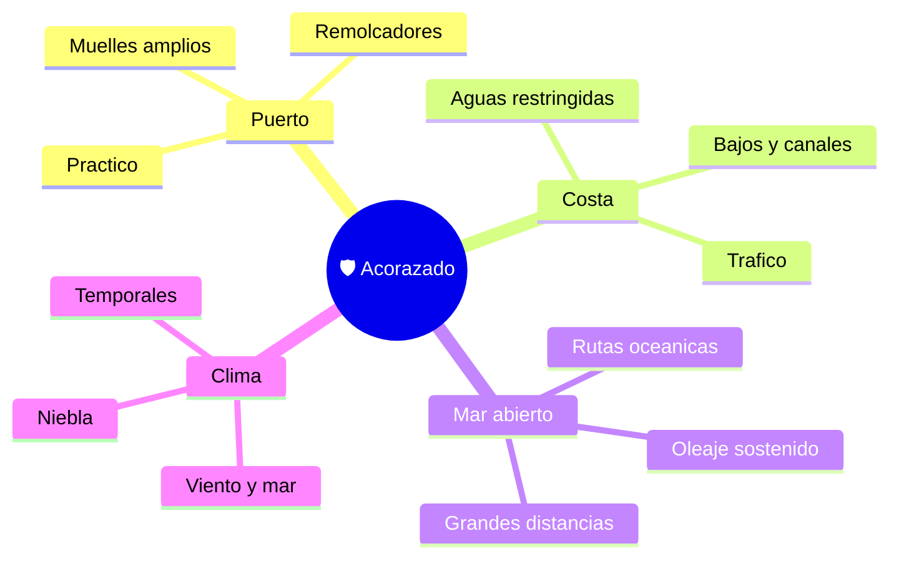

# 🌍 Entornos de trabajo del acorazado

[🏠 Inicio](../../../README.md) · [🛡️ Curso: Acorazados](../README.md) · 🌍 Entornos

Donde navegaba un gran buque blindado y cómo cambia la navegación según el
entorno. Enfoque general y educativo; cada entorno se traduce en un escenario de
simulación distinto.

---

## 🗺️ Entornos principales

| Entorno | Características | Riesgos típicos | Ajuste de navegación |
| --- | --- | --- | --- |
| Puerto | Espacio estrecho para su tamaño. | Colisión, mala maniobra. | Baja velocidad, remolcadores. |
| Costa | Aguas restringidas, bajos. | Varada por gran calado. | Vigilancia, sonda, margen amplio. |
| Mar abierto | Rutas largas, oleaje. | Temporales, fatiga. | Rumbo, guardias, meteorología. |
| Niebla / noche | Baja visibilidad. | No ser visto, abordaje. | Luces, señales, vigilancia. |
| Temporal | Viento y mar gruesa. | Escora, esfuerzos del casco. | Reducir velocidad, cuidar estabilidad. |

---

## 🌦️ Factores del entorno

- **Viento y mar**: el oleaje afecta rumbo, escora y esfuerzos del casco.
- **Corrientes y mareas**: modifican la trayectoria y el calado disponible.
- **Profundidad**: el gran calado limita puertos y rutas.
- **Visibilidad**: niebla y noche exigen luces y vigilancia.
- **Distancia**: las travesías oceánicas exigen autonomía y guardias.

---

## 🎮 Traducción a simulación

Cada entorno es un escenario con su profundidad, clima, corriente y tráfico. Ver
como se modela en el
[Módulo 8: Diseño de simulación](../simulacion/diseno-simulador-acorazado.md).

---

[⬅️ Anterior: Principios y operación](principios-acorazado.md) · [➡️ Siguiente: Reglamentos](../reglamentos/reglamentos-acorazado.md)
