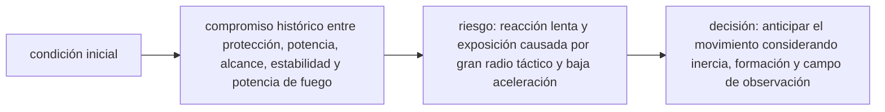

<!-- clase-meta
tipo_documento: clase
clase: 6
codigo: ACORAZADOS-06
curso: acorazados
titulo: "Principios y operación del acorazado"
modalidad: "resolución de problemas"
duracion_minutos: 90
nivel: introductorio
prerrequisito: ACORAZADOS-05
competencia: "razonamiento_operacional"
resultados_aprendizaje:
  - "Explicar principios físicos, fases de operación, decisiones y errores frecuentes con vocabulario propio de Acorazados."
  - "Aplicar esos conceptos a una decisión segura o a un escenario de simulación de Acorazados."
evidencia: "Resolución argumentada de un escenario operacional."
criterio_aprobacion: "Aplica los principios correctos, anticipa consecuencias y respeta los límites del curso."
fuentes: manuales/fuentes.md
ultima_revision: 2026-09-10
-->

# 🧪 Principios y operación del acorazado

[🏠 Inicio](../../../README.md) · [🛡️ Curso: Acorazados](../README.md) · 🧪 Principios

Documento general, educativo e histórico. Trata solo principios físicos públicos
de flotación, blindaje y estabilidad. No sustituye formación náutica ni describe
operación militar real, táctica o sistemas de armas.

## Principios de funcionamiento

- **Flotación**: el buque flota porque desplaza un peso de agua igual al suyo
  (principio de Arquímedes).
- **Propulsión**: las hélices empujan agua hacia atrás y, por reacción, el buque
  avanza (tercera ley de Newton).
- **Gobierno**: la pala del timón desvia el flujo de agua en popa; necesita
  velocidad para responder.
- **Inercia**: la enorme masa hace que acelerar, frenar y girar sea muy lento;
  toda maniobra se anticipa.
- **Estabilidad**: el peso del blindaje eleva el centro de gravedad, por lo que
  el reparto de masa y el lastre son críticos para no escorar en exceso.

## Fases de operación

| Fase | Que ocurre | Puntos clave |
| --- | --- | --- |
| Preparación | Revisión antes de zarpar | Máquina, gobierno, flotabilidad. |
| Desatraque | Salir del muelle | Baja velocidad, remolcadores si aplica. |
| Salida de puerto | Navegar el canal | Práctico, señales, margen amplio. |
| Navegación | Travesía oceánica | Rumbo, guardias, vigilancia. |
| Aproximación | Acercarse a puerto | Reducir velocidad con mucha antelación. |
| Atraque | Amarrar en muelle | Maniobra fina, gran inercia. |
| Cierre | Dejar segura la nave | Máquina parada, amarre firme. |

## Estabilidad: idea general

1. El **blindaje** aporta peso alto, subiendo el centro de gravedad.
2. El **lastre** en el fondo baja ese centro y mejora la estabilidad.
3. Una **inundación asimétrica** provoca escora que hay que compensar.
4. La **compartimentación** limita el agua que entra a una zona.
5. El objetivo es que el buque **vuelva a la vertical** tras una escora.

## Errores comunes que la simulación puede enseñar a evitar

- Subestimar la enorme distancia de frenado por la inercia.
- Intentar gobernar con el buque casi parado.
- Ignorar la profundidad bajo la quilla y varar.
- Descuidar el reparto de peso y la estabilidad.
- No compensar una escora por inundación asimétrica.

## Relación con los niveles de realismo

- **Nivel 1 (educativo)**: rumbo, velocidad y flotación básica.
- **Nivel 2 (simplificado)**: agregar inercia, distancia de frenado y viento.
- **Nivel 3 (técnico)**: sumar estabilidad, escora, lastre y compartimentación.

Ver [`docs/03-niveles-de-realismo.md`](../../../docs/03-niveles-de-realismo.md) para el detalle de cada nivel.

## 🧭 Guía de estudio aplicada

### Pregunta guía

¿Cómo ayuda **Principios de funcionamiento, Fases de operación, Estabilidad: idea general y Errores comunes que la simulación puede enseñar a evitar** a **resolver maniobra histórica simulada de una unidad pesada en formación sin agotar el margen operacional**?

### Explicación razonada

El principio rector puede resumirse así: compromiso histórico entre protección, potencia, alcance, estabilidad y potencia de fuego. Esto explica por qué una misma orden produce resultados distintos cuando cambian velocidad, carga, configuración o entorno. Operar bien consiste en leer la tendencia antes de agotar el margen y tomar esta decisión: anticipar el movimiento considerando inercia, formación y campo de observación.

Esta clase se conecta con el resto del curso mediante **compromiso histórico entre protección, potencia, alcance, estabilidad y potencia de fuego**. El hilo de
seguridad consiste en reconocer a tiempo **reacción lenta y exposición causada por gran radio táctico y baja aceleración** y poder justificar la decisión
**anticipar el movimiento considerando inercia, formación y campo de observación**; en clases posteriores cambiará el ángulo de análisis, no esa relación causal.
La lectura funcional común sigue **calderas o motores → turbinas → ejes y hélices → casco blindado**, de modo que cada concepto pueda
ubicarse dentro del funcionamiento completo y no quede como un dato aislado.

**Apoyo documental:** [Ships](https://www.history.navy.mil/browse-by-topic/ships.html) aporta historia pública de buques militares;
[Safety of Navigation](https://www.imo.org/en/ourwork/safety/pages/navigationdefault.aspx) se usa para navegación, SOLAS, COLREG y STCW. Estas fuentes
se contrastan con el alcance de la clase y no sustituyen un manual de equipo concreto.

### Caso resuelto: de la observación a la decisión

1. **Datos:** reconoce condiciones, configuración y margen disponibles en **maniobra histórica simulada de una unidad pesada en formación**.
2. **Modelo:** aplica **compromiso histórico entre protección, potencia, alcance, estabilidad y potencia de fuego** para predecir una tendencia antes de actuar.
3. **Riesgo:** explica mediante qué cadena de causas podría ocurrir **reacción lenta y exposición causada por gran radio táctico y baja aceleración**.
4. **Decisión:** ejecuta mentalmente **anticipar el movimiento considerando inercia, formación y campo de observación** y define qué observación confirmaría que funcionó.

### Comprueba tu comprensión

1. ¿Qué variable del principio «compromiso histórico entre protección, potencia, alcance, estabilidad y potencia de fuego» cambia primero en el caso?
2. ¿Cómo se propaga ese cambio hasta **casco blindado**?
3. ¿Qué evidencia confirmaría que **anticipar el movimiento considerando inercia, formación y campo de observación** conservó margen operacional?

Orientación para revisar tus respuestas

- La primera respuesta debe relacionar el eslabón elegido con un efecto posterior, no solo nombrarlo.
- La segunda debe proponer una señal medible u observable y explicar qué tendencia sería preocupante.
- La tercera debe cambiar al menos una variable de capacidad, mando, entorno o margen de seguridad.

## 🎓 Cierre de clase

- **Actividad:** Resuelve un escenario de Acorazados explicando, paso a paso, cómo intervienen principios físicos, fases de operación, decisiones y errores frecuentes.
- **Evidencia:** Resolución argumentada de un escenario operacional.
- **Criterio de aprobación:** Aplica los principios correctos, anticipa consecuencias y respeta los límites del curso.
- **Transferencia:** explica qué cambiaría al pasar a otra variante de esta máquina.

### Fuentes de esta clase

- [US-NHHC-SHIPS](https://www.history.navy.mil/browse-by-topic/ships.html): Ships, Naval History and Heritage Command. Uso: historia pública de buques militares.
- [IMO-NAV](https://www.imo.org/en/ourwork/safety/pages/navigationdefault.aspx): Safety of Navigation, International Maritime Organization. Uso: navegación, SOLAS, COLREG y STCW.

> Las fuentes sostienen el marco conceptual y normativo; esta clase no reemplaza el manual
> del fabricante, la formación certificada ni la habilitación exigida para operar equipos reales.

---

[⬅️ Anterior: Mandos](../mandos/manual-mandos-acorazado.md) · [➡️ Siguiente: Entornos de trabajo](entornos-acorazado.md)
