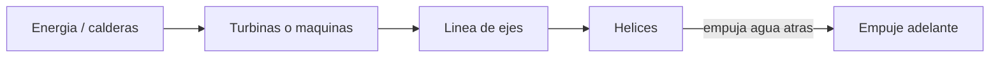

# 🔧 Sistemas mecanicos del acorazado

[🏠 Inicio](../../../README.md) · [🛡️ Curso: Acorazados](../README.md) · 🔧 Sistemas mecanicos

Este modulo describe, **solo con fisica publica**, como flota, avanza, gobierna y
se mantiene estable un gran buque blindado. No incluye sistemas de armas,
tactica ni datos sensibles. Es la base para entender los mandos (Modulo 4) y la
fisica de la navegacion (Modulo 5).

---

## 1. 🚢 Casco y flotacion

El casco es la estructura estanca que sostiene el buque por flotacion. En un
acorazado es especialmente robusto por el peso del blindaje.

- **Obra viva y obra muerta**: parte sumergida y parte emergida del casco.
- **Reserva de flotabilidad**: volumen estanco por encima de la flotacion.
- **Compartimentacion**: mamparos que dividen el casco para limitar inundaciones.

| Parte | Funcion | Efecto en el buque |
| --- | --- | --- |
| Quilla | Eje estructural inferior | Rigidez y estabilidad. |
| Mamparos | Dividen el casco | Contienen inundaciones. |
| Doble fondo | Espacio inferior estanco | Proteccion y lastre. |
| Francobordo | Altura hasta cubierta | Reserva de flotabilidad. |

---

## 2. 🛡️ Blindaje (concepto fisico)

El blindaje es acero de proteccion distribuido en el casco. Tratado aqui solo
como masa estructural y su efecto en la fisica del buque, no como sistema de
combate.

- **Peso**: el blindaje anade mucha masa, aumentando la inercia y el calado.
- **Distribucion**: concentrar peso alto sube el centro de gravedad y reduce
  estabilidad; por eso el diseno cuida donde va cada tonelada.
- **Compromiso**: mas proteccion implica mas peso y menor velocidad o autonomia.

| Aspecto fisico | Efecto |
| --- | --- |
| Masa del blindaje | Mayor inercia y calado. |
| Altura del peso | Afecta el centro de gravedad. |
| Reparto | Condiciona la estabilidad. |

---

## 3. 🔧 Propulsion

Convierte energia en empuje para mover una gran masa.

- **Planta propulsora**: historicamente maquinas de vapor o turbinas.
- **Linea de ejes**: transmite el giro a varias helices.
- **Helices**: empujan agua hacia atras y, por reaccion, mueven el buque.

---

## 4. ⚙️ Gobierno y timon

El gobierno cambia el rumbo desviando el flujo de agua en la popa.

- **Pala del timon**: al girar desvia el agua y hace rotar el buque.
- **Servomotor**: mueve la pala con la fuerza necesaria para la gran masa.
- **Inercia**: por su tamano, el giro es amplio y lento.

---

## 5. ⚖️ Estabilidad y control de flotabilidad

La estabilidad depende del equilibrio entre peso, blindaje y lastre.

| Concepto | Definicion | Riesgo si falla |
| --- | --- | --- |
| Centro de gravedad (G) | Punto donde actua el peso total. | Muy alto: inestable. |
| Metacentro (M) | Referencia de estabilidad al escorar. | G sobre M: riesgo de vuelco. |
| Escora | Inclinacion transversal. | Excesiva por inundacion asimetrica. |
| Contrainundacion | Igualar peso entre costados. | Concepto de seguridad de flotabilidad. |
| Lastre | Agua de ajuste de peso. | Mal manejo: inestabilidad. |

---

## 🔁 Como se conecta todo

1. El **casco** aporta flotacion y aloja el **blindaje**.
2. La **planta propulsora** genera potencia para las **helices**.
3. El **timon** desvia el agua para cambiar el rumbo.
4. La **compartimentacion** y el **lastre** cuidan la estabilidad.
5. Todo se opera de forma coordinada por la tripulacion.

Con esto entendido, el
[Modulo 4: Mandos](../mandos/manual-mandos-acorazado.md) describe, a nivel
educativo, como se navega el buque desde el puente.

---

[⬅️ Anterior: Caracteristicas](caracteristicas-acorazado.md) · [➡️ Siguiente: Mandos e instrumentos](../mandos/manual-mandos-acorazado.md)
