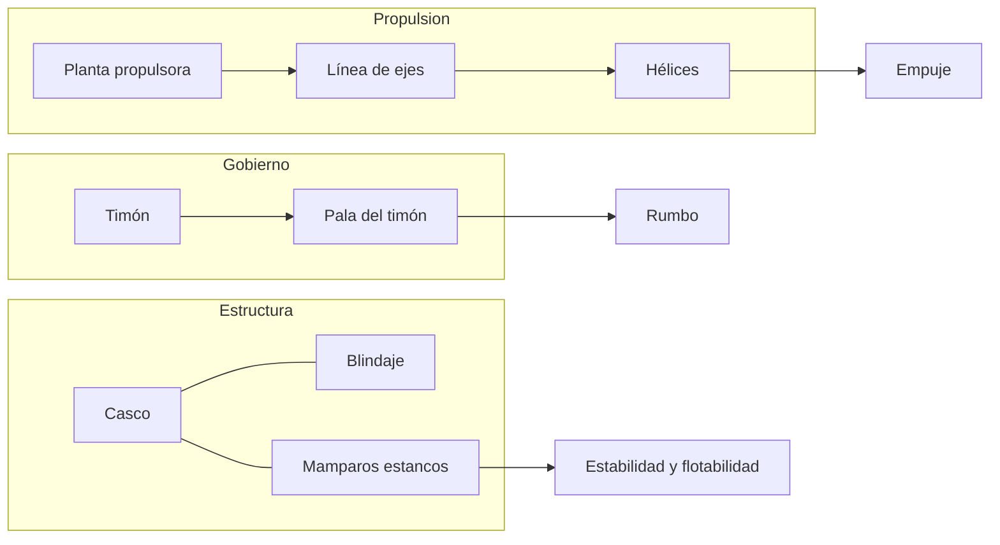
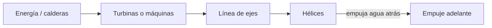

# 🔧 Sistemas mecánicos del acorazado

[🏠 Inicio](../../../README.md) · [🛡️ Curso: Acorazados](../README.md) · 🔧 Sistemas mecánicos

Este módulo describe, **solo con física pública**, como flota, avanza, gobierna y
se mantiene estable un gran buque blindado. No incluye sistemas de armas,
táctica ni datos sensibles. Es la base para entender los mandos (Módulo 4) y la
física de la navegación (Módulo 5).

---

## 1. 🚢 Casco y flotación

El casco es la estructura estanca que sostiene el buque por flotación. En un
acorazado es especialmente robusto por el peso del blindaje.

- **Obra viva y obra muerta**: parte sumergida y parte emergida del casco.
- **Reserva de flotabilidad**: volumen estanco por encima de la flotación.
- **Compartimentación**: mamparos que dividen el casco para limitar inundaciones.

| Parte | Función | Efecto en el buque |
| --- | --- | --- |
| Quilla | Eje estructural inferior | Rigidez y estabilidad. |
| Mamparos | Dividen el casco | Contienen inundaciones. |
| Doble fondo | Espacio inferior estanco | Protección y lastre. |
| Francobordo | Altura hasta cubierta | Reserva de flotabilidad. |

---

## 2. 🛡️ Blindaje (concepto físico)

El blindaje es acero de protección distribuido en el casco. Tratado aquí solo
como masa estructural y su efecto en la física del buque, no como sistema de
combate.

- **Peso**: el blindaje añade mucha masa, aumentando la inercia y el calado.
- **Distribución**: concentrar peso alto sube el centro de gravedad y reduce
  estabilidad; por eso el diseño cuida donde va cada tonelada.
- **Compromiso**: más protección implica más peso y menor velocidad o autonomía.

| Aspecto físico | Efecto |
| --- | --- |
| Masa del blindaje | Mayor inercia y calado. |
| Altura del peso | Afecta el centro de gravedad. |
| Reparto | Condiciona la estabilidad. |

---

## 3. 🔧 Propulsión

Convierte energía en empuje para mover una gran masa.

- **Planta propulsora**: históricamente máquinas de vapor o turbinas.
- **Línea de ejes**: transmite el giro a varias hélices.
- **Hélices**: empujan agua hacia atrás y, por reacción, mueven el buque.

---

## 4. ⚙️ Gobierno y timón

El gobierno cambia el rumbo desviando el flujo de agua en la popa.

- **Pala del timón**: al girar desvia el agua y hace rotar el buque.
- **Servomotor**: mueve la pala con la fuerza necesaria para la gran masa.
- **Inercia**: por su tamaño, el giro es amplio y lento.

---

## 5. ⚖️ Estabilidad y control de flotabilidad

La estabilidad depende del equilibrio entre peso, blindaje y lastre.

| Concepto | Definición | Riesgo si falla |
| --- | --- | --- |
| Centro de gravedad (G) | Punto donde actua el peso total. | Muy alto: inestable. |
| Metacentro (M) | Referencia de estabilidad al escorar. | G sobre M: riesgo de vuelco. |
| Escora | Inclinación transversal. | Excesiva por inundación asimétrica. |
| Contrainundación | Igualar peso entre costados. | Concepto de seguridad de flotabilidad. |
| Lastre | Agua de ajuste de peso. | Mal manejo: inestabilidad. |

---

## 🔁 Cómo se conecta todo

1. El **casco** aporta flotación y aloja el **blindaje**.
2. La **planta propulsora** genera potencia para las **hélices**.
3. El **timón** desvia el agua para cambiar el rumbo.
4. La **compartimentación** y el **lastre** cuidan la estabilidad.
5. Todo se opera de forma coordinada por la tripulación.

Con esto entendido, el
[Módulo 4: Mandos](../mandos/manual-mandos-acorazado.md) describe, a nivel
educativo, como se navega el buque desde el puente.

---

[⬅️ Anterior: Características](caracteristicas-acorazado.md) · [➡️ Siguiente: Mandos e instrumentos](../mandos/manual-mandos-acorazado.md)
