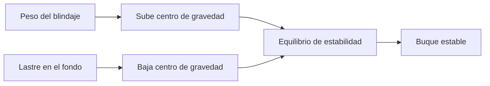

# 🧰 Recursos del acorazado

[🏠 Inicio](../../../README.md) · [🛡️ Curso: Acorazados](../README.md) · 🧰 Recursos

Glosario nautico especifico, enlaces y diagramas de apoyo del curso de
acorazados. Solo material publico e historico. Amplia el
[glosario general](../../../docs/05-glosario-general.md).

---

## 📖 Glosario especifico

| Termino | Definicion |
| --- | --- |
| Desplazamiento | Peso del agua que desplaza el buque; su peso total. |
| Blindaje | Acero de proteccion del casco (tratado como masa estructural). |
| Compartimentacion | Division del casco en zonas estancas por mamparos. |
| Escora | Inclinacion transversal del buque. |
| Contrainundacion | Igualar peso entre costados para corregir escora. |
| Metacentro | Punto de referencia de la estabilidad transversal. |
| Calado | Profundidad sumergida del casco. |
| Nudo | Unidad de velocidad: una milla nautica por hora. |
| Babor / estribor | Costado izquierdo / derecho mirando a proa. |

---

## 🗺️ Diagrama de estabilidad con blindaje

---

## 🔗 Enlaces y fuentes

- Seguridad y limites: [🦺 docs/04-seguridad-y-limites.md](../../../docs/04-seguridad-y-limites.md)
- Marco legal: [⚖️ docs/07-marco-legal-chile.md](../../../docs/07-marco-legal-chile.md)
- Registro de fuentes: [📚 manuales/fuentes.md](../../../manuales/fuentes.md)
- Buques museo y fuentes historicas publicas: ver el registro de fuentes.

Registrar cada recurso nuevo con su origen y licencia, siguiendo
[`recursos/README.md`](../../../recursos/README.md).

---

[🎓 Portada del curso](../README.md) · [⬅️ Anterior: Diseno de simulacion](../simulacion/diseno-simulador-acorazado.md)
