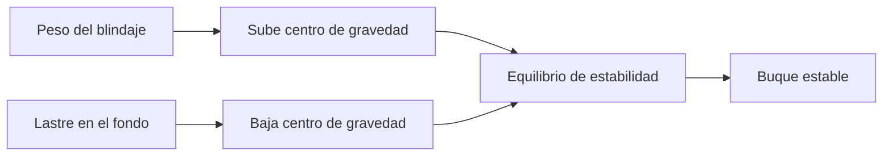

<!-- clase-meta
tipo_documento: clase
clase: 10
codigo: ACORAZADOS-10
curso: acorazados
titulo: "Recursos del acorazado"
modalidad: "taller documental"
duracion_minutos: 45
nivel: introductorio
prerrequisito: ACORAZADOS-09
competencia: "alfabetizacion_tecnica"
resultados_aprendizaje:
  - "Explicar glosario, esquemas y trazabilidad de fuentes con vocabulario propio de Acorazados."
  - "Aplicar esos conceptos a una decisión segura o a un escenario de simulación de Acorazados."
evidencia: "Glosario aplicado y ficha breve de trazabilidad."
criterio_aprobacion: "Los términos permiten interpretar el curso y las fuentes se distinguen por autoridad, alcance y vigencia."
fuentes: manuales/fuentes.md
ultima_revision: 2026-09-10
-->

# 🧰 Recursos del acorazado

[🏠 Inicio](../../../README.md) · [🛡️ Curso: Acorazados](../README.md) · 🧰 Recursos

Glosario náutico específico, enlaces y diagramas de apoyo del curso de
acorazados. Solo material público e histórico. Amplia el
[glosario general](../../../docs/05-glosario-general.md).

---

## 📖 Glosario específico

| Término | Definición |
| --- | --- |
| Desplazamiento | Peso del agua que desplaza el buque; su peso total. |
| Blindaje | Acero de protección del casco (tratado como masa estructural). |
| Compartimentación | División del casco en zonas estancas por mamparos. |
| Escora | Inclinación transversal del buque. |
| Contrainundación | Igualar peso entre costados para corregir escora. |
| Metacentro | Punto de referencia de la estabilidad transversal. |
| Calado | Profundidad sumergida del casco. |
| Nudo | Unidad de velocidad: una milla náutica por hora. |
| Babor / estribor | Costado izquierdo / derecho mirando a proa. |

---

## 🗺️ Diagrama de estabilidad con blindaje

```mermaid
flowchart LR
    Blindaje[Peso del blindaje] --> G[Sube centro de gravedad]
    Lastre[Lastre en el fondo] --> Baja[Baja centro de gravedad]
    G --> Equilibrio[Equilibrio de estabilidad]
    Baja --> Equilibrio
    Equilibrio --> Estable[Buque estable]
```

---

## 🔗 Enlaces y fuentes

- Seguridad y límites: [🦺 docs/04-seguridad-y-limites.md](../../../docs/04-seguridad-y-limites.md)
- Marco legal: [⚖️ docs/07-marco-legal-chile.md](../../../docs/07-marco-legal-chile.md)
- Registro de fuentes: [📚 manuales/fuentes.md](../../../manuales/fuentes.md)
- Buques museo y fuentes históricas públicas: ver el registro de fuentes.

Registrar cada recurso nuevo con su origen y licencia, siguiendo
[`recursos/README.md`](../../../recursos/README.md).

## 🧭 Guía de estudio aplicada

### Pregunta guía

¿Cómo ayuda **Glosario específico, Diagrama de estabilidad con blindaje, Enlaces y fuentes y Guía de estudio aplicada** a **explicar con fuentes los términos calderas o motores, turbinas, ejes y hélices y casco blindado**?

### Explicación razonada

El vocabulario técnico organiza relaciones: calderas o motores, turbinas, ejes y hélices y casco blindado nombran partes distintas de una misma cadena funcional. Una fuente se usa para sostener una afirmación concreta —principio, límite, procedimiento o contexto— y debe distinguirse del manual particular de un fabricante o de una regla narrativa.

Esta clase se conecta con el resto del curso mediante **compromiso histórico entre protección, potencia, alcance, estabilidad y potencia de fuego**. El hilo de
seguridad consiste en reconocer a tiempo **reacción lenta y exposición causada por gran radio táctico y baja aceleración** y poder justificar la decisión
**anticipar el movimiento considerando inercia, formación y campo de observación**; en clases posteriores cambiará el ángulo de análisis, no esa relación causal.
La lectura funcional común sigue **calderas o motores → turbinas → ejes y hélices → casco blindado**, de modo que cada concepto pueda
ubicarse dentro del funcionamiento completo y no quede como un dato aislado.

**Apoyo documental:** [Ships](https://www.history.navy.mil/browse-by-topic/ships.html) aporta historia pública de buques militares;
[Safety of Navigation](https://www.imo.org/en/ourwork/safety/pages/navigationdefault.aspx) se usa para navegación, SOLAS, COLREG y STCW. Estas fuentes
se contrastan con el alcance de la clase y no sustituyen un manual de equipo concreto.

### Caso resuelto: de la observación a la decisión

1. **Definir en contexto:** explica **calderas o motores**, **turbinas**, **ejes y hélices** y **casco blindado** por su función y relación.
2. **Respaldar:** enlaza cada afirmación importante con una fuente identificable y declara su alcance.
3. **Contrastar:** separa principios generales, requisitos locales, manual de fabricante y —si aplica— canon ficticio.
4. **Reformular:** convierte una definición copiada en una explicación propia con un ejemplo de **Acorazados**.

### Comprueba tu comprensión

1. Explica la diferencia funcional entre **turbinas** y **ejes y hélices** sin copiar una definición.
2. ¿Qué fuente respalda el principio «compromiso histórico entre protección, potencia, alcance, estabilidad y potencia de fuego» y cuál es su alcance?
3. ¿Qué dato exigiría un manual de fabricante en vez de una fuente general?

Orientación para revisar tus respuestas

- La primera respuesta debe relacionar el eslabón elegido con un efecto posterior, no solo nombrarlo.
- La segunda debe proponer una señal medible u observable y explicar qué tendencia sería preocupante.
- La tercera debe cambiar al menos una variable de capacidad, mando, entorno o margen de seguridad.

## 🎓 Cierre de clase

- **Actividad:** Selecciona términos de glosario, esquemas y trazabilidad de fuentes, explícalos en contexto de Acorazados y verifica la procedencia de las fuentes utilizadas.
- **Evidencia:** Glosario aplicado y ficha breve de trazabilidad.
- **Criterio de aprobación:** Los términos permiten interpretar el curso y las fuentes se distinguen por autoridad, alcance y vigencia.
- **Transferencia:** explica qué cambiaría al pasar a otra variante de esta máquina.

### Fuentes de esta clase

- [US-NHHC-SHIPS](https://www.history.navy.mil/browse-by-topic/ships.html): Ships, Naval History and Heritage Command. Uso: historia pública de buques militares.
- [IMO-NAV](https://www.imo.org/en/ourwork/safety/pages/navigationdefault.aspx): Safety of Navigation, International Maritime Organization. Uso: navegación, SOLAS, COLREG y STCW.

> Las fuentes sostienen el marco conceptual y normativo; esta clase no reemplaza el manual
> del fabricante, la formación certificada ni la habilitación exigida para operar equipos reales.

---

[🎓 Portada del curso](../README.md) · [⬅️ Anterior: Diseño de simulación](../simulacion/diseno-simulador-acorazado.md) · [➡️ Siguiente: Ejercicios](../ejercicios/ejercicios-acorazado.md)
