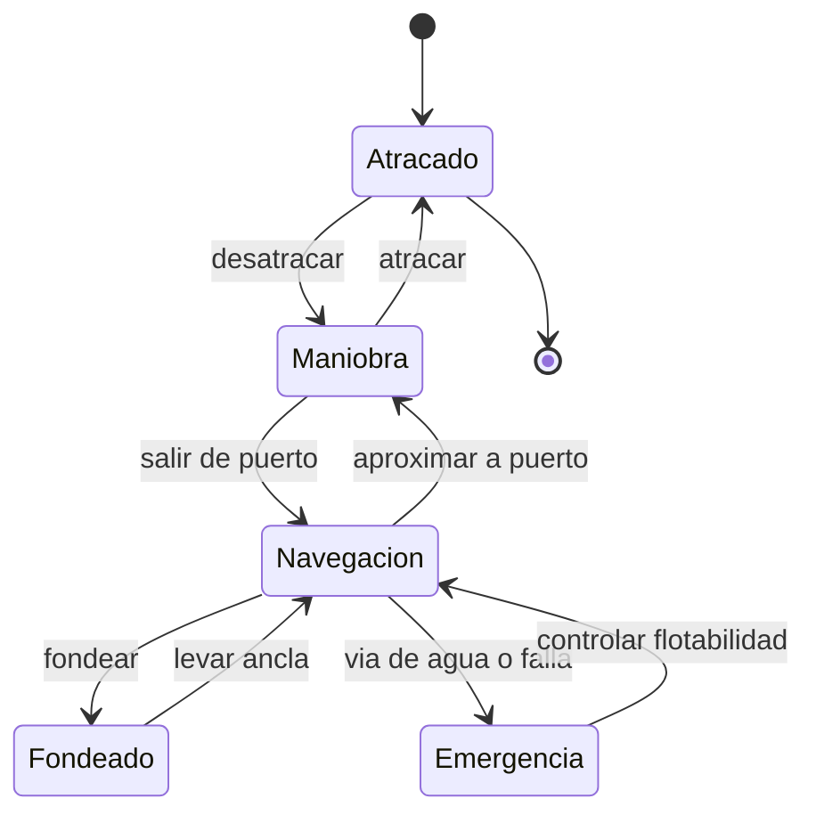

# 🎮 Diseno de simulacion del acorazado

[🏠 Inicio](../../../README.md) · [🛡️ Curso: Acorazados](../README.md) · 🎮 Simulacion

## Objetivo de la simulacion

Que el usuario aprenda a navegar un gran buque respetando la inercia, gestionar
la propulsion y el gobierno, y comprender la fisica de flotacion y estabilidad,
de forma educativa. **Fuera de alcance**: tactica, doctrina y sistemas de armas.

## Nivel de realismo

- Nivel elegido: se ofrece del 1 al 3 (ver `docs/03-niveles-de-realismo.md`).
- Justificacion: el foco es historico y fisico; la escala y el blindaje agregan
  inercia y retos de estabilidad respecto de un buque mercante.

## Variables principales

| Variable | Tipo | Rango | Afecta a | Comentarios |
| --- | --- | --- | --- | --- |
| Velocidad | numerica | 0-30 nudos | Avance y gobierno | El timon necesita flujo. |
| Rumbo | numerica | 0-359 grados | Direccion | Cambia con retardo. |
| Regimen de maquina | discreta | atras..avante toda | Empuje | Escalonado por telegrafo. |
| Angulo de timon | numerica | -35..35 grados | Radio de giro | Giro amplio por la masa. |
| Escora | numerica | grados | Estabilidad | Vigilar inundacion asimetrica. |
| Estabilidad (GM) | numerica | positiva | Seguridad | Afectada por peso del blindaje. |
| Lastre | numerica | 0-100% | Estabilidad y calado | Ajuste de peso. |
| Viento y corriente | vectorial | variable | Deriva | Ajuste del entorno. |

## Ciclo basico

1. Leer entrada del usuario (timon, telegrafo, lastre, rumbo).
2. Actualizar estado de la maquina y la posicion del timon.
3. Calcular fuerzas: empuje, resistencia, viento y corriente.
4. Aplicar la gran inercia de la masa al cambio de velocidad y rumbo.
5. Actualizar posicion, rumbo, escora y flotabilidad.
6. Refrescar instrumentos (rumbo, sonda, inclinometro) y alarmas.

## Modos de juego futuros

- Tutorial guiado del puente y el telegrafo.
- Practica libre de maniobra en puerto.
- Travesia oceanica con clima variable.
- Desafios de estabilidad y control de flotabilidad.
- Recorridos historicos de buques museo, sin contenido sensible.

## Elementos fuera de alcance

- Tactica, doctrina o sistemas de armas de cualquier tipo.
- Reproduccion de combate o procedimientos militares reales.
- Datos clasificados, restringidos o no publicos.

## Pendientes

- [ ] Definir valores por defecto por clase historica de buque.
- [ ] Prototipar el modelo de inercia y estabilidad.
- [ ] Ajustar el efecto del blindaje en el centro de gravedad.
- [ ] Agregar fuentes historicas publicas a [`manuales/fuentes.md`](../../../manuales/fuentes.md).

---

[⬅️ Anterior: Reglamentos](../reglamentos/reglamentos-acorazado.md) · [➡️ Siguiente: Recursos](../recursos/recursos-acorazado.md)
