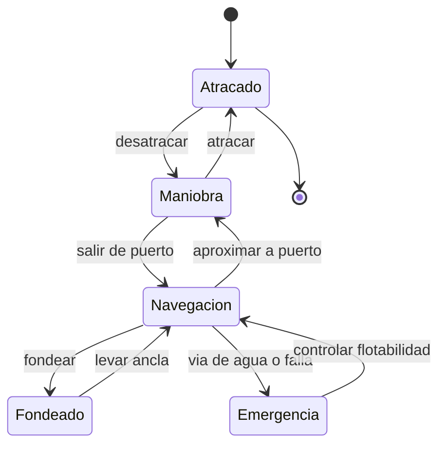

# 🎮 Diseño de simulación del acorazado

[🏠 Inicio](../../../README.md) · [🛡️ Curso: Acorazados](../README.md) · 🎮 Simulación

## Objetivo de la simulación

Que el usuario aprenda a navegar un gran buque respetando la inercia, gestionar
la propulsión y el gobierno, y comprender la física de flotación y estabilidad,
de forma educativa. **Fuera de alcance**: táctica, doctrina y sistemas de armas.

## Nivel de realismo

- Nivel elegido: se ofrece del 1 al 3 (ver `docs/03-niveles-de-realismo.md`).
- Justificación: el foco es histórico y físico; la escala y el blindaje agregan
  inercia y retos de estabilidad respecto de un buque mercante.

## Variables principales

| Variable | Tipo | Rango | Afecta a | Comentarios |
| --- | --- | --- | --- | --- |
| Velocidad | numérica | 0-30 nudos | Avance y gobierno | El timón necesita flujo. |
| Rumbo | numérica | 0-359 grados | Dirección | Cambia con retardo. |
| Régimen de máquina | discreta | atrás..avante toda | Empuje | Escalonado por telégrafo. |
| Ángulo de timón | numérica | -35..35 grados | Radio de giro | Giro amplio por la masa. |
| Escora | numérica | grados | Estabilidad | Vigilar inundación asimétrica. |
| Estabilidad (GM) | numérica | positiva | Seguridad | Afectada por peso del blindaje. |
| Lastre | numérica | 0-100% | Estabilidad y calado | Ajuste de peso. |
| Viento y corriente | vectorial | variable | Deriva | Ajuste del entorno. |

## Ciclo básico

1. Leer entrada del usuario (timón, telégrafo, lastre, rumbo).
2. Actualizar estado de la máquina y la posición del timón.
3. Calcular fuerzas: empuje, resistencia, viento y corriente.
4. Aplicar la gran inercia de la masa al cambio de velocidad y rumbo.
5. Actualizar posición, rumbo, escora y flotabilidad.
6. Refrescar instrumentos (rumbo, sonda, inclinómetro) y alarmas.

## Modos de juego futuros

- Tutorial guiado del puente y el telégrafo.
- Práctica libre de maniobra en puerto.
- Travesía oceánica con clima variable.
- Desafíos de estabilidad y control de flotabilidad.
- Recorridos históricos de buques museo, sin contenido sensible.

## Elementos fuera de alcance

- Táctica, doctrina o sistemas de armas de cualquier tipo.
- Reproducción de combate o procedimientos militares reales.
- Datos clasificados, restringidos o no públicos.

## Pendientes

- [ ] Definir valores por defecto por clase histórica de buque.
- [ ] Prototipar el modelo de inercia y estabilidad.
- [ ] Ajustar el efecto del blindaje en el centro de gravedad.
- [ ] Agregar fuentes históricas públicas a [`manuales/fuentes.md`](../../../manuales/fuentes.md).

---

[⬅️ Anterior: Reglamentos](../reglamentos/reglamentos-acorazado.md) · [➡️ Siguiente: Recursos](../recursos/recursos-acorazado.md)
