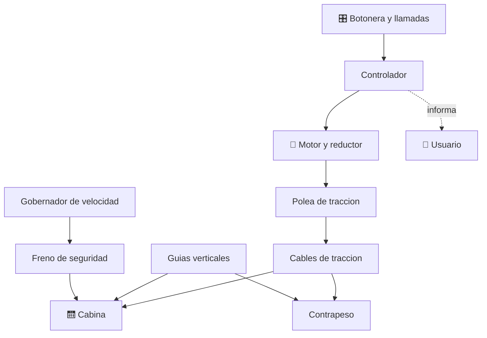

# 🛗 Curso: Ascensores

[🏠 Inicio](../../README.md) · [🚙 Catalogo de vehiculos](../README.md) · [🎓 Guia de curso](../../docs/08-guia-de-estilo-y-curso.md)

> **Curso de transporte vertical fijo.** Documenta el ascensor de principio a
> fin: historia, caracteristicas, mecanica en profundidad, control de llamadas,
> fisica del transporte vertical, entornos, marco legal chileno (Ley 20.296) y
> diseno de simulacion. Es maquinaria fija: no circula por via publica y su
> nucleo normativo es la mantencion e inspeccion.

---

## 🎯 Objetivos de aprendizaje

Al terminar este curso deberias poder:

- Explicar como una cabina sube y baja de forma controlada y segura.
- Identificar cabina, contrapeso, cables, poleas, motor, guias y frenos.
- Reconocer la botonera, el control de llamadas y los indicadores.
- Comprender la fisica del transporte vertical: equilibrio con contrapeso.
- Conocer el marco legal chileno (Ley 20.296, OGUC) de mantencion e inspeccion.
- Traducir todo lo anterior en variables de un simulador educativo.

---

## 🗺️ Mapa del vehiculo

---

## 📚 Modulos del curso

| # | Modulo | Contenido | Enlace |
| :-: | --- | --- | --- |
| 1 | 📜 Historia | Origen y evolucion del ascensor, linea de tiempo. | [Abrir](historia/historia-ascensor.md) |
| 2 | 📋 Caracteristicas | Que es, tipos de ascensor y para que sirve cada uno. | [Abrir](operacion/caracteristicas-ascensor.md) |
| 3 | 🔧 Sistemas mecanicos | Cabina, contrapeso, cables, motor, guias y frenos. | [Abrir](operacion/sistemas-mecanicos-ascensor.md) |
| 4 | 🎛️ Mandos e instrumentos | Botonera, control de llamadas e indicadores. | [Abrir](mandos/manual-mandos-ascensor.md) |
| 5 | 🧪 Principios y operacion | Fisica del transporte vertical y fases de un viaje. | [Abrir](operacion/principios-ascensor.md) |
| 6 | 🌍 Entornos de trabajo | Edificios residenciales, oficinas, hospitales. | [Abrir](operacion/entornos-ascensor.md) |
| 7 | ⚖️ Reglamentos | Ley 20.296 y OGUC: mantencion, inspeccion, certificacion. | [Abrir](reglamentos/reglamentos-ascensor.md) |
| 8 | 🎮 Diseno de simulacion | Variables, ciclo y modos de juego. | [Abrir](simulacion/diseno-simulador-ascensor.md) |
| 9 | 🧰 Recursos | Glosario, enlaces y diagramas. | [Abrir](recursos/recursos-ascensor.md) |

---

## 🧩 Requisitos previos

Ninguno. El ascensor es un buen punto de entrada al transporte vertical: permite
explicar equilibrio con contrapeso, traccion por cable y frenos de seguridad con
menor complejidad que una grua. Comparte ideas con la
[🗼 grua torre](../grua-torre/README.md) en cables y poleas. Marco legal en
[⚖️ docs/07-marco-legal-chile.md](../../docs/07-marco-legal-chile.md), seccion
1.8 (ascensores).

---

[➡️ Empezar por el Modulo 1: Historia](historia/historia-ascensor.md)
