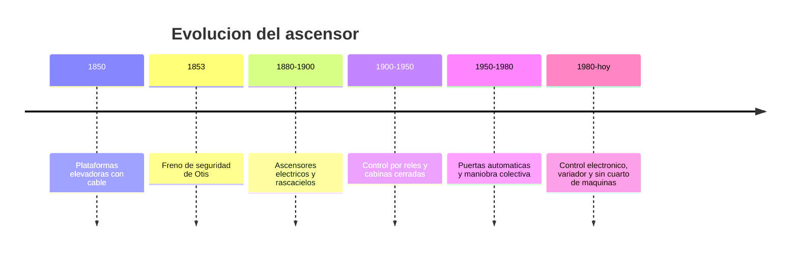

# 📜 Historia del ascensor

[🏠 Inicio](../../../README.md) · [🛗 Curso: Ascensores](../README.md) · 📜 Historia

## Origen

El transporte vertical mecanico existe desde el siglo XIX con plataformas
elevadas por cable. El salto decisivo fue el **freno de seguridad**: un
dispositivo que detiene la cabina si el cable falla. Con esa seguridad, el
ascensor de pasajeros se volvio confiable y permitio construir edificios altos.

## Linea de tiempo

| Periodo | Hito | Importancia |
| --- | --- | --- |
| 1850 | Plataformas con cable | Primer transporte vertical mecanico. |
| 1853 | Freno de seguridad | Detiene la cabina si falla el cable; da confianza. |
| 1880-1900 | Ascensores electricos | Hace viables los rascacielos. |
| 1900-1950 | Control por reles | Automatiza la maniobra y las paradas. |
| 1950-1980 | Puertas automaticas | Mas comodidad y seguridad de acceso. |
| 1980-presente | Control electronico y variador | Marcha suave, eficiencia y precision. |

## Evolucion tecnologica

- **Traccion**: de tambor de arrollamiento a polea de traccion con contrapeso.
- **Motor**: de corriente continua a motores con variador de frecuencia.
- **Control**: de reles a controladores electronicos y maniobra colectiva.
- **Seguridad**: freno de seguridad, gobernador de velocidad y finales de carrera.
- **Puertas**: de manuales a automaticas con sensores de obstaculo.
- **Arquitectura**: aparicion de equipos sin cuarto de maquinas.

## Tipos representativos

| Tipo | Uso tipico | Caracteristica destacada |
| --- | --- | --- |
| Electrico de traccion | Edificios medios y altos | Contrapeso y polea de traccion. |
| Hidraulico | Edificios bajos | Piston, sin cuarto de maquinas en altura. |
| Sin cuarto de maquinas | Edificios residenciales | Motor compacto en el hueco. |
| De carga | Industria y bodegas | Cabina robusta y gran capacidad. |
| Panoramico | Centros comerciales | Cabina con vista, foco estetico. |

## Impacto social y economico

El ascensor cambio la ciudad: sin el, la vida en altura seria inviable. Hizo
posibles los rascacielos, mejoro la accesibilidad para personas con movilidad
reducida y se volvio parte invisible pero critica de hospitales, oficinas y
viviendas. Su seguridad depende hoy de una mantencion e inspeccion reguladas.

## Fuentes

- Registrar aqui las fuentes publicas consultadas.
- Enlazar cada fuente tambien en [`manuales/fuentes.md`](../../../manuales/fuentes.md).

---

[🎓 Portada del curso](../README.md) · [➡️ Siguiente: Caracteristicas](../operacion/caracteristicas-ascensor.md)
