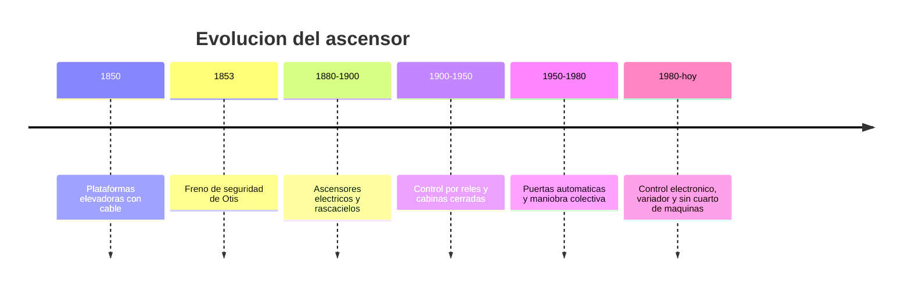

# 📜 Historia del ascensor

[🏠 Inicio](../../../README.md) · [🛗 Curso: Ascensores](../README.md) · 📜 Historia

## Origen

El transporte vertical mecánico existe desde el siglo XIX con plataformas
elevadas por cable. El salto decisivo fue el **freno de seguridad**: un
dispositivo que detiene la cabina si el cable falla. Con esa seguridad, el
ascensor de pasajeros se volvió confiable y permitió construir edificios altos.

## Línea de tiempo

| Periodo | Hito | Importancia |
| --- | --- | --- |
| 1850 | Plataformas con cable | Primer transporte vertical mecánico. |
| 1853 | Freno de seguridad | Detiene la cabina si falla el cable; da confianza. |
| 1880-1900 | Ascensores eléctricos | Hace viables los rascacielos. |
| 1900-1950 | Control por reles | Automatiza la maniobra y las paradas. |
| 1950-1980 | Puertas automáticas | Más comodidad y seguridad de acceso. |
| 1980-presente | Control electrónico y variador | Marcha suave, eficiencia y precisión. |

## Evolución tecnológica

- **Tracción**: de tambor de arrollamiento a polea de tracción con contrapeso.
- **Motor**: de corriente continua a motores con variador de frecuencia.
- **Control**: de reles a controladores electrónicos y maniobra colectiva.
- **Seguridad**: freno de seguridad, gobernador de velocidad y finales de carrera.
- **Puertas**: de manuales a automáticas con sensores de obstáculo.
- **Arquitectura**: aparición de equipos sin cuarto de máquinas.

## Tipos representativos

| Tipo | Uso típico | Característica destacada |
| --- | --- | --- |
| Eléctrico de tracción | Edificios medios y altos | Contrapeso y polea de tracción. |
| Hidráulico | Edificios bajos | Pistón, sin cuarto de máquinas en altura. |
| Sin cuarto de máquinas | Edificios residenciales | Motor compacto en el hueco. |
| De carga | Industria y bodegas | Cabina robusta y gran capacidad. |
| Panorámico | Centros comerciales | Cabina con vista, foco estético. |

## Impacto social y económico

El ascensor cambio la ciudad: sin el, la vida en altura sería inviable. Hizo
posibles los rascacielos, mejoró la accesibilidad para personas con movilidad
reducida y se volvió parte invisible pero crítica de hospitales, oficinas y
viviendas. Su seguridad depende hoy de una mantención e inspección reguladas.

## Fuentes

- Registrar aquí las fuentes públicas consultadas.
- Enlazar cada fuente también en [`manuales/fuentes.md`](../../../manuales/fuentes.md).

---

[🎓 Portada del curso](../README.md) · [➡️ Siguiente: Características](../operacion/caracteristicas-ascensor.md)
