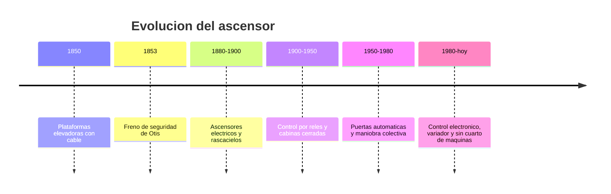

<!-- clase-meta
tipo_documento: clase
clase: 1
codigo: ASCENSORES-01
curso: ascensores
titulo: "Historia del ascensor"
modalidad: "teórica dialogada"
duracion_minutos: 45
nivel: introductorio
prerrequisito: ninguno
competencia: "contexto_historico"
resultados_aprendizaje:
  - "Explicar origen, evolución tecnológica, variantes representativas e impacto con vocabulario propio de Ascensores."
  - "Aplicar esos conceptos a una decisión segura o a un escenario de simulación de Ascensores."
evidencia: "Línea de tiempo comentada con cuatro hitos o más."
criterio_aprobacion: "Los hitos están ordenados, son pertinentes y dos relaciones de causa y efecto quedan justificadas."
fuentes: manuales/fuentes.md
ultima_revision: 2026-09-10
-->

# 📜 Historia del ascensor

[🏠 Inicio](../../../README.md) · [🛗 Curso: Ascensores](../README.md) · 📜 Historia

```mermaid
timeline
    title Evolucion del ascensor
    1850 : Plataformas elevadoras con cable
    1853 : Freno de seguridad de Otis
    1880-1900 : Ascensores electricos y rascacielos
    1900-1950 : Control por reles y cabinas cerradas
    1950-1980 : Puertas automaticas y maniobra colectiva
    1980-hoy : Control electronico, variador y sin cuarto de maquinas
```

## Origen

El transporte vertical mecánico existe desde el siglo XIX con plataformas
elevadas por cable. El salto decisivo fue el **freno de seguridad**: un
dispositivo que detiene la cabina si el cable falla. Con esa seguridad, el
ascensor de pasajeros se volvió confiable y permitió construir edificios altos.

## Línea de tiempo

| Periodo | Hito | Importancia |
| --- | --- | --- |
| 1850 | Plataformas con cable | Primer transporte vertical mecánico. |
| 1853 | Freno de seguridad | Detiene la cabina si falla el cable; da confianza. |
| 1880-1900 | Ascensores eléctricos | Hace viables los rascacielos. |
| 1900-1950 | Control por reles | Automatiza la maniobra y las paradas. |
| 1950-1980 | Puertas automáticas | Más comodidad y seguridad de acceso. |
| 1980-presente | Control electrónico y variador | Marcha suave, eficiencia y precisión. |

## Evolución tecnológica

- **Tracción**: de tambor de arrollamiento a polea de tracción con contrapeso.
- **Motor**: de corriente continua a motores con variador de frecuencia.
- **Control**: de reles a controladores electrónicos y maniobra colectiva.
- **Seguridad**: freno de seguridad, gobernador de velocidad y finales de carrera.
- **Puertas**: de manuales a automáticas con sensores de obstáculo.
- **Arquitectura**: aparición de equipos sin cuarto de máquinas.

## Tipos representativos

| Tipo | Uso típico | Característica destacada |
| --- | --- | --- |
| Eléctrico de tracción | Edificios medios y altos | Contrapeso y polea de tracción. |
| Hidráulico | Edificios bajos | Pistón, sin cuarto de máquinas en altura. |
| Sin cuarto de máquinas | Edificios residenciales | Motor compacto en el hueco. |
| De carga | Industria y bodegas | Cabina robusta y gran capacidad. |
| Panorámico | Centros comerciales | Cabina con vista, foco estético. |

## Impacto social y económico

El ascensor cambio la ciudad: sin el, la vida en altura sería inviable. Hizo
posibles los rascacielos, mejoró la accesibilidad para personas con movilidad
reducida y se volvió parte invisible pero crítica de hospitales, oficinas y
viviendas. Su seguridad depende hoy de una mantención e inspección reguladas.

## 🧭 Guía de estudio aplicada

### Pregunta guía

¿Cómo ayuda **Origen, Línea de tiempo, Evolución tecnológica y Tipos representativos** a **explicar cómo la evolución hizo posibles alternativas como ascensor de tracción frente a ascensor hidráulico**?

### Explicación razonada

La evolución de Ascensores se comprende mejor como una sucesión de respuestas a problemas, no como una lista de fechas. Los cambios en motor, polea tractora, cables y cabina y contrapeso alteraron qué podía hacer la máquina, quién podía usarla y qué riesgos debían controlarse. El contraste «ascensor de tracción frente a ascensor hidráulico» permite observar qué decisiones de diseño permanecieron y cuáles cambiaron con la tecnología y el propósito.

Esta clase se conecta con el resto del curso mediante **equilibrio de masas y control de aceleración, velocidad, nivelación y frenado**. El hilo de
seguridad consiste en reconocer a tiempo **movimiento con puertas inseguras, mala nivelación o pérdida de tracción** y poder justificar la decisión
**verificar enclavamientos y estado antes de autorizar el movimiento**; en clases posteriores cambiará el ángulo de análisis, no esa relación causal.
La lectura funcional común sigue **motor → polea tractora → cables → cabina y contrapeso**, de modo que cada concepto pueda
ubicarse dentro del funcionamiento completo y no quede como un dato aislado.

**Apoyo documental:** [1917.116 Elevators and Escalators](https://www.osha.gov/laws-regs/regulations/standardnumber/1917/1917.116) aporta inspección y riesgos de transporte vertical;
[Vehicle Safety](https://www.nhtsa.gov/vehicle-safety) se usa para seguridad de vehículos terrestres. Estas fuentes
se contrastan con el alcance de la clase y no sustituyen un manual de equipo concreto.

### Caso resuelto: de la observación a la decisión

1. **Situar:** ordena los hitos que explican cómo se llegó a **ascensor de tracción frente a ascensor hidráulico** y describe la necesidad que impulsó cada cambio.
2. **Relacionar:** explica qué se modificó en **motor**, **polea tractora**, **cables** o **cabina y contrapeso**; una fecha sin mecanismo no basta.
3. **Interpretar:** vincula el cambio con una capacidad nueva y también con el riesgo **movimiento con puertas inseguras, mala nivelación o pérdida de tracción**.
4. **Transferir:** usa la evolución para justificar por qué hoy conviene **verificar enclavamientos y estado antes de autorizar el movimiento**.

### Comprueba tu comprensión

1. ¿Qué necesidad histórica impulsó un cambio en **motor** o **polea tractora**?
2. ¿Qué hito modificó la relación entre capacidad y **movimiento con puertas inseguras, mala nivelación o pérdida de tracción**?
3. ¿Por qué **ascensor de tracción frente a ascensor hidráulico** no puede explicarse como una simple diferencia estética?

Orientación para revisar tus respuestas

- La primera respuesta debe relacionar el eslabón elegido con un efecto posterior, no solo nombrarlo.
- La segunda debe proponer una señal medible u observable y explicar qué tendencia sería preocupante.
- La tercera debe cambiar al menos una variable de capacidad, mando, entorno o margen de seguridad.

## 🎓 Cierre de clase

- **Actividad:** Construye una línea de tiempo de Ascensores y explica cómo dos cambios históricos transformaron su función o su puesto de mando.
- **Evidencia:** Línea de tiempo comentada con cuatro hitos o más.
- **Criterio de aprobación:** Los hitos están ordenados, son pertinentes y dos relaciones de causa y efecto quedan justificadas.
- **Transferencia:** explica qué cambiaría al pasar a otra variante de esta máquina.

### Fuentes de esta clase

- [OSHA-ELEVATORS](https://www.osha.gov/laws-regs/regulations/standardnumber/1917/1917.116): 1917.116 Elevators and Escalators, OSHA. Uso: inspección y riesgos de transporte vertical.
- [US-NHTSA](https://www.nhtsa.gov/vehicle-safety): Vehicle Safety, NHTSA. Uso: seguridad de vehículos terrestres.

> Las fuentes sostienen el marco conceptual y normativo; esta clase no reemplaza el manual
> del fabricante, la formación certificada ni la habilitación exigida para operar equipos reales.

---

[🎓 Portada del curso](../README.md) · [➡️ Siguiente: Características](../operacion/caracteristicas-ascensor.md)
