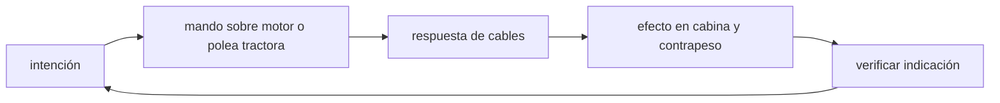

<!-- clase-meta
tipo_documento: clase
clase: 5
codigo: ASCENSORES-05
curso: ascensores
titulo: "Mandos e instrumentos del ascensor"
modalidad: "taller de simulación"
duracion_minutos: 60
nivel: introductorio
prerrequisito: ASCENSORES-04
competencia: "lectura_y_mando"
resultados_aprendizaje:
  - "Explicar controles, instrumentos, entradas y estados del sistema con vocabulario propio de Ascensores."
  - "Aplicar esos conceptos a una decisión segura o a un escenario de simulación de Ascensores."
evidencia: "Mapa de mandos y resolución de dos estados del tablero."
criterio_aprobacion: "Reconoce los controles críticos y responde a los estados sin introducir acciones inseguras."
fuentes: manuales/fuentes.md
ultima_revision: 2026-09-10
-->

# 🎛️ Mandos e instrumentos del ascensor

[🏠 Inicio](../../../README.md) · [🛗 Curso: Ascensores](../README.md) · 🎛️ Mandos

## Vista general

El ascensor no tiene un "conductor": el usuario pide un viaje y el controlador lo
ejecuta. Los mandos se reparten entre la botonera de piso (llamada), la botonera
de cabina (destino) y los indicadores. Un técnico usa además controles de
mantención que no están al alcance del público.

## Mapa de controles

| Zona | Control | Tipo | Función | Prioridad | Comentarios |
| --- | --- | --- | --- | --- | --- |
| Piso | Botón de llamada | Pulsador | Pedir la cabina en un sentido | Alta | Sube o baja según necesidad. |
| Cabina | Botones de piso | Pulsadores | Elegir destino | Alta | Uno por planta. |
| Cabina | Botón de apertura | Pulsador | Mantener puerta abierta | Media | Comodidad y seguridad. |
| Cabina | Botón de cierre | Pulsador | Adelantar el cierre | Baja | Acelera el viaje. |
| Cabina | Botón de alarma | Pulsador | Pedir ayuda | Alta | Comunicación con conserjería. |
| Cabina | Parada de emergencia | Pulsador | Detener el equipo | Alta | Uso solo ante riesgo. |
| Cabina | Intercomunicador | Botón | Hablar con el exterior | Alta | Requisito de seguridad. |
| Técnico | Modo inspección | Llave o selector | Operar en mantención | Alta | Solo personal competente. |

## Instrumentos e indicadores

| Instrumento | Muestra | Formato | Importancia | Notas |
| --- | --- | --- | --- | --- |
| Indicador de posición | Piso actual | número/letra | Alta | En cabina y en pisos. |
| Flechas de sentido | Sube o baja | flecha | Alta | Orientan al usuario. |
| Indicador de sobrecarga | Exceso de peso | luz/sonido | Alta | Impide arrancar sobrecargado. |
| Indicador de puerta | Puerta abierta o cerrada | luz | Media | Estado del acceso. |
| Testigo de fuera de servicio | Equipo detenido | luz/cartel | Alta | Avisa mantención o falla. |

## Entradas de simulación

| Acción | Teclado | Controlador | Pantalla táctil | Comentarios |
| --- | --- | --- | --- | --- |
| Llamar en piso | Tecla arriba/abajo | Botón asignado | Botón de llamada | Define sentido. |
| Elegir destino | Teclas numéricas | Cruceta | Botones de piso | Uno por planta. |
| Abrir puerta | Tecla O | Botón | Botón apertura | Mantiene abierto. |
| Cerrar puerta | Tecla C | Botón | Botón cierre | Adelanta el cierre. |
| Alarma | Tecla A | Botón | Botón alarma | Pide ayuda. |
| Parada de emergencia | Tecla E | Botón | Botón parada | Solo ante riesgo. |

## Estados del sistema

| Estado | Descripción | Indicadores | Acciones disponibles |
| --- | --- | --- | --- |
| Reposo | Cabina detenida en un piso | Posición fija | Recibir llamada. |
| Viajando | Cabina en movimiento | Flechas y posición | Continuar hasta destino. |
| En parada | Puerta abierta en piso | Puerta abierta | Entrar, salir, elegir destino. |
| Sobrecarga | Exceso de peso | Alerta de sobrecarga | No arranca; reducir carga. |
| Fuera de servicio | Mantención o falla | Cartel y testigo | Solo modo inspección técnico. |

## Observaciones ergonomicas

- El indicador de posición y las flechas deben verse siempre con claridad.
- La botonera debe ser accesible, con marcas en relieve y braille.
- Alarma e intercomunicador deben ser inconfundibles y funcionar sin energía
  normal.
- El modo inspección es solo para personal competente; la simulación debe
  distinguirlo del uso público.

## 🧭 Guía de estudio aplicada

### Pregunta guía

¿Cómo ayuda **Vista general, Mapa de controles, Instrumentos e indicadores y Entradas de simulación** a **interpretar mandos e indicaciones durante viaje con carga variable seguido de una orden de parada en piso**?

### Explicación razonada

Un mando no se aprende memorizando su nombre, sino recorriendo el ciclo intención → acción → indicación → verificación. En Ascensores, el operador actúa sobre motor o polea tractora, observa la respuesta en cables y confirma el efecto en cabina y contrapeso. Una indicación inesperada exige detener la secuencia mental, identificar el modo activo y evitar una segunda orden que agrave el estado.

Esta clase se conecta con el resto del curso mediante **equilibrio de masas y control de aceleración, velocidad, nivelación y frenado**. El hilo de
seguridad consiste en reconocer a tiempo **movimiento con puertas inseguras, mala nivelación o pérdida de tracción** y poder justificar la decisión
**verificar enclavamientos y estado antes de autorizar el movimiento**; en clases posteriores cambiará el ángulo de análisis, no esa relación causal.
La lectura funcional común sigue **motor → polea tractora → cables → cabina y contrapeso**, de modo que cada concepto pueda
ubicarse dentro del funcionamiento completo y no quede como un dato aislado.

**Apoyo documental:** [1917.116 Elevators and Escalators](https://www.osha.gov/laws-regs/regulations/standardnumber/1917/1917.116) aporta inspección y riesgos de transporte vertical;
[Vehicle Safety](https://www.nhtsa.gov/vehicle-safety) se usa para seguridad de vehículos terrestres. Estas fuentes
se contrastan con el alcance de la clase y no sustituyen un manual de equipo concreto.

### Caso resuelto: de la observación a la decisión

1. **Intención:** formula qué cambio se necesita durante **viaje con carga variable seguido de una orden de parada en piso**.
2. **Mando:** identifica el control que actúa sobre **motor** o **polea tractora** y el modo que debe estar activo.
3. **Lectura:** localiza la indicación que confirma la respuesta de **cables** y el efecto en **cabina y contrapeso**.
4. **Verificación:** si la lectura no coincide, no acumules órdenes; estabiliza e investiga el estado.

### Comprueba tu comprensión

1. ¿Qué mando inicia la respuesta y qué instrumento confirma que el modo correcto está activo?
2. ¿Qué indicación temprana advertiría **movimiento con puertas inseguras, mala nivelación o pérdida de tracción**?
3. ¿Qué secuencia usarías si la respuesta de **cabina y contrapeso** no coincide con la orden?

Orientación para revisar tus respuestas

- La primera respuesta debe relacionar el eslabón elegido con un efecto posterior, no solo nombrarlo.
- La segunda debe proponer una señal medible u observable y explicar qué tendencia sería preocupante.
- La tercera debe cambiar al menos una variable de capacidad, mando, entorno o margen de seguridad.

## 🎓 Cierre de clase

- **Actividad:** Recorre el puesto de mando simulado de Ascensores: localiza los controles de controles, instrumentos, entradas y estados del sistema y asocia cada indicación con una decisión.
- **Evidencia:** Mapa de mandos y resolución de dos estados del tablero.
- **Criterio de aprobación:** Reconoce los controles críticos y responde a los estados sin introducir acciones inseguras.
- **Transferencia:** explica qué cambiaría al pasar a otra variante de esta máquina.

### Fuentes de esta clase

- [OSHA-ELEVATORS](https://www.osha.gov/laws-regs/regulations/standardnumber/1917/1917.116): 1917.116 Elevators and Escalators, OSHA. Uso: inspección y riesgos de transporte vertical.
- [US-NHTSA](https://www.nhtsa.gov/vehicle-safety): Vehicle Safety, NHTSA. Uso: seguridad de vehículos terrestres.

> Las fuentes sostienen el marco conceptual y normativo; esta clase no reemplaza el manual
> del fabricante, la formación certificada ni la habilitación exigida para operar equipos reales.

---

[⬅️ Anterior: Sistemas mecánicos](../operacion/sistemas-mecanicos-ascensor.md) · [➡️ Siguiente: Principios y operación](../operacion/principios-ascensor.md)
